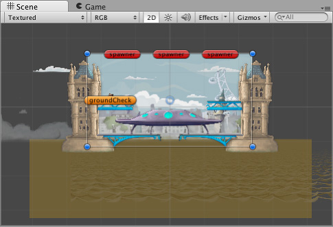

## Gameplay in 2D
虽然Unity以其3D功能而闻名，但它也可以用于创建2D游戏。熟悉的编辑器功能仍然可用，但是添加了一些有用的功能来简化2D开发。  
  
*以2D模式观看的场景*  
最引人注目的功能是 **Scene view** 中的 **toolbar** 上的 *2D view mode* 按键。启用2D模式时，将设置一个直角(即无透视)视图;相机沿Z轴向上看，Y轴向上看。这可以让你想象场景轻松放置2D对象。启用2D模式后，将设置正交（即无透视图）视图；该相机沿Z轴方向，而Y轴方向向上。这使您可以可视化场景，轻松放置 2D对象。  
有关2D组件的完整列表，如何在2D和3D模式之间切换以及不同的2D和3D模式设置，请参阅[2D或3D项目](https://docs.unity3d.com/Manual/2Dor3D.html)。

### 2D graphics
2D 中的图像对象被称为 **Sprites**。Sprite本质上只是标准纹理，但是有一些特殊的技术可以组合和管理Sprite纹理，以在开发过程中提高效率和便利性。Unity提供了内置的[Sprite编辑器](../Sprites/SpriteEditor/README.md)让您从较大的图像中提取精灵图形。这样，您就可以在图像编辑器中的单个纹理内编辑大量组件图像。例如，您可以使用此功能将角色的手臂，腿部和身体作为一个单独的元素保留在一个图像中。

Sprites 通过 [Sprite Renderer](../Sprites/SpriteRender/README.md) 组件渲染，而不是3D对象中使用的 [Mesh Renderer](https://docs.unity3d.com/Manual/class-MeshRenderer.html)。您可以通过“组件”菜单（**Component > Rendering > Sprite Renderer**）将其添加到GameObject中，或者，也可以直接在已附加Sprite Renderer的情况下直接创建GameObject（菜单：**GameObject> 2D Object> Sprite**）。  
此外，您可以使用[Sprite Creator](../Sprites/SpriteCreator/README.md)工具制作占位符2D图像。

### 2D physics
Unity有一个单独的物理引擎处理2D物理的，以便仅2D可用的优化。这些组件与标准3D物理组件相对应，例如[Rigidbody](https://docs.unity3d.com/Manual/class-Rigidbody.html), [Box Collider](https://docs.unity3d.com/Manual/class-BoxCollider.html) 和 [Hinge Joint](https://docs.unity3d.com/Manual/class-HingeJoint.html)，但在名称后附加“ 2D”。因此，精灵可以配备[Rigidbody 2D](https://docs.unity3d.com/Manual/class-Rigidbody2D.html)，[Box Collider 2D](https://docs.unity3d.com/Manual/class-BoxCollider2D.html)和[Hinge Joint 2D](https://docs.unity3d.com/Manual/class-HingeJoint2D.html)。大多数2D物理组件只是3D等效项的“展平”版本（例如Box Collider 2D是正方形，而Box Collider是立方体），但也有一些例外。

有关2D物理组件的完整列表，请参见[2D或3D项目](https://docs.unity3d.com/Manual/2Dor3D.html)。参考[物理](https://docs.unity3d.com/Manual/PhysicsSection.html)手册关于2D物理概念和组件的进一步信息部分。要指定2D物理设置，请参见[Physics 2D窗口](https://docs.unity3d.com/Manual/class-Physics2DManager.html)。