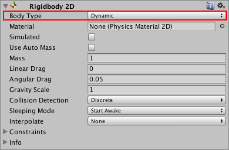

# Rigidbody 2D
刚体2D组件将物体置于物理引擎的控制下。标准[刚体](https://docs.unity3d.com/Manual/class-Rigidbody.html)组件所熟悉的许多概念都并转移到Rigidbody 2D；区别在于在2D模式下，对象只能在XY平面中移动，并且只能在垂直于该平面的轴上旋转。  
  
*The Rigidbody 2D component appears differently in the Unity Editor depending on which [Body Type](#body-type) you have selected. See Body Type, below, to learn more.*

## How a Rigidbody 2D works
通常，Unity编辑器的Transform组件定义了GameObject(游戏对象)的方式(及其子游戏对象)在场景中定位、旋转和缩放。当它被更改时，它会更新其他组件，这些组件可能会更新诸如它们呈现的位置或碰撞器的位置等内容。2D物理引擎能够移动碰撞器并使它们彼此交互，因此物理引擎需要一种方法来将碰撞器的移动通信回转换组件。这种运动和与碰撞器的连接是Rigidbody 2D组件的用途。

Rigidbody 2D组件覆盖转换并将其更新为Rigidbody 2D定义的位置/旋转。请注意，虽然您仍然可以通过修改转换组件来覆盖Rigidbody 2D(因为Unity会在所有组件上公开所有属性)，但是这样做会导致一些问题，比如GameObjects相互之间的传递，以及不可预知的移动。

添加到相同GameObject或子GameObject的任何对撞机2D组件都隐式地附加到Rigidbody 2D。当一个碰撞器2D被附加到刚体2D上时，它会随之移动。碰撞器2D不应该直接使用转换或任何碰撞器偏移来移动;Rigidbody 2D应该被移动。这提供了最好的性能，并确保正确的冲突检测。附加在同一个刚体2D上的碰撞器2Ds不会相互碰撞。这意味着您可以创建一组碰撞器，它们作为单个复合碰撞器有效地工作，所有这些碰撞器都与Rigidbody 2D同步移动和旋转。

当设计一个场景时，你可以使用默认的Rigidbody 2D并开始附加碰撞器。这些碰撞器允许附加在不同刚体2Ds上的任何其他碰撞器相互碰撞。

### Tip
添加一个Rigidbody 2D可以通过应用来自脚本API的力量使sprite以一种物理上令人信服的方式移动。当适当的碰撞器组件也被附加到sprite GameObject(游戏物体)上时，它会受到与其他移动的GameObject(游戏物体)碰撞的影响。使用物理简化了许多常见的游戏机制，并允许现实的行为与最小的编码。

## Body Type
Rigidbody 2D组件在顶部有一个标记为Body类型的设置。为此选择的选项将影响组件上的其他可用设置。  
  

**Body Type**有三种选择;每个定义一个公共的和固定的行为。任何附加到Rigidbody 2D的碰撞器2D都会继承Rigidbody 2D的Body类型。这三个选项是:
* Dynamic
* Kinematic
* Static

您选择的选项定义:
* 运动(位置和旋转)行为
* 对撞机交互

请注意，虽然刚体2Ds经常被描述为相互碰撞，但碰撞的是附着在每个碰撞体上的碰撞体2Ds。刚体2Ds没有碰撞器就不能相互碰撞。

更改Rigidbody 2D的身体类型可能是一个复杂的过程。当身体类型发生变化时，立即重新计算各种与质量相关的内部属性，并需要在GameObject的下一个FixedUpdate期间重新评估附加到Rigidbody 2D上的Collider 2Ds的所有现有联系人。根据身体上有多少触点和碰撞器2Ds，改变身体类型会导致性能的变化。

