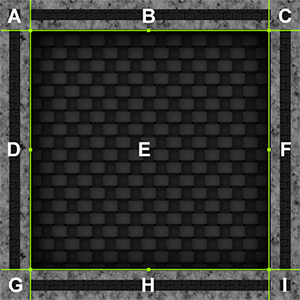
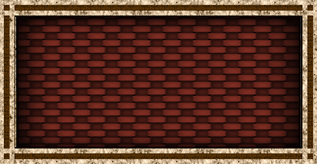
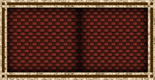

## 9-slicing Sprites
9-slicing 是一种2D技术，可让您以各种尺寸重用图像，而无需准备多个资源。它涉及将图像分为九个部分，以便在重新调整 [Sprite](../README.md) 的大小时，其中的不同部分缩放或平铺（即以网格形式重复），以使Sprite保持比例。创建图案或[纹理](https://docs.unity3d.com/Manual/class-TextureImporter.html)时，此功能很有，例如2D环境中的墙壁或地板。

这是一个 9-slicing Sprite的示例，分为9个部分。每个部分都标有一个从A到I的字母。  

以下几点描述了更改图像尺寸时发生的情况：
* 四个角（A，C，G和I）的大小不变。
* B和H部分水平拉伸或平铺。
* D和F部分垂直拉伸或平铺。
* E部分在水平和垂直方向上拉伸或平铺。

本页介绍如何设置9切片，以及根据要拉伸还是平铺上面显示的区域应用哪些设置。

### Setting up your Sprite for 9-slicing
在对Sprite 9-slicing 之前，需要确保正确设置了Sprite。

首先，您需要确保将 **Mesh Type** 设置为**Full Rect**。要应用此功能，请选择 Sprite，然后在 Inspector 窗口中单击 **Mesh Type** 下拉菜单并选择 **Full Rect**。如果 **Mesh Type** 设置为 **Tight**，则9切片可能无法正常工作，这是因为 Sprite 设置为9切片时，Sprite Renderer 如何生成和渲染Sprite。  
  
*The Sprite’s Inspector window. **Mesh Type** is highlighted in the red box.*

接下来，您需要通过[Sprite Editor](../SpriteEditor/README.md)窗口定义Sprite的边框。为此，选择Sprite，然后在 [Inspector](https://docs.unity3d.com/Manual/UsingTheInspector.html) 窗口中，单击 **Sprite Editor** 按钮。  
  
*The Sprite’s Inspector window. The **Sprite Editor** button is highlighted in the red box. See documentation on [Sprites](../README.md) for information on all of the properties in the Sprite Import Settings.*

使用 Sprite Editor 窗口定义精灵的边界（即您要在其中定义平铺区域，如地砖的墙壁的边界）。为此，请使用Sprite控制面板的L，R，T和B字段（分别为左，右，上和下）。或者，单击并拖动顶部，底部和侧面的绿点。  
  
*Defining the borders of the Sprite in the Sprite Editor window*

在 Sprite Editor 窗口的顶部栏中单击 **Apply**。关闭 Sprite Editor 窗口，然后将 Sprite 从 [Project window](https://docs.unity3d.com/Manual/ProjectView.html) 窗口拖动到场景中视图以开始对此进行研究。

### 9-slicing your Sprite
在 [Scene view](https://docs.unity3d.com/Manual/UsingTheSceneView.html) 或者[Hierarchy window](https://docs.unity3d.com/Manual/Hierarchy.html)中选择 Sprite。或口。在 Inspector 窗口中，导航到 [Sprite Renderer](../SpriteRender/README.md)组件，然后更改 **Draw Mode** 属性。  
  

默认情况下设置为 **Simple**。要应用9切片，请根据需要将其设置为 **Sliced** 或 **Tiled**。以下各节说明使用此Sprite的各种行为：  
  
*The original Sprite used for the examples shown below*

#### Simple
  
这是默认的Sprite Renderer行为。尺寸改变时，图像会在所有方向缩放。**Simple** 不用于 9-slicing。

#### Sliced
  
在 **Sliced** 模式下，拐角保持相同的大小，Sprite 的顶部和底部水平延伸，Sprite 的侧面垂直延伸，Sprite 的中心水平和垂直延伸以适合 Sprite 的大小。

当 Sprite 的 **Draw Mode** 设置为 **Sliced** 时，可以选择使用 **Sprite Renderer** 或 [Rect Transform Tool](https://docs.unity3d.com/Manual/Toolbar.html)上的 **Size** 属性来更改大小。您仍然可以使用Transform属性或Transform Tool缩放Sprite。但是，Transform 在不应用9-slicing的情况下缩放Sprite。

#### Tiled

在 **Tiled** 模式下，sprite 保持相同大小，并且不缩放。相反，Sprite的顶部和底部在水平方向上重复，侧面在垂直方向上重复，并且Sprite的中心以瓦片形式重复以适合Sprite的大小。

当 Sprite 的 **Draw Mode** 设置为 Sliced 时，可以选择使用 Sprite Renderer 或 [Rect Transform Tool](https://docs.unity3d.com/Manual/Toolbar.html) 上的 **Size** 属性来更改大小。您仍然可以使用Transform属性或Transform Tool缩放Sprite。但是，Transform 在不应用9-slicing的情况下缩放Sprite。

将 **Draw Mode** 设置为 **Tiled** 时，将出现一个名为 **Tile Mode** 的附加属性。有关**Tile Mode**如何工作的更多信息，请参见此页面的下一部分。

有关组件所有属性的完整详细信息，请参见[Sprite Renderer](../SpriteRender/README.md)上的文档。

## Tile Mode
当 **Draw Mode** 设置为 **Tiled** 时，使用 **Tile Mode** 属性控制Sprite尺寸更改时各部分的重复方式。  

### Continuous
默认情况下，**Tile Mode** 设置为 **Continuous**。当Sprite的大小更改时，重复部分在Sprite中均匀重复。  

### Adaptive
当 **Tile Mode** 设置为 **Adaptive** 时，仅当Sprite的尺寸达到 **Stretch Value** 时，重复部分才会重复。  

使用 **Stretch Value** 滑块在0到1之间设置值。请注意，1表示将图像调整为原始尺寸的两倍，因此，如果将 **Stretch Value** 设置为1，则在将图像拉伸至原始尺寸的两倍时，该部分会重复。

为了说明这一点，以下图像显示了相同尺寸但拉伸值不同的图像之间的差异：

**Stretch Value 0.1:**  

**Stretch Value 0.5:**  

## 9-slicing and Colliders
如果您的[Sprite](../README.md)附加了[Collider2D](https://docs.unity3d.com/Manual/Collider2D.html)，则需要确保在更改Sprite的尺寸时，Collider2D随之更改。

[Box Collider 2D](https://docs.unity3d.com/Manual/class-BoxCollider2D.html)和[Polygon Collider 2D](https://docs.unity3d.com/Manual/class-PolygonCollider2D.html)是Unity中唯一支持 9-slicing 的Collider2D组件。这两个Collider2D具有一个 **Auto Tiling** 复选框。为了确保将Collider2D组件设置为9-slicing，请选择要对其应用的Sprite，在Inspector窗口中导航到Collider2D，然后选中 **Auto Tiling** 复选框。这样可以自动更新Collider2D的形状，这意味着在Sprite的尺寸更改时会自动重新调整形状。如果未启用 **Auto Tiling**，则即使Sprite的尺寸发生更改，Collider2D仍保持相同的形状和大小。

### 局限性和已知问题
* BoxCollider2D和PolygonCollider2D是仅有的两个支持 9-slicing 的Collider2D。
* 将Sprite Renderer的 **Draw Mode** 设置为 **Sliced** 或 **Tiled** 时，不能编辑BoxCollider2D或PolygonCollider2D 。在 Inspector 窗口中的编辑被禁用，并且出现一条警告通知您Collider2D无法编辑，因为它是由Sprite Renderer组件的切片属性驱动的。
* 在自动平铺中重新生成形状时，Collider2D的形状内可能会出现其他边缘。这可能会对碰撞产生影响。