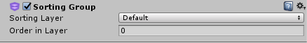
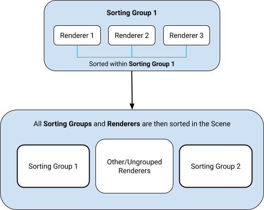
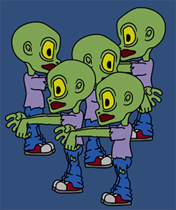

## Sorting Groups
**Sorting Groups**允许把带有 [Sprite Renderers](../SpriteRender/README.md) 的 GameObjects分组，并且控制他们渲染sprite的顺序。Unity把具有相同 Sorting Group 的 Sprite Renderers 一起渲染，就像是一个 GameObject。

### Set up a Sorting Group
要将GameObject放入 Sorting Group 中，请向其中添加**Sorting Group**组件。为此，选择GameObject并转到**Component > Rendering > Sorting Group**，或在GameObject的Inspector窗口中选择[Add Component](https://docs.unity3d.com/Manual/UsingComponents.html)按钮。

当您向游戏对象添加排序组组件时，Unity会将相同的[Sorting Group](https://docs.unity3d.com/Manual/class-SortingGroup.html#SGProperties)应用于该组件所连接的游戏对象的所有子游戏对象。  
  
*The ‘Sprite’ child objects belong to the empty parent GameObject’s Sorting Group.*

Unity使用排序组的设置来确定如何在场景中的其他渲染器和排序组之间对它的渲染器进行排序。有关更多信息，请参见[2D排序](../2DSorting/README.md)。

要对排序组中的渲染器进行排序，Unity使用排序组中渲染器的各个排序设置。有关更多信息，请参见[Sorting Renderers within a Sorting Group](#sorting-renderers-within-a-sorting-group)。

### Sorting Group properties

### Sorting Renderers within a Sorting Group
Unity使用 **Sorting Group** 的[Sorting Layer](https://docs.unity3d.com/Manual/class-TagManager.html#SortingLayers)和 Order 在 Layer的值来确定其在渲染中优先级将队列以及场景中的其他排序组和GameObject。  
  
*The Sorting Group component*  

|属性|功能|
|:---|:---|
|Sorting&nbsp;Layer|从此下拉菜单中选择或添加[Sorting Layer](https://docs.unity3d.com/Manual/class-TagManager.html#SortingLayers)，以确定排序组在渲染队列中的位置。Unity通过其在“排序层”设置中的位置来确定“排序层”顺序；它按照在列表中显示的顺序渲染“排序层”。有关设置“排序图层”的信息，请参见[Tags and Layers](https://docs.unity3d.com/Manual/class-TagManager.html#SortingLayers)。|
|Order&nbsp;in&nbsp;Layer|在其排序层中设置此排序组的渲染顺序。Unity将具有较低值的渲染器首先在渲染队列中排队，因此它们出现在具有较高值的​​渲染器之前。|
有关使用“排序图层”对Sprite进行排序以及Unity的Renderer排序标准的更多信息，请参见[2D排序](../../2DSorting/README.md)。

### Sorting Renderers within a Sorting Group
Unity通过 [Renderer properties](https://docs.unity3d.com/Manual/class-SpriteRenderer.html) 中的各个**Sorting Layer**和**Order in Layer**对同一 Sorting Group 中的所有渲染器进行排序。Unity不会考虑每个渲染器与相机的单独距离，用于创建场景中特定视点的图像的组件。输出要么绘制到屏幕上，要么捕获为纹理。[更多信息](https://docs.unity3d.com/Manual/CamerasOverview.html)

在此排序过程中，请参阅[词汇表](https://docs.unity3d.com/Manual/Glossary.html#Camera)属性。而是根据包含排序组组件的根GameObject的位置，为整个排序组（包括其所有子渲染器）设置一个距离 Camera的值。

当Unity在场景中的其他渲染器和排序组之间对排序组进行排序时，排序组的内部排序顺序保持不变。

下图显示了排序过程。  
  
*Internal Sorting Group sorting process.*  

Unity将属于同一排序组的所有渲染器视为一个图层，并根据非组的渲染器的 Sorting Layer   和 **Order in Layer** 设置对它们进行排序。

### Particle System
编辑器将 Sorting Group 下的[粒子系统](https://docs.unity3d.com/Manual/class-ParticleSystem.html)视为该排序组内的另一个渲染器，并根据其 **Sorting Layer** 和 **Order in Layer** 设置在内部与其他渲染器排序。

当Unity与排序组中的其他渲染器对粒子系统进行排序时，它将忽略粒子系统的 **Sorting Fudge** 值。

### Nested Sorting Groups
嵌套排序组是具有父排序组的排序组。Unity首先对嵌套排序组中的渲染器进行排序，然后对其父级进行排序（请参阅 [Sorting Renderers within a Sorting Group](#sorting-renderers-within-a-sorting-group)）。

Unity确定嵌套排序组的内部排序顺序后，它将与父渲染组中的其他渲染器或排序组一起对嵌套排序组进行排序。嵌套排序组可以将嵌套排序组作为子级。Unity首先将最里面的子组排序，再将它们的父级排序。

下图为您提供了一个嵌套的“排序组”排序过程的示例。  
  
*Nested Sorting Group sorting process.*

## Using Sorting Groups
创建2D多Sprite角色的最常见方法是在“层次结构”窗口中一起排列多个父Sprite渲染器并将其作为父对象，以形成一个角色。您可以使用**Sorting Groups**来帮助管理这种复杂的多Sprite字符。

在下面的示例中，Sprite Renderer属于相同的**Sorting Layer**，但具有不同的 **Order in Layer**。Unity按照您希望它们出现的顺序对字符的不同部分进行排序。  
  
*A character Prefab with its parts in a hierarchy.*

配置了“排序组”和“排序层”后，可以将角色另存为“ [Prefab](https://docs.unity3d.com/Manual/Prefabs.html)，并根据需要将其克隆多次。

但是，所有预制精灵都具有相同的 **Sorting Layer**和 **Order in Layer** 值，并且渲染成与其他预制相同的层，这可能导致预制角色的不同部分不正确地相交和分层。  
  
*Sprites from two Prefabs intersect incorrectly, because Unity is rendering the Sprites on the same layers.*

为确保预制件保持其自身的渲染顺序一致以便正确显示，请将“排序组”组件添加到每个预制件的根GameObject中。保存已编辑的预制件，以便所有当前和将来的预制件实例也具有“排序组”组件。

每个预制件应具有一个排序组组件，该组件具有相同的 **Sorting Layer** 和 **Order in Layer** 属性设置。这可能会导致同一排序层上的Prefabs中的渲染器以不一致的方式进行渲染，因为它们在 [渲染队列](https://docs.unity3d.com/Manual/SL-SubShaderTags.html) 中具有相同的优先级。

为避免出现此问题，请为每个“预制”的“排序组”组件赋予一个唯一的 **Order in Layer** 值。Unity会首先渲染“ 层”中顺序较低的排序组，而较高值的排序组与较低的“排序组”重叠。有关编辑和重新排序排序图层的更多信息，请参考[标签和图层](https://docs.unity3d.com/Manual/class-TagManager.html)。  

每个预制件都有一个“排序组”组件，该组件具有唯一的 **Order in Layer** 值，以确保Unity正确渲染每个字符及其零件。