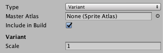

## Master and Variant Sprite Atlases
该 **Type** 属性定义是否 **Sprite Atlas** 是 **Master** 或 **Variant**。**Sprite Atlas**默认情况下被创建为 **Master** 类型。将其类型设置为 **Variant** 以创建一个 **Variant Atlas**。

Variant Atlas需要在其 **Master Atlas** 属性中设置一个Master类型的Sprite Atlas 。Variant Atlas接收Master Atlas内容的副本，以用作自己的内容。有关如何创建和使用Variant Sprite Atlas的更多详细信息，请参阅[Variant Sprite Atlas](../SpriteAtlasWorkflow/README.md)上的文档。

当 Sprite Atlas 类型设置为 Variant 时，将显示以下属性：  

|Property|Description|
|:-------|:----------|
|Type|将 Sprite Atlas 类型设置为 Variant 以显示以下属性。|
|Master&nbsp;Atlas|Variant Atlas会收到其Master Atlas内容的副本，以用作自己的内容。将一个Sprite Atlas分配给此属性，使其成为当前所选Variant Atlas 的Master Atlas。Master Atlas本身不能是Variant Atlas。|
|Include in Build|选中此框可将Sprite Atlas包括在当前版本中。默认情况下启用此选项。|
|Scale|设置Variant Sprite Atlas的比例因子，范围从0.1到1。Variant Atlas Texture的大小是Master Atlas的Texture乘以Scale值的结果。默认和最大缩放比例值为1，此时其中 Sprite Atlas 纹理与其主地图集的“纹理”保持相同。|