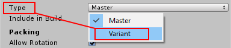

## Variant Sprite Atlas
一个 [Variant Sprite Atlas](../README.md) 是一个 Sprite Atlas 类型，不包含其自己的选定纹理列表，因为其属性中没有打包对象列表。相反，它接收设置为其 **Master Atlas** 的一个 Sprite Atlas 内容拷贝。

Variant Sprite Atlas 是[Sprite Atlas工作流程](../../SpriteAtlasWorkflow/README.md)中的可选步骤。它们的主要目的是创建另一个Sprite Atlas的纹理的变体，但具有不同的[缩放](#scale-the-textures-of-a-variant-sprite-atlas)分辨率。

创建变体精灵图集：
1. 准备Sprite Atlas，它将成为Variant Atlas的Master Atlas。它包含Variant Atlas将从中获取其自身内容的Texture Assets。
2. 创建一个新的Sprite Atlas，并将其Type设置为'Variant'。  

3. 将在步骤1中准备的Sprite Atlas分配给此属性，以将其设置为Variant的Master。  

由于没有Master Atlas的Variant Atlas本身不包含任何内容，因此Unity不会将其打包到.spriteatlas资源中。

在既包含Master Atlas又包含Variant Atlas的项目中，如果两者都包含在Build中，则相互Sprite使用的Textured可以来自任一Sprite Atlas（请参阅[Resolving different Sprite Atlas scenarios](../../PreparingSpriteAtlasesForDistribution/ResolvingdifferentSpriteAtlasScenarios/README.md)页面的场景3）。

若要从 Variant Atlas 而不是从 Master Atlas 自动加载 Sprite Textures，请仅对 Variant Atlas 启用 **Include in Build**，并为 Master Atlas 禁用它。然后，构建会在运行时自动加载Variant Sprite Atlas而不是Master Atlas。

### Scale the Textures of a Variant Sprite Atlas
Variant Sprite Atlas通过其Scale属性缩放从其主地图集获得的纹理。Variant Atlas纹理的分辨率是Master Atlas纹理乘以比例因子的结果。

将变异图集的比例设置为0.1到1：  
  

使用相同的主图集和不同的比例值创建多个变式图集，以创建较低分辨率的图集纹理副本。如果要为具有不同硬件限制的一系列平台创建各种变型图集，这将很有用。