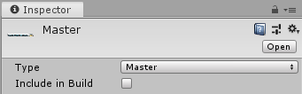

## Preparing Sprite Atlases for distribution
一个项目可以具有多个Sprite地图集用于不同的目的（例如，Variant Atlases 以 lower-resolution 与不同的限制硬件纹理）。如果启用所有可用的Sprite Atlas，则可能会遇到冲突（有关更多信息，请参阅解决不同的Sprite Atlas场景）。

为防止这些问题，请按照以下步骤正确准备要分发的Sprite Atlas：
1. 在Sprite Atlas中禁用 ‘Include in Build’ 属性。
2. 选择一种分发地图集的方法。
3. 使用脚本通过后期绑定加载地图集。

### Disable ‘Include in Build’
默认情况下，Unity在项目的构建中包含Sprite Atlases，并在运行时自动加载它们。清除选定的Sprite Atlas 的 **Include in Build** 设置以禁用此行为。  

如果禁用了 **Include in Build**，则Unity仍将Sprite Atlas打包到Project的Assets文件夹中的* .spriteatlas文件中。但是，在禁用的Sprite Atlas中引用纹理的Sprite看起来是不可见的，因为参考纹理不可用或未加载。Unity在项目的已发布版本中不包含禁用的Sprite Atlas，并且不会在运行时自动加载。为此，需要一个脚本通过Late Binding加载Sprite Atlas 。