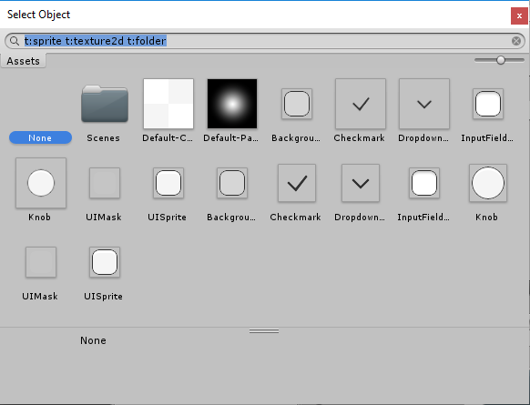
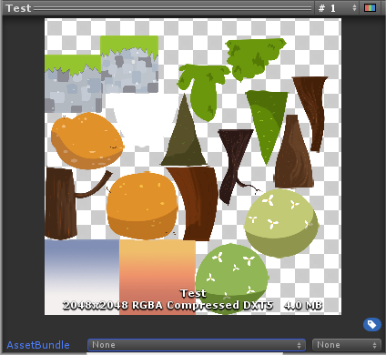

## Sprite Atlas workflow
请按照以下步骤创建Sprite：
1. 创建一个[Sprite Atlas](#create-a-sprite-atlas-asset) 资源。
2. 选择要打包到Sprite Atlas 中的[对象列表](#selecting-items-for-the-objects-for-packing-list)。
3. 启用Sprite Atlas上的 [Include in Build](#include-in-build) 以将它们包括在项目中。
4. （可选）创建[Variant Sprite Atlas](../MasterAndVariantSpriteAtlases/VariantSpriteAtlas/README.md)。
5. （可选）准备要[分发](../PreparingSpriteAtlasesForDistribution/README.md)的 Sprite Atlas 。
    * 准备分发的精灵需要使用脚本通过 [Late Binding](../PreparingSpriteAtlasesForDistribution/LateBinding/README.md) 加载。
6. （可选）在项目中[优化](#how-to-optimize-sprite-atlas-usage-and-size-for-improved-performance) Sprite Atlas的用法和大小以提高性能。

### Create a Sprite Atlas Asset
创建**Sprite Atlas**资源，转到**Asset > Create > Sprite Atlas**。Unity在Asset文件夹中创建Sprite Atlas，文件扩展名为* .spriteatlas。

### Selecting items for the Objects for Packing list
**Objects for Packing**列表显示 Sprite Atlas 中当前选定的项目。您可以在此列表中放置Texture2D和Sprite资源。将文件夹直接拖放到列表中，即可自动将文件夹中的所有有效内容添加到列表中（仅文件夹出现在列表中）。

为列表选择特定项目：
1. 选择Sprite Atlas资源，然后在其 Inspector 窗口中找到 Objects For Packing 列表窗口。它将显示当构建Sprite Atlas时要打包的Unity项目列表。  

2. 要添加项目，请选择列表右下方的加号（+）图标以创建新行。将有效资产拖动到空行以将其添加到列表，或选择该行右侧的圆圈图标以打开 **Select Object** 窗口。从 **Object Picker** 窗口中选择资产，将其添加到列表中：  
  
要从列表中删除项目，请单击 Objects For Packing 列表右下方的减号（-）图标。要替换项目，请将另一个项目拖到它要替换的行上，以将其替换在列表中。
3. 选择 **Pack Preview** 以在 **Asset Preview** 窗口中预览组合的Atlas纹理。  

### Include in Build
创建时，默认情况下，所有Sprite Atlas都将启用 **Include in Build**。这意味着Unity将在项目的构建中
包含Sprite Atlases。将项目，并在构建运行时自动加载它们。启用或禁用 **Include in Build** 属性，以控制将哪些Sprite Atlas包含在Project构建中。  
  
清除 ‘Include in Build’ 会[禁用](../PreparingSpriteAtlasesForDistribution/README.md)此行为，并且在准备分发 Sprite Atlas时会完成此操作。

### How to optimize Sprite Atlas usage and size for improved performance
当精灵在场景中
处于活动状态时，，Unity加载其所属的Sprite Atlas及其包含的所有纹理。如果场景中没有任何东西使用大多数贴图时，如果Unity用非常大的贴图加载Sprite Atlas，这可能会导致过多的性能开销。

为了优化Sprite Atlas的使用，理想情况下，场景中活动的所有或大多数Sprite应该属于同一Atlas。优良作法是根据“精灵纹理”的常用用法将其拆分为多个较小的地图集。

减少性能开销的另一种方法是减少Sprite Atlas中压缩纹理之间的空白空间。这样可以减少Sprite Atlas的大小。为此，请选择Sprite Atlas，然后在其 Inspector 设置底部的 Pack Preview 窗口中检查打包的Atlas纹理。如果没有可用的预览，请选择 Objects for Packing 列表下的 Pack Preview 按钮以生成打包的纹理。  
  
*Sprite Atlas with excess empty space.*

如果可见多余的空白空间，则可以手动减小打包的Texture的大小，以减少空白空间的数量并优化Atlas的大小。为此，请转到 Inspector 窗口底部的 **Platform-specific overrides** 面板。从 **Max Texture Size** 设置的下拉菜单中选择一个较低的值，然后选择 **Pack Preview** 以重新生成打包的纹理。  
  
*Set the Max Texture Size.*

当 **Max Texture Size** 值小于“ Sprite Atlas纹理”的当前尺寸时，Unity会减小打包的“纹理”尺寸，以使其与设置的 **Max Texture Size** 尽可能接近，并自动修剪掉多余的空白空间。如果所选的Sprite Textures超出了Sprite Atlas 的 **Max Texture Size** 设置，则Sprite Atlas将忽略 **Max Texture Size** 设置，并保持包含Sprite Textures原始尺寸所需的最小尺寸。  
  
*Textures in a Sprite Atlas remain in their original dimensions.*