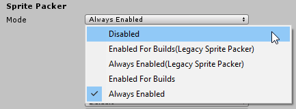

## Sprite Packer Modes
启用或禁用Sprite Atlas默认打包行为，打开编辑器设置（菜单：**Edit > Project Settings > Editor**），然后导航至**Sprite Packer > Mode**。选择Sprite Packer 模式，以确定Unity如何在编辑器中使用Sprite Atlas。  
  
* **Disabled**: Sprite Atlas包装在项目中被禁用。当项目进入播放模式或发布构建版本时，Sprite Atlas不会被构建。包预览也被禁用。  
* **Enabled for Builds (Legacy Sprite Packer)**: 选择此模式将启用遗留的Sprite封隔器并禁用精灵图集，因为它们不能同时启用。Unity用遗留的Sprite打包器打包精灵，只用于发布的版本。编辑器和播放模式参考原始的源纹理，而不是填充图集中的纹理。  
* **Always Enabled (Legacy Sprite Packer)**: 选择此模式将启用遗留的Sprite Packer并禁用Sprite Atlas，因为它们不能同时启用。Unity用遗留的Sprite打包器将选择的纹理打包到地图集中，Sprites在运行时参考打包的纹理。然而，精灵会在编辑模式中引用原始的未打包纹理。
* **Enabled for Builds**: Unity将精灵打包到精灵地图中，只用于发布版本。编辑器和播放模式参考原始的源纹理，而不是在Sprite图集中的纹理。
* **Always Enabled**: 默认情况下启用此选项。Unity将选择的纹理打包到Sprite图册中，Sprite在运行时参考打包的纹理。然而，精灵会在编辑模式中引用原始的未打包纹理。