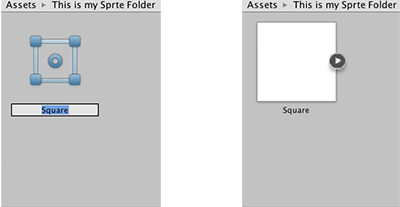

## Sprite Creator
使用此工具，您可以创建临时占位符精灵（2D）图形。您可以在开发期间在项目中使用它们，然后将它们替换为要使用的图形。

### Accessing the Sprite Creator
选择 **Assets>Create>Sprites**，然后选择要制作的占位符精灵（正方形，三角形，菱形，六边形或多边形）。
  
*访问精灵创建者*

### Using the Sprite
新的占位符精灵在您当前打开的资产文件夹中显示为白色。新精灵的名称默认为其形状名称，但是您可以选择在首次创建时重命名它。如果您不确定要调用的名称，则将其保留为默认值。您可以稍后通过单击对其进行更改。  
  
*为您的新精灵命名（或将其保留为默认值）*  
您可以将占位符精灵拖放到 **Scene View** 或 **Hierarchy** 中以开始在项目中使用它。  
  
*将占位符精灵拖放到“场景视图”中*

### Replacing your Placeholder Sprite
要更改占位符精灵，请在 **Scene View** 中单击它，然后通过 **Inspector** 中的 **Sprite Renderer Component** 进行编辑。  
  
*通过Inspector工具中的Sprite Renderer组件替换Sprite*

编辑**Sprite**字段：您可以单击输入字段右侧的小圆圈以显示**Sprite Selector**，您可以在其中浏览并从可用的2D图形资源菜单中进行选择。  
  
*精灵选择器*

## Details
* Sprite Creator制作4x4白色PNG轮廓纹理。
* 占位符精灵是由算法生成的完美的原始多边形（例如，三角形，六边形，n边多边形）。
* 注意：占位符精灵不像3D图元：占位符是一种资产，并且作为多面多边形，可以表示许多不同的形状，因此占位符精灵的构建不像3D图元。