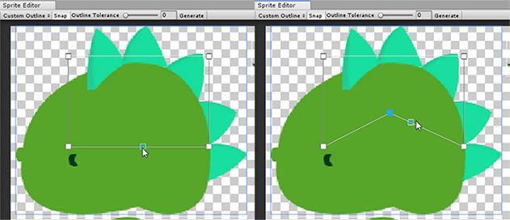

## Sprite Editor: Custom Outline
使用[Sprite Editor](../README.md)的 **Custom Outline** 选项来编辑Unity渲染Sprite的纹理上的[网格](https://docs.unity3d.com/Manual/class-Mesh.html)形状。自定义轮廓编辑器允许您使用控制点来创建和定义Sprite的网格轮廓的形状。

默认情况下，Unity在矩形网格上渲染每个Sprite。此网格可能包括纹理边界之外的透明区域，以及渲染这些透明区域可能会对性能产生负面影响。使用“自定义轮廓”编辑器定义与“精灵纹理”的轮廓匹配的“网格”轮廓时，可以减小透明区域的大小，从而提高性能。  

要访问“自定义轮廓”编辑器，请选择一个Sprite，然后在其 **Inspector** 窗口中选择 [Sprite Editor](../README.md)。点击**Sprite Editor**窗口左上方的下拉菜单，然后选择**Custom Outline**。  
  
Selecting Custom Outline

### Automatically generating a Mesh outline
Unity可以自动为您生成一个网格轮廓。Custom Outline 模式具有用于调整Unity如何执行的设置。  
  
*The **Outline Tolerance** slider and associated settings for automatically generating an Outline*  

#### Properties

| 属性 | 功能 |
|:-------|:------|
| Snap |捕捉控制点指向最近的像素。启用它以有效使用轮廓公差。|
|Outline&nbsp;Tolerance|使用滑块控制生成的网格轮廓的复杂度和准确性。Sprite Editor的最小值（0）会在Sprite周围以最少的控制点数量生成基本的Mesh轮廓。Sprite编辑器以最大值（1）生成具有许多控制点的Mesh轮廓和紧密贴近Mesh的紧密Mesh，该网格紧随Sprite的像素轮廓。|
|Generate|单击以自动创建网格轮廓。|

自动生成网格轮廓：

1. 选择一个精灵，导航到**Sprite Editor > Custom Outline**窗口，然后选择 **Generate**。编辑器自动生成一个遵循Sprite透明边框的“网格”轮廓。
2. 启用**Snap**以确保生成的“网格”轮廓遵循“精灵纹理”的形状。
3. 使用**Outline Tolerance**滑块来调整生成的“网格”轮廓尝试遵循“精灵纹理”轮廓的紧密程度。这会影响网格轮廓的整体复杂性以及生成的控制点的数量。
4. 选择 **Generate** 以在每次更改后刷新“网格”轮廓。  

*Left: An automatically generated Mesh outline with a low Outline Tolerance.*  
*Right: An automatically generated Mesh outline with a high Outline Tolerance.*  

### Creating a custom Mesh outline
您可以创建自己的自定义网格轮廓。如果您希望“网格”与“精灵纹理”更小，更大或不同，这将非常有用。按照此工作流程创建自定义网格轮廓。

**Create a Mesh outline**：单击并拖动Sprite以创建具有四个控制点的矩形网格轮廓。重复此步骤可在Sprite中创建多个网格轮廓。Unity仅渲染包含在网格轮廓内的区域。  
  
*Creating Mesh outlines*  

**Change the shape of a Mesh outline**：要调整网格轮廓的形状，请单击并拖动控制点。将鼠标悬停在控制点上时，它会变成蓝色，表明您可以选择它。单击并将控制点拖动到其他位置，以调整“网格”轮廓的形状。  
  
*Changing the shape of a Mesh outline*

**Add a control point to a Mesh outline**：要添加控制点，请将鼠标悬停在网格轮廓的一部分上。控制点的预览会沿着“网格”轮廓的边缘出现。单击以在该位置添加新的控制点。  
  
*Adding a control point to a Mesh outline*

**Move a section of Mesh outline between control points**：要在两个控制点之间移动截面，请在将鼠标悬停在“网格轮廓”部分上时按住**Ctrl**。网格轮廓的此部分变为黄色。按住**Ctrl**的同时，单击并拖动该部分以将其移动到其他位置。  
  
*Moving a section of Mesh outline between two control points*