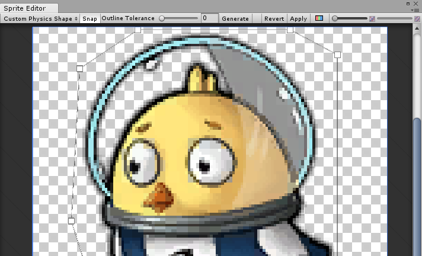
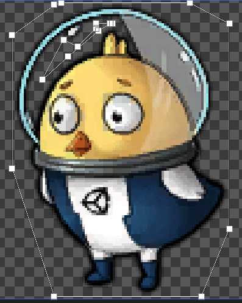
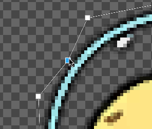
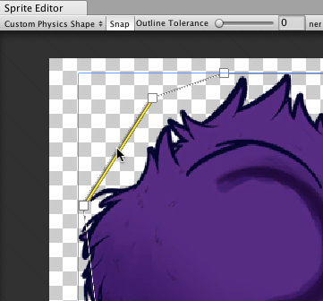
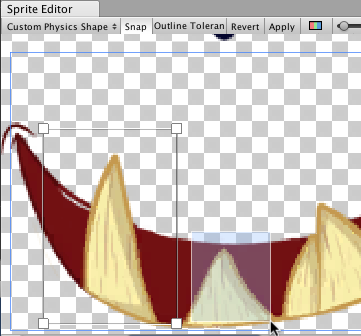
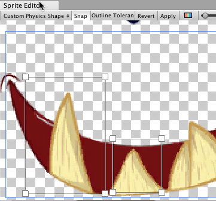

## Sprite Editor: Custom Physics Shape
### Overview
该**Sprite**编辑器的 **Custom Physics Shape** 使您可以编辑Sprite的Physics Shape，该形状定义了Sprite的[Collider 2D](https://docs.unity3d.com/Manual/Collider2D.html) Mesh的初始形状。您可以通过**Collider**
组件设置进一步细化物理形状。

编辑精灵的物理形状：

1. 在“项目”窗口中，选择要更改的Sprite。
2. 在**Inspector**窗口中，单击**Sprite Editor**按钮。
3. 在“精灵编辑器”窗口中，选择左上方的下拉菜单，然后选择**Custom Physics Shape**。  
  
*Editing a Custom Physics Shape*

### Properties
|属性|功能|
|:---|:---|
|Snap|捕捉控制点指向最近的像素。|
|Outline&nbsp;Tolerance|使用此选项可以控制生成的轮廓紧贴Sprite纹理轮廓的轮廓。Sprite编辑器以最小值（0）生成围绕Sprite的基本轮廓。Sprite Editor以最大值（1）生成一个轮廓，该轮廓尽可能接近Sprite的像素轮廓。|
|Generate|单击以自动创建物理形状轮廓。|

### Standard workflow
首先打开所选Sprite的Sprite Editor。然后，从编辑器的左上方下拉菜单中选择**Custom Physics Shape**。  
  

然后单击**Generate**以创建物理形状的轮廓。默认情况下，Unity会按照原始Sprite纹理的形状生成轮廓，并且还要考虑透明区域。  
  
*The generated outline and control points*  

调整**Outline Tolerance**滑块以细化“物理形状”的轮廓。调整**Outline Tolerance**值后，单击 **Generate** 以刷新轮廓。  
  
*Outline Tolerance slider*

单击并拖动每个控制点以精炼物理形状的轮廓。要删除控制点，请选择一个控制点，然后按 **Command+Del/Del** 键。  
  
*Moving a control point*

当鼠标悬停在轮廓上时，沿边缘会出现一个透明的控制点。单击以在该位置创建一个新的控制点。通过选择一个控制点并按**Del/Command+Del**键来删除它。  

*Fig.1: Transparent control point.*  

  
*Fig.2: Click to create new control point.*

单击并拖动一个区域以选择多个控制点。您可以在选择时完全定位或删除它们。  
  
*Selecting multiple control points*

按住 **Control/Ctrl** 键，可以选择边缘而不是控制点。单击突出显示的边缘以将其拖动到新位置。  
  
*Fig.1: Select the edge of the outline.*

  
*Fig.2: Drag and move the edge freely once selected.*

### Working With Multiple Outlines

单个物理形状可以包含多个单独的轮廓。如果仅Sprite的特定区域需要碰撞器2D网格进行碰撞，则此功能很有用。例如，作为游戏机制的一部分，您可能希望角色仅对Sprite特定区域上的碰撞做出反应，以防损坏。

在“精灵编辑器”窗口中单击并拖动到任何空白处，以创建具有4个控制点的新矩形轮廓。重复此步骤以创建其他轮廓。您可以按照与单个“物理形状”轮廓相同的方式来细化每个轮廓。

  
*Fig. 1: Click and drag to create 4-point box.* 

  
*Fig. 2: Box physics shape with 4 control points.*  

  
*Fig. 3: Click and drag again for another box.*

  
*Fig. 4: Repeat to create more separate outlines.*

## Additional tips
如果您编辑了现有 GameObjects 已引用 Sprite 的轮廓，右键单击Collider 2D组件的标题，然后选择重置。这将更新Collider 2D网格的形状。  
