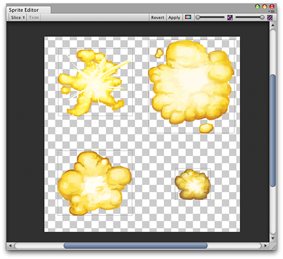
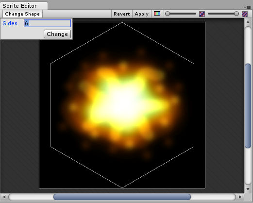

## Sprite Editor
有时Sprite Texture仅包含一个图形元素，但是将多个相关图形组合在一起成为一个图像通常更为方便。例如，图像可以包含单个字符的组成部分，就像车轮独立于车身移动的汽车一样。通过提供一个Sprite编辑器，Unity可以轻松地从合成图像中提取元素。  
**注意**：确保要编辑的图形的 **Texture Type** 设置为 **Sprite (2D and UI)**。有关导入和设置Sprite的信息，请参见[Sprites](../README.md)。

具有多个元素的Sprite Textures需要在 **Inspector** 中将**Sprite Mode**设置为**Multiple**。（下面的“纹理导入检查器”图像。）

### Opening the Sprite Editor  
打开精灵编辑器：
1. 从 **Project View** 中选择要编辑的2D图像。该（图1：Project View）。  
    请注意，您无法通过在 **Scene View** 选择一个Sprite来编辑。
2. 单击 **Texture Import Inspector** 中的 **Sprite Editor** 按钮。（图2：纹理导入检查器），然后显示**Sprite Editor** （图3：Sprite Editor）。

注意：只有将所选图像上的 **Texture Type** 设置为 **Sprite (2D and UI)** 时，您才能看到 **Sprite Editor** 按钮。  
  
*Project View*  
  
*Texture Import Inspector with Sprite Editor button*  

注意：如果图像包含多个元素，请在 **Texture Import Inspector** 中将 **Sprite Mode** 设置为 **Multiple**。  

  
*Sprite Editor*  
与合成图像一起，您将在窗口顶部的栏中看到许多控件。右上方的滑块控制缩放，而其左侧的颜色栏按钮则选择查看图像本身还是其Alpha级别。最右边的滑块控制纹理的像素化（mipmap）。向左移动滑块会降低“精灵纹理”的分辨率。最重要的控件是左上角的 **Slice** 菜单，该菜单为您提供用于自动分离图像元素的选项。最后，**Apply**和**Revert**按钮允许您保留或放弃所做的任何更改。  

### Using the Editor
使用编辑器的最直接方法是手动识别元素。如果单击图像，您将看到一个矩形选择区域，该区域的拐角处带有手柄。您可以拖动矩形的手柄或边缘以围绕特定元素调整其大小。隔离一个元素后，您可以通过在图像的单独部分中拖动一个新的矩形来添加另一个元素。您会注意到，当您选择一个矩形时，一个面板会出现在窗口的右下方：  
  

面板中的控件使您可以为Sprite图形选择名称，并通过其坐标设置矩形的位置和大小。可以以像素为为单位指定左，上，右和下的边框宽度。[9-Slicing](../9-SlicingSprites/README.md)精灵时，边框非常有用。Sprite的轴也有一些设置，Unity将其用作图形的坐标原点和主要“锚点”。您可以从多个默认的矩形相对位置（例如，“中心”，“右上角”等）中进行选择，也可以使用自定义坐标。

Slice菜单项旁边的 **Trim** 按钮将调整矩形的大小，以使其根据透明度紧紧围绕图形的边缘。

注意：仅UI支持边框，系统中的内容，不适用于2D SpriteRenderer。 

### Automatic Slicing
手动隔离Sprite矩形效果很好，但是在许多情况下，Unity可以通过检测图形元素并自动为您提取来节省您的工作。如果单击控制栏中的 **Slice** 菜单，将看到以下面板：  
  

将切片类型设置为**Automatic**时，编辑器将尝试通过透明度猜测Sprite元素的边界。您可以为每个已标识的Sprite设置默认枢轴。通过 **Method** 菜单，您可以选择如何处理窗口中的现有选择。在删除现有的选项将只需更换任何已经被选中，智能将尝试同时保留或调整现有的创建新的矩形，并安全将增加新的矩形不到位已经在改变任何东西。

切片类型还提供 **Grid by Cell Size** 或 **Grid by Cell Count** 选项。如果在创建过程中已经将Sprites布置为常规模式，这将非常有用：  
  

**Pixel Size** 值确定以像素为单位的图块的高度和宽度。如果您选择按单元格计数的网格，则 **Column & Row** 确定用于切片的列和行的数量。您还可以使用 **Offset** 值从图像的左上角移动网格位置，并使用 **Padding** 值从网格稍微插入“精灵”矩形。该 **Pivot** 可以与九个预设位置或一个被设置**Custom Pivot**位置可任意设置。

请注意，在使用任何自动切片方法之后，仍可以手动编辑生成的矩形。您可以让Unity处理Sprite边界和枢轴的粗略定义，然后自己进行任何必要的微调。  

### Polygon Resizing  
打开多边形的 **Sprite Editor**，您可以选择更改其形状，大小和枢轴位置。

#### Polygon shape
  
*Sprite Editor: Polygon resizing - shape*

在“ 边数”字段中输入希望多边形具有的边数，然后单击“ 更改”。

#### Polygon size and pivot
  
*Sprite Editor: Polygon resizing - size and pivot point - click on the polygon to display these options*

##### Polygon size
要更改多边形的大小，请单击Sprite以显示绿色边框线和Sprite信息框。单击并拖动绿线以创建所需的边框，并且**Border** 字段中的值会更改。

##### Polygon pivot
要更改多边形的枢轴点（即多边形移动的轴点），请在图像上单击以显示Sprite信息框。单击 **Pivot** 下拉菜单，然后选择一个选项。这将在多边形上显示一个蓝色的枢轴圆。其位置取决于您选择的支点选项。如果要进一步更改它，请选择 **Custom Pivot**，然后单击并拖动蓝色枢轴圆以将其定位。