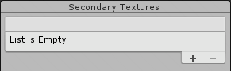
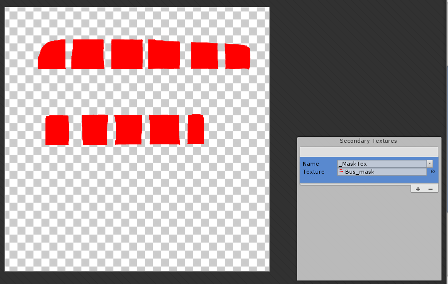

## Sprite Editor: Secondary Textures
Sprite编辑器的 **Secondary Textures** 模块可以将其他纹理与编辑的Sprites相关联。一个 **shader** 可以对这些次要纹理进行采样，以对Sprite施加其他效果，例如法线贴图。当前仅**Sprite Renderers**支持次要纹理，不适用于其他Renderer组件。

要使用此功能，请从**Sprite Editor**窗口左上方的下拉菜单中选择**Secondary Textures**模块。  
  

### Adding a Secondary Texture
要添加新的次要纹理条目，请选择 **Secondary Textures** 面板右下方的 “+” 。您最多可以为每个Sprite或Sprite Sheet添加八个辅助纹理。每个添加的辅助纹理在列表中显示为一个条目，带有两个字段：名称和纹理。  

您可以在“名称”字段中为“辅助纹理”输入自定义名称。一些Unity软件包建议可与其着色器一起使用的纹理名称。“名称”字段右侧的下拉箭头显示有效建议名称的列表。即使卸载了相关的软件包，建议的名称仍保留在下拉菜单中。  

使用与主“精灵”纹理相同的UV坐标对次要纹理进行采样。将次要纹理与主“精灵”纹理对齐，以确保正确显示其他纹理效果。  

要在“ Sprite编辑器”窗口中预览“ Sprite Texture”（主纹理）的状态下预览“ Secondary Texture”（辅助纹理），请在列表中选择一个条目。在“辅助纹理”列表的外部单击以取消选择该条目，然后将再次显示主“ Sprite Texture”。  

### Deleting a Secondary Texture
要从列表中删除辅助纹理，请选择它，然后选择窗口右下角的“-”按钮。  

### Applying the Changes
要将更改应用到已编辑的Sprite，请选择工具栏上的“应用。没有名称或所选纹理的条目将被视为无效，并且在应用更改后会被自动删除。  
