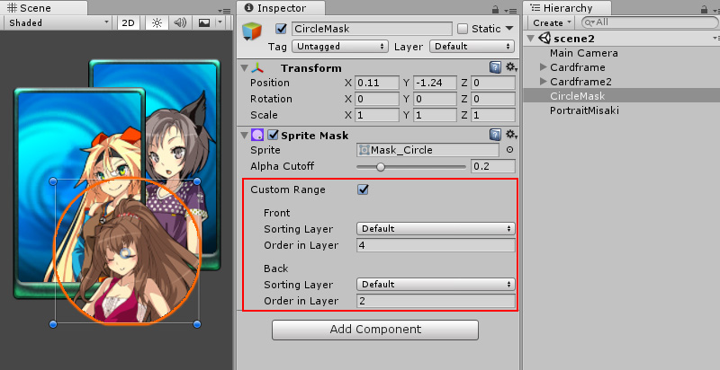

## Sprite Masks
Sprite遮罩用于隐藏或显示Sprite或Sprites组的。该 **Sprite Mask** 只影响使用的对象 **Sprite Renderer** 组件。

### Creating a Sprite Mask
要创建Sprite Mask，请从主菜单GameObject> 2D Object> Sprite Mask中选择。  
  
*Creating a Sprite Mask from the menu*

  
*A new Sprite Mask GameObject is created in the Scene*

### Properties

|Property|Function|
|:-------|:-------|
|Sprite|用作遮罩的Sprite。|
|Alpha&nbsp;Cutoff|如果Alpha包含透明区域和不透明区域之间的混合，则可以手动确定要显示其区域的截止点。您可以通过调整“ Alpha截止”滑块来更改此截止。|
|Range&nbsp;Start|范围起点是蒙版从其开始进行蒙版的排序层。|
|Sorting&nbsp;Layer|用于 mask Sorting Layer。|
|Order&nbsp;in&nbsp;Layer|用于 mask 的 Sorting Order.|
|Range End||
|Mask All|默认情况下，遮罩将影响其后面的所有排序层（较低的排序顺序）。|
|Custom|范围末端可以设置为自定义排序层和层顺序。|

### Using Sprite Masks
  
*The Sprite to be used as a mask needs to be assigned to the Sprite Mask Component*

Sprite Mask GameObject 本身在场景中不可见，而仅与Sprites交互。要在场景中查看 Sprite Masks，在 Scene Menu 中选择Sprite Mask选项。  
  
*Scene view with Sprite Mask view turned on in the scene* 

Sprite Masks 始终有效。受Sprite蒙版影响的Sprite必须在Sprite Renderer中设置其Mask Interaction。  
  
*The character sprites Mask Interaction is set to Visible Under Mask thus only parts of the sprite that are in the mask area are visible*

默认情况下，Sprite Mask 会影响将其 Mask Interaction 设置为“在蒙版下可见”或“不可见”的场景中的任何精灵。通常，我们希望蒙版仅影响特定的精灵或一组精灵。  
  
*The character sprites are interacting with masks on both the cards*

确保蒙版与特定精灵交互的一种方法是使用排序组组件。  
  

控制蒙版效果的另一种方法是使用Sprite蒙版的“自定义范围设置”。  
  
*A Sprite Mask with a Custom Range setting ensures the mask will affect only Sprites in the specified Sorting Layer or Order in Layer range*

范围起点和范围终点提供了根据精灵的排序层或图层顺序有选择地掩盖精灵的功能。  
