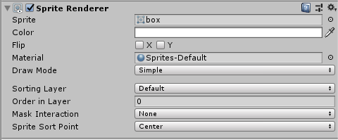

## Sprite Renderer
**Sprite Renderer**组件渲染**Sprite**和用于控制在场景中的视觉呈现对于 [2D and 3D projects](https://docs.unity3d.com/Manual/2Dor3D.html)。  
当你创建一个Sprite(**GameObject > 2D Object > Sprite**),Unity自动创建一个附加**Sprite Renderer**的对象。你也可以通过 **Components** 菜单给存在的对象添加该组件(**Component > Rendering > Sprite Renderer**)。

### Properties
  
*Sprite Renderer Inspector*

|Property|Function|
|:-------|:-------|
|Sprite|定义组件应渲染的Sprite纹理。单击右侧的小点以打开对象选择器窗口，然后从可用的Sprite资产列表中进行选择。|
|Color|定义Sprite的顶点颜色，以着色或重新着色Sprite的图像。使用颜色选择器设置渲染的Sprite纹理的顶点颜色。有关示例，请参见此表下方的[颜色](#color)部分。|
|Flip|沿选中的轴翻转“精灵”纹理。这不会翻转GameObject的Transform位置。|
|Material|定义用于渲染Sprite纹理的[Material](#)|
|Draw&nbsp;Mode|定义Sprite尺寸更改时的缩放方式。从下拉框中选择以下选项之一。|
|&nbsp;&nbsp;&nbsp;&nbsp;Simple|尺寸改变时，整个图像将缩放。这是默认选项。|
|&nbsp;&nbsp;&nbsp;&nbsp;Sliced|如果 Sprite 是 [9-sliced](../9-SlicingSprites/README.md)选择这个模式。|
|&nbsp;&nbsp;&nbsp;&nbsp;&nbsp;&nbsp;&nbsp;&nbsp;Size&nbsp;(‘Sliced’&nbsp;or&nbsp;‘Tiled’)|输入精灵的新宽度和高度，以正确缩放9切片的精灵。您还可以在应用9切片属性时使用[Rect变换工具](../9-SlicingSprites/README.md)缩放Sprite。|
|&nbsp;&nbsp;&nbsp;&nbsp;Tiled|默认情况下，此模式会导致9切片Sprite的中间在其尺寸更改时平铺而不是缩放。使用平铺模式控制Sprite的平铺行为。|
|&nbsp;&nbsp;&nbsp;&nbsp;&nbsp;&nbsp;&nbsp;&nbsp;Continuous|这是默认的平铺模式。在“连续”模式下，更改“精灵”尺寸时，中间部分会平铺。|
|&nbsp;&nbsp;&nbsp;&nbsp;&nbsp;&nbsp;&nbsp;&nbsp;Adaptive|在“自适应”模式下，类似于“简单”模式，Sprite纹理在其尺寸更改时会拉伸。当更改的尺寸的比例符合“拉伸值”时，中间部分开始平铺。|
|&nbsp;&nbsp;&nbsp;&nbsp;&nbsp;&nbsp;&nbsp;&nbsp;Stretch Value|使用滑块将值设置为0到1。最大值为1，表示原始Sprite比例的两倍。|
|Sorting Layer|设置Sprite 的[Sorting Layer](https://docs.unity3d.com/Manual/class-TagManager.html)，在渲染期间控制其优先级。从下拉框中选择一个现有的排序层，或创建一个新的排序层。|
|Order In Layer|在Sprite的[Sorting Layer](https://docs.unity3d.com/Manual/class-TagManager.html)中设置Sprite的渲染优先级。编号较低的Sprite首先渲染，编号较高的Sprite与下面的Sprite重叠。|
|Mask Interaction|设置与Sprite Mask交互时Sprite Renderer的行为。请参阅下面的“ 掩膜交互”部分中的不同选项示例。|
|&nbsp;&nbsp;&nbsp;&nbsp;None|Sprite Renderer不会与场景中的任何Sprite Mask交互。这是默认选项。|
|&nbsp;&nbsp;&nbsp;&nbsp;Visible Inside Mask|Sprite在Sprite Mask覆盖的位置可见，但不在其外部。|
|&nbsp;&nbsp;&nbsp;&nbsp;Visible Outside Mask|Sprite在Sprite Mask的外部可见，但在其内部却不可见。Sprite Mask隐藏了它所覆盖的Sprite的各个部分。|
|Sprite Sort Point|计算Sprite和相机之间的距离时，在Sprite的中心或其枢轴点之间进行选择。有关更多详细信息，请参见[精灵排序点](#sprite-sort-point)部分。|

### Details
#### Color
下图演示了在Sprite Renderer的“颜色”设置中更改RGB值的效果。要更改Sprite的不透明度，请更改其Color属性的Alpha（A）通道的值。  
  
*Left: The original Sprite. Right: The Sprite with its RGB colors set to red.*
#### Material
使用材质的[材质和着色器设置](https://docs.unity3d.com/Manual/Materials.html)来控制Unity渲染方式。有关这些设置的更多信息，请参考[材质，着色器和纹理](https://docs.unity3d.com/Manual/Shaders.html)。

新创建的Sprite的默认材质为**Sprites-Default**。场景照明不会影响此默认Sprite。要使Sprite对照明有反应，请改为指定材质 **Default-Diffuse**。为此，请单击“材质”字段旁边的小圆圈以调出对象选择器窗口，然后选择 **Default-Diffuse** 材质。
#### Mask Interaction
遮罩交互控制Sprite Renderer与[Sprite遮罩](../SpriteMasks/README.md)的交互方式。从下拉菜单中选择 **Visible Inside Mask** 或 **Visible Outside Mask**。下面的示例使用方形Sprite和圆形Mask演示每个选项的效果：

要与Sprite蒙版进行交互，请从下拉菜单中选择 **Visible Inside Mask** 或 **Visible Outside Mask**。
  

#### Sprite Sort Point
仅当Sprite Renderer的Draw Mode设置为Simple时，此属性才可用。

在2D项目中，默认情况下，“主摄影机”设置为“ 正交投影”模式。在此模式下，Unity沿精灵视图的方向按其到相机的距离的顺序渲染精灵。
  

默认情况下，将Sprite的 **Sort Point** 设置为其Center，Unity测量相机的 Transform 位置与Sprite中心之间的距离，以确定其渲染顺序。

要设置与中心不同的 **Sort Point**，请选择 **Pivot** 选项。在[Sprite Editor](../SpriteEditor/README.md)中编辑Sprite的Pivot位置。