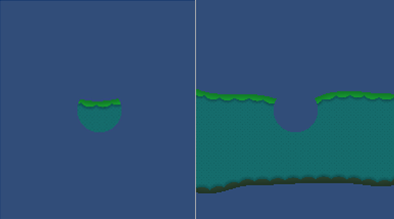

## Sprite Shape Renderer
Sprite Shape Renderer 组件渲染Unity沿[样条](https://docs.unity3d.com/Packages/com.unity.2d.spriteshape@2.1/manual/SSController.html#editing-the-spline)生成的几何图形，并控制它在场景中的视觉效果，适用于[2D和3D项目](https://docs.unity3d.com/Manual/2Dor3D.html)。它的输入来自于[Sprite Shape Profile](https://docs.unity3d.com/Packages/com.unity.2d.spriteshape@2.1/manual/SSProfile.html)。

### Properties
  
*Sprite Shape Renderer property settings*

|Property|Function|
|:-------|:-------|
|Color|定义Sprite形状几何图形的顶点颜色，该图形可对“ 精灵形状” 进行着色或重新着色。使用颜色选择器设置顶点。有关示例，请参见此表下方的[Color](https://docs.unity3d.com/Manual/class-SpriteRenderer.html#color)部分。|
|Mask Interaction|设置Sprite Renderer与Sprite Mask交互时的行为。请参阅下面的[Mask Interaction](../SpriteMasks/README.md)部分中的不同选项示例。|
|&nbsp;&nbsp;None|Sprite Shape Renderer不会与场景中的任何Sprite Mask交互。这是默认选项。|
|&nbsp;&nbsp;Visible Inside Mask|Sprite Shape在Sprite Mask覆盖的位置可见，但不在其外部。|
|&nbsp;&nbsp;Visible Outside Mask|Sprite Shape在Sprite Mask的外部可见，但在其内部不可见。SpriteMask隐藏了它所覆盖的Sprite Shape的各个部分。|
|Sorting Layer|设置Sprite Shape几何体的 Sorting Layer，以控制其在渲染优先级。从下拉框中选择一个现有的排序层，或创建一个新的排序层。|
|Order In Layer|在 Sprite Shape 的 Sorting Layer 中设置其渲染优先级。先渲染编号较低的Sprite形状，编号较高的Sprite形状与下面的形状重叠。|

### Details
#### Color
下面的示例显示了在**Sprite Shape Renderer**的 **Color** 设置上更改RGB值时会发生的情况。若要更改Sprite Shape的不透明度，请更改Alpha（A）通道的值，其中较低的值使Sprite看起来更透明，而较高的值使Sprite看起来更不透明。  
  
*Left: The original Sprite. Right: The Sprite with its RGB colors set to red.*

## Fill Material and Edge Material
使用 Material 的 [Material and Shader settings](https://docs.unity3d.com/Manual/Materials.html) 设置来控制Unity如何渲染“填充”和“边缘”几何形状。新的精灵形状的默认材质为 **Sprites-Default**。场景照明不会影响此默认 Sprite Shape。**Default-Diffuse**材质。为此，请单击 Material 字段旁边的小圆圈以显示 **Object Picker** 窗口，然后选择 **Default-Diffuse** 材质。有关这些设置的更多信息，请参考[Materials, Shaders & Textures](https://docs.unity3d.com/Manual/Shaders.html)。

## Mask Interaction
蒙版交互控制 Sprite Shape Renderer 与[Sprite Masks](../SpriteMasks/README.md)交互的方式。从 **Mask Interaction** 下拉菜单中选择“ 可见内部蒙版”或“ 可见外部蒙版 ” 。以下示例显示了两种选择的效果：  
  
*Left: With Visible Inside Mask enabled. Right: With Visible Outside Mask enabled.*