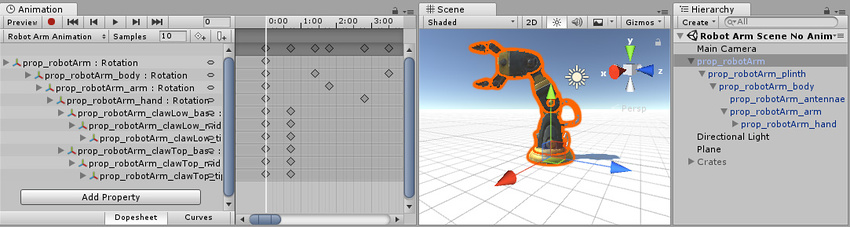

# Using the Animation view
Animation view用于在Unity中预览和编辑GameObjects动画剪辑。要在Unity中打开动画视图，打开**Window > Animation**。

## Viewing Animations on a GameObject
**Animation window** 关联Hierarchy window, Project window, Scene view, 和 Inspector window。比如 **Inspector** Animation window 显示当前选定的GameObject或 Animation Clip 资源的时间轴和关键帧。你可以使用 Hierarchy window 或者 Scene View 选择一个 GameObject, 或者使用 Project Window 选择一个 Animation Clip Asset。

## The Animated Properties list
在下面的图像中，Animation view（左）显示了当前选定的GameObject及其子GameObject（如果它们也受此Animation控制）使用的动画。该场景右侧的 Scene 和 Hierarchy 视图中，这表明Animation view显示了附加到当前所选GameObject的动画。

动画视图的左侧是动画属性的列表。在尚未录制动画的新创建的剪辑中，此列表为空

*显示一个空剪辑的“动画”视图。尚无属性显示在左侧。*

当您开始为该剪辑中的各种属性设置动画时，动画属性将显示在此处。如果动画控制多个子对象，则该列表还将包括每个子对象的动画属性的层次子列表。在上面的示例中，机械臂的GameObject层次结构的各个部分都在同一动画剪辑中进行了动画处理。

在像这样的单个剪辑中为GameObjects的层次结构设置动画时，请确保在层次结构的根GameObject上创建Animation。

可以折叠和展开每个属性，以显示每个关键帧上记录的确切值。如果播放头（白线）在关键帧之间，则值字段显示插值。您可以直接编辑这些字段。如果在播放头位于关键帧上方时进行了更改，则会修改关键帧的值。如果在播放头位于关键帧之间时进行了更改（因此显示的值是一个插值），则将使用您输入的新值在该点创建一个新的关键帧。