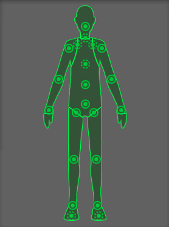

# Humanoid Avatars
Unity的动画系统具有处理人形角色的特殊功能。由于类人角色在游戏中非常普遍，因此Unity提供了专门的工作流程以及用于类人动画
的扩展工具集。
[Avatar system](https://docs.unity3d.com/Manual/ConfiguringtheAvatar.html)是Unity识别布局中特定动画模型是人形生物的方式，以及模型的哪些部分对应于腿，臂，头和身体。

由于不同人形角色之间骨骼结构的相似性，因此可以将动画从一个人形角色映射到另一个人形角色，从而可以重新定位
，从而和逆运动学__（IK）__。
