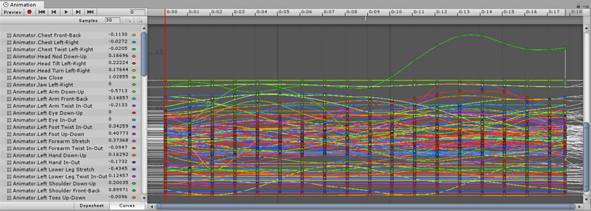
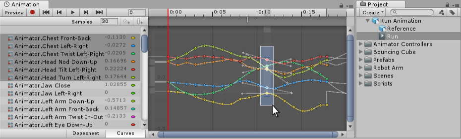

# Animation from external sources
来自外部源的动画以与常规3D文件相同的方式导入到Unity中。这些文件，无论是通用FBX文件还是3D软件（例如Autodesk®Maya®，Cinema 4D，Autodesk®3dsMax®或Blender™）的本机格式，都可以线性记录动作的形式包含动画数据。文件中对象的数量。

*导入的FBX 3D资源包含名为“run”的动画*

在某些情况下，要进行动画处理的对象（例如角色）和与之相关的动画可以存在于同一文件中。在其他情况下，动画可能存在于要制作动画的模型的单独文件中。
可能动画是特定于特定模型的，不能在其他模型上重用。例如，在你的游戏中，一个巨大的章鱼终极boss可能有一个独特的四肢和骨骼结构，以及它自己的一套动画。
在其他情况下，你可能有一个动画库，用于场景中各种不同的模型。例如，许多不同的类人角色可能都使用相同的walk和run动画。在这些情况下，通常在动画文件中有一个简单的占位符模型，用于预览它们。另外，也可以使用动画文件，即使它们没有任何几何图形，只有动画数据。
在导入多个动画时，动画可以作为单独的文件存在于项目文件夹中，也可以提取多个动画剪辑从一个单一的FBX文件，如果从motionbuilder 或 与 Autodesk®Maya® 插件/脚本或Autodesk®3ds Max®或其他3D软件包导出。如果您的文件包含多个单独的动画，并安排在一个时间轴上，您可能希望这样做。例如，一个较长的动作捕捉时间轴可能包含几个不同的跳跃动作的动画，您可能希望将其中的某些部分作为单独的剪辑使用，而放弃其余部分。Unity提供了动画切割工具来实现这一点，当你导入所有动画在一个时间轴，让你选择帧范围为每个剪辑。

## Importing animation files
在Unity中使用任何动画之前，它必须首先被导入到你的项目中。Unity可以进口本机Autodesk®Maya®(。Autodesk®3ds Max®(. Max)， Blender™(.blend)和Cinema 4D (.c4d)文件，以及可以[从大多数动画包导出](https://docs.unity3d.com/Manual/HOWTO-exportFBX.html)的通用FBX文件。注意，从.blend文件导入需要本地安装Blender™。

有关更多信息，请参见[导入](https://docs.unity3d.com/Manual/ImportingAssets.html)。

## Viewing and copying data from imported animation files
您可以在 Animation window 查看导入的动画剪辑的关键帧和曲线。有时，如果这些导入的剪辑的骨骼很多，关键帧很多，那么信息量可能看起来非常复杂。例如，下面的图像是类人动物运行动画在 Animation window 中的外观：

为了简化视图，请选择您要检查的特定骨骼。然后，Animation window将仅显示这些骨骼的关键帧或曲线。

*将视图限制为仅选定的骨骼*

查看导入的动画关键帧时，Animation window 提供了“动画”数据的只读视图。要编辑此数据，请在Unity中创建一个新的空动画剪辑（请参阅[创建新的动画剪辑](https://docs.unity3d.com/Manual/animeditor-CreatingANewAnimationClip.html)），然后从导入的动画剪辑中选择，复制动画并将其粘贴到新的可写动画剪辑中。

*从导入的剪辑中选择关键帧。*