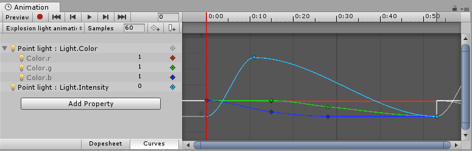

# Animation Clips
动画剪辑是Unity动画系统的核心元素之一。Unity支持从外部来源导入动画，并提供创从头开始在编辑器中使用动画窗口建动画剪辑的能力。

## Animation from External Sources
从外部来源导入的动画剪辑可能包括：
* 人形动画运动捕捉工作室
* 由艺术家在外部3D应用程序（例如Autodesk®3dsMax®或Autodesk®Maya®）中从头开始创建的动画
* 来自第三方库的动画集（例如，来自Unity资产商店的动画集）
* 从单个导入的时间轴剪切和切片多个片段。

*在Unity的Inspector窗口中查看的导入动画剪辑的示例*

## Animation Created and Edited Within Unity
Unity的动画窗口还允许您创建和编辑动画剪辑。这些剪辑可以设置动画：

* GameObjects的位置，旋转和比例
* 组件属性，例如材料的颜色，光的强度，声音的音量
* 自己脚本中的属性包括浮点数，整数，枚举，向量和布尔变量
* 在自己的脚本中调用函数的时间

*一个Unity动画窗口的示例，该窗口用于为组件的参数设置动画-在这种情况下，是点光源的强度和范围*