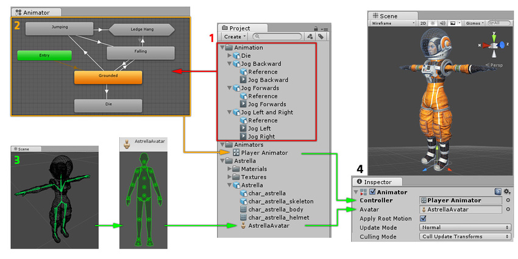

# Animation System Overview
Unity具有丰富而复杂的动画系统（有时称为“ Mecanim ”）。它提供：
* 轻松的工作流和动画设置适用于Unity的所有元素，包括对象，字符和属性。
* 支持[导入的动画片段](https://docs.unity3d.com/Manual/class-AnimationClip.html)和在Unity中创建的动画。
* [人形动画重新定位](https://docs.unity3d.com/Manual/Retargeting.html) - 能将动画从一种角色模型应用于另一种角色模型。
* 简化对齐动画剪辑的工作流程。
* 方便预览动画剪辑，它们之间的过渡和交互。这使动画师可以更独立于程序员工作，在连接游戏代码之前制作原型并预览其动画。
* 使用可视化编程工具管理动画之间的复杂交互。
* 用不同的逻辑对不同的身体部位进行动画处理。
* 分层和遮罩功能。

*Animator窗口中的动画状态机的典型视图*

## Animation workflow
Unity的动画系统基于[Animation Clips](https://docs.unity3d.com/Manual/AnimationClips.html)的概念，其中包含有关某些对象如何随时间改变其位置，旋转或其他属性的信息。每个剪辑都可以视为单个线性记录。外部来源的动画剪辑是由艺术家或动画师使用第三方工具（例如Autodesk®3dsMax®或Autodesk®Maya®）创建的，或者来自运动捕捉工作室或其他来源。

然后将动画剪辑组织成一个结构化的类似于流程图的系统，称为[Animator Controller](https://docs.unity3d.com/Manual/class-AnimatorController.html)。该 Animator Controller 作为一个 [[State Machine](https://docs.unity3d.com/Manual/AnimationStateMachines.html)]，跟踪当前正在播放哪个剪辑以及何时应将动画更改或融合在一起。

一个非常简单的Animator控制器可能只包含一个或两个剪辑，例如，用于控制加电旋转和弹跳，或在正确的时间为门的打开和关闭进行动画处理。更加高级的Animator Controller可能包含许多主要角色动作的人形动画，并且可能同时在多个剪辑之间融合，以使玩家在场景中移动时提供流畅的动作。

Unity的动画系统还具有许多特殊的功能，用于处理人形角色，让你能[重新定位](https://docs.unity3d.com/Manual/Retargeting.html)来自任何来源的人型化动画（例如：motion capture; the Asset Store; or some other third-party animation library）到你自己的人物模型，以及调整[肌肉定义](https://docs.unity3d.com/Manual/MuscleDefinitions.html)。这些特殊功能由Unity的[Avatar](https://docs.unity3d.com/Manual/AvatarCreationandSetup.html)系统启用，其中人形角色映射到通用内部格式。

这些片段中的每一个-动画剪辑，动画控制器和Avatar通过 GameObject 上的[Animator组件](https://docs.unity3d.com/Manual/class-Animator.html)组合在一起。该组件引用了Animator Controller和该模型的Avatar（如果需要）。反过来，“ Animator控制器”包含对其使用的“动画剪辑”的引用。

*动画系统的各个部分如何连接在一起*

上图显示了以下内容：
1. 动画剪辑是[从外部源导入](https://docs.unity3d.com/Manual/class-AnimationClip.html)的，或者是在Unity中创建的。在此示例中，它们是[导入的运动捕获人形动画](https://docs.unity3d.com/Manual/ConfiguringtheAvatar.html)。
2. 动画剪辑被放置并布置在 Animator Controller。 找 Animator window 中显示  Animator Controller 视图。这些状态（可能表示动画或嵌套的子状态机）显示为由线连接的节点。该Animator Controller作为资产存在于“项目”窗口中。
3. 装配的角色模型（在本例中为宇航员“ Astrella”）具有特定的骨骼配置，这些骨骼被映射为Unity的通用[Avatar](https://docs.unity3d.com/Manual/class-Avatar.html)格式。此映射作为导入的角色模型的一部分存储为Avatar资产，并且还显示在“项目”窗口中，如图所示。
4. 对角色模型进行动画处理时，它会附加一个Animator组件。在“ 检查器”上面显示的视图中，您可以看到同时分配了Animator控制器和Avatar的Animator组件。动画师将它们一起用于为模型制作动画。仅当为人形角色动画时，才需要Avatar 引用。对于[其他类型的动画](https://docs.unity3d.com/Manual/GenericAnimations.html)仅需要动画控制器。

Unity的动画系统带有许多概念和术语。在任何时候，如果您需要了解什么意思，请转到我们的[动画词汇表](https://docs.unity3d.com/Manual/AnimationGlossary.html)。

## Legacy animation system
虽然建议在大多数情况下使用Mecanim，但Unity保留了Unity 4之前存在的旧动画系统。在处理Unity 4之前创建的较旧内容时，可能需要使用它。有关旧版动画系统的信息，请参阅[本节](https://docs.unity3d.com/Manual/Animations.html)。