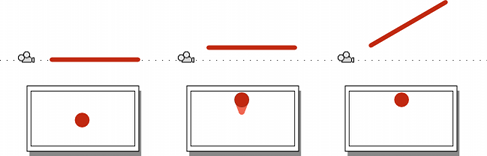

## Understanding the View Frustum
**frustum**这个词指的是一种固体形状，看起来像一个金字塔，顶部与底部平行。这是可以被透视相机看到和渲染的区域形状
。下面的思维实验应该有助于解释为什么会这样。

想象一下，你拿着一根直杆(比如扫帚柄或铅笔)对着相机，然后拍照。如果杆被放在照片的中心，垂直于相机镜头，那么只有它的末端在照片上可以看到一个圆圈;它的其他部分都将被遮蔽。如果你向上移动它，下面的一面会开始变得可见，但你可以通过向上倾斜的杆再次隐藏它。如果你继续向上移动杆并使它向上倾斜，圆形的一端最终会到达图片的顶部边缘。在这一点上，任何物体上面的世界空间的跟踪杆将不可见的图片。

杆可以很容易地移动和旋转左，右，或向下或任何组合的水平和垂直。“隐藏”杆的角度仅仅取决于它与屏幕中心在两个轴上的距离。

这个思想实验的意义在于，相机图像中的任何一点实际上都对应着世界空间中的一条直线，而在图像中只能看到这条直线上的一个点。那个位置后面的所有东西都是模糊的。

图像的外边缘由与图像的角对应的发散线定义。如果这些线被回溯到摄像机，它们最终都会聚在一个点上。在Unity中，这个点恰好位于摄像机的变换位置，被称为透视的中心。从屏幕顶部和底部中心向透视中心汇聚的线所对应的角度称为视场(通常缩写为FOV)。

如上所述，任何落在图像边缘的发散线之外的东西对相机来说都是不可见的，但是在渲染上还有另外两个限制。近处和远处的**clipping planes**都平行于相机的XY平面，且每一组都沿其中心线设定一定距离。任何比**near clipping plane**更接近摄像机的东西和任何比**far clipping plane**更远的东西不会被渲染。

发散的角线图像沿着两个剪切平面定义了一个截断的金字塔-the view frustum。