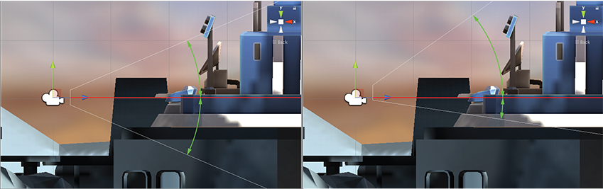

## Using an Oblique Frustum
默认情况下，视图截锥是对称地围绕摄像机布置的的中心线，但它不一定需要是。你可以使截锥体“斜”，这意味着一边比另一边与中心线的夹角更小。这使得图像一侧的透视看起来更紧凑，给人的印象是，观察者非常接近在那一侧可见的物体。一个如何使用这个的例子是赛车游戏;如果截锥体的底部边缘是扁平的，那么在观察者看来，它们更靠近道路，强调了速度的感觉。


虽然相机组件没有专门设置截锥体倾角的功能，但是您可以通过启用相机的物理相机属性并应用镜头偏移来实现，或者添加一个脚本来更改相机的投影矩阵。

### Setting Frustum Obliqueness with a Lens Shift
启用相机的物理相机属性来显示镜头移动选项。您可以使用这些偏移相机的焦点中心沿X轴和Y轴的方式，以最小化失真的渲染图像。

移动镜头减少了与移动方向相反一侧的截锥体角度。例如，当你向上移动镜头时，截锥体底部和相机中心线之间的角度会变小。

*Normally a camera’s frustum is symmetrical (left), meaning the angles on either side of the center line are equal. Shifting the lens (right) makes the frustum oblique, meaning the angle is smaller on one side than on the other.*

有关物理相机选项的详细信息，请参阅关于[物理相机](https://docs.unity3d.com/Manual/PhysicalCameras.html)的文档。
有关设置单个物理相机属性的详细信息，请参阅[相机组件](https://docs.unity3d.com/Manual/class-Camera.html)参考。

## Setting Frustum Obliqueness Using a Script
下面的脚本示例演示了如何通过更改摄像机的投影矩阵来快速实现斜截锥体。请注意，您只能在游戏运行播放模式时看到脚本的效果。
```CS
using UnityEngine;
using System.Collections;

public class ExampleScript : MonoBehaviour {
    void SetObliqueness(float horizObl, float vertObl) {
        Matrix4x4 mat  = Camera.main.projectionMatrix;
        mat[0, 2] = horizObl;
        mat[1, 2] = vertObl;
        Camera.main.projectionMatrix = mat;
    }
}
```
*C# script example*

```JS
function SetObliqueness(horizObl: float, vertObl: float) {
    var mat: Matrix4x4 = camera.projectionMatrix;
    mat[0, 2] = horizObl;
    mat[1, 2] = vertObl;
    camera.projectionMatrix = mat;
}
```
*JS script example*

幸运的是，没有必要了解投影矩阵是如何工作的。水平倾斜度和垂直倾斜度值分别设置水平倾斜度和垂直倾斜度。0表示没有倾斜。正值使截体向右或向上移动，从而使左侧或底部变平。负值向左或向下移动，从而使截骨的右侧或顶部变平。如果将该脚本添加到摄像机中，并将游戏切换到场景视图，则可以直接看到效果当游戏运行时;当你在检查器中改变水平栏和垂直栏的值时，相机的线框图将会改变
。任一变量的值为1或-1，表示截头体的一侧与中心线完全平坦。虽然很少需要使用超出此范围的值，但这是可能的。