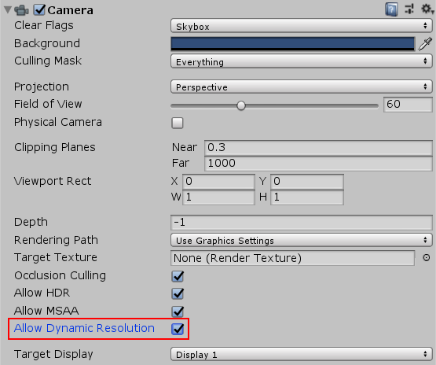

## Dynamic resolution
动态分辨率是一个相机设置允许你动态缩放单独的渲染目标，以减少GPU上的工作负载。在应用程序帧率降低的情况下，您可以逐渐降低分辨率，以保持一致的帧率。如果性能数据表明，由于应用程序受gpu限制，帧速率将会降低，那么Unity就会触发这种缩放。您还可以通过抢占应用程序中特定的gpu密集型部分并通过脚本控制伸缩来手动触发伸缩。如果逐步缩放，动态分辨率几乎是不可察觉的。

### Supported platforms
Unity支持Xbox One的动态分辨率， PS4，任天堂交换机，iOS， macOS和tvOS(仅限Metal)， Android(仅限Vulkan)， Windows单机和UWP(仅限DirectX 12)。

### Impact on render targets
使用动态分辨率，Unity不会重新分配渲染目标。概念上，Unity缩放了渲染目标;然而，在现实中，Unity使用了混叠，缩小的渲染目标只使用了原始渲染目标的一小部分。Unity在渲染目标的全分辨率下分配渲染目标，然后动态分辨率系统将它们缩小并重新分配，使用原始目标的一部分而不是重新分配一个新的目标。

### Scaling render targets
使用动态分辨率，呈现目标具有[DynamicallyScalable](https://docs.unity3d.com/ScriptReference/RenderTextureCreationFlags.DynamicallyScalable.html)标志。你可以设置这个来声明Unity是否应该缩放这个渲染纹理
是否作为动态解析过程的一部分。相机也有[allowDynamicResolution](https://docs.unity3d.com/ScriptReference/Camera-allowDynamicResolution.html)标志，你可以用它来设置动态分辨率，这样就不需要覆盖渲染目标，如果你只是想把动态分辨率应用到一个不太复杂的场景。


### MRT buffers
当你在相机上启用**Allow Dynamic Resolution**时，Unity会缩放相机的所有目标。

#### Controlling the scaling
您可以通过[ScalableBufferManager](https://docs.unity3d.com/ScriptReference/ScalableBufferManager.html)控制缩放。[ScalableBufferManager](https://docs.unity3d.com/ScriptReference/ScalableBufferManager.html)为您提供了对所有渲染目标的动态宽度和高度比例的控制，您已经为动态分辨率系统的比例做了标记。
例如，假设你的应用程序以理想的帧速率运行，但在某些情况下，由于粒子、后期效果和屏幕复杂性的增加，GPU性能下降。Unity [FrameTimingManager](https://docs.unity3d.com/ScriptReference/FrameTimingManager.html)允许您检测CPU或GPU性能何时开始下降。因此，您可以使用FrameTimingManager来计算新的期望宽度和高度比例，以将帧速率保持在您希望的范围内，并将比例降低到该值，以保持性能稳定(可以是立即稳定，也可以是逐渐稳定)。当屏幕复杂度降低，GPU表现稳定时，你可以将宽度和高度调整回你计算出的GPU可以处理的值。

### Example
这个示例脚本演示了API的基本用法。将其添加到场景中的相机中，并在相机设置中勾选 **Allow Dynamic Resolution**。您还需要打开**Player**设置(菜单:**Edit > Project Settings**，然后选择**Player**类别)，并选中**Enable Frame Timing Stats**复选框。

点击鼠标，或者用一个手指轻敲屏幕，分别降低`scaleWidthIncrement`和`scaleHeightIncrement`变量中的高度和宽度分辨率。用两个手指轻敲可以以相同的增量提高分辨率。

```cs

using System;
using System.Collections;
using System.Collections.Generic;
using UnityEngine;
using UnityEngine.UI;

public class DynamicResolutionTest : MonoBehaviour
{
    public Text screenText;

    FrameTiming[] frameTimings = new FrameTiming[3];

    public float maxResolutionWidthScale = 1.0f;
    public float maxResolutionHeightScale = 1.0f;
    public float minResolutionWidthScale = 0.5f;
    public float minResolutionHeightScale = 0.5f;
    public float scaleWidthIncrement = 0.1f;
    public float scaleHeightIncrement = 0.1f;

    float m_widthScale = 1.0f;
    float m_heightScale = 1.0f;

    // Variables for dynamic resolution algorithm that persist across frames
    uint m_frameCount = 0;

    const uint kNumFrameTimings = 2;

    double m_gpuFrameTime;
    double m_cpuFrameTime;

    // Use this for initialization
    void Start()
    {
        int rezWidth = (int)Mathf.Ceil(ScalableBufferManager.widthScaleFactor * Screen.currentResolution.width);
        int rezHeight = (int)Mathf.Ceil(ScalableBufferManager.heightScaleFactor * Screen.currentResolution.height);
        screenText.text = string.Format("Scale: {0:F3}x{1:F3}\nResolution: {2}x{3}\n",
            m_widthScale,
            m_heightScale,
            rezWidth,
            rezHeight);
    }

    // Update is called once per frame
    void Update()
    {
        float oldWidthScale = m_widthScale;
        float oldHeightScale = m_heightScale;

        // One finger lowers the resolution
        if (Input.GetButtonDown("Fire1"))
        {
            m_heightScale = Mathf.Max(minResolutionHeightScale, m_heightScale - scaleHeightIncrement);
            m_widthScale = Mathf.Max(minResolutionWidthScale, m_widthScale - scaleWidthIncrement);
        }

        // Two fingers raises the resolution
        if (Input.GetButtonDown("Fire2"))
        {
            m_heightScale = Mathf.Min(maxResolutionHeightScale, m_heightScale + scaleHeightIncrement);
            m_widthScale = Mathf.Min(maxResolutionWidthScale, m_widthScale + scaleWidthIncrement);
        }

        if (m_widthScale != oldWidthScale || m_heightScale != oldHeightScale)
        {
            ScalableBufferManager.ResizeBuffers(m_widthScale, m_heightScale);
        }
        DetermineResolution();
        int rezWidth = (int)Mathf.Ceil(ScalableBufferManager.widthScaleFactor * Screen.currentResolution.width);
        int rezHeight = (int)Mathf.Ceil(ScalableBufferManager.heightScaleFactor * Screen.currentResolution.height);
        screenText.text = string.Format("Scale: {0:F3}x{1:F3}\nResolution: {2}x{3}\nScaleFactor: {4:F3}x{5:F3}\nGPU: {6:F3} CPU: {7:F3}",
            m_widthScale,
            m_heightScale,
            rezWidth,
            rezHeight,
            ScalableBufferManager.widthScaleFactor,
            ScalableBufferManager.heightScaleFactor,
            m_gpuFrameTime,
            m_cpuFrameTime);
    }

    // Estimate the next frame time and update the resolution scale if necessary.
    private void DetermineResolution()
    {
        ++m_frameCount;
        if (m_frameCount <= kNumFrameTimings)
        {
            return;
        }
        FrameTimingManager.CaptureFrameTimings();
        FrameTimingManager.GetLatestTimings(kNumFrameTimings, frameTimings);
        if (frameTimings.Length < kNumFrameTimings)
        {
            Debug.LogFormat("Skipping frame {0}, didn't get enough frame timings.",
                m_frameCount);

            return;
        }

        m_gpuFrameTime = (double)frameTimings[0].gpuFrameTime;
        m_cpuFrameTime = (double)frameTimings[0].cpuFrameTime;
    }
}
```

## See also
* [FrameTimingManager](https://docs.unity3d.com/ScriptReference/FrameTimingManager.html) scripting class reference.
* [ScalableBufferManager](https://docs.unity3d.com/ScriptReference/ScalableBufferManager.html) scripting class reference.