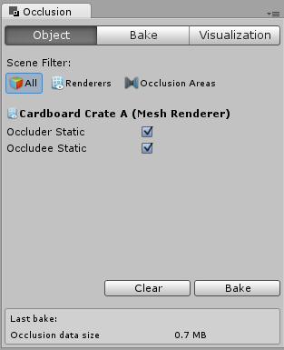
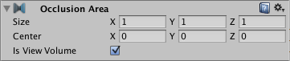

## Occlusion Culling
遮挡剔除(Occlusion Culling)是一种功能，当物体当前没有被摄像头看到时，它会使物体不被渲染，因为它们被其他物体遮挡住了。这在3D计算机图形中并不会自动发生，因为大多数时候，离摄像机最远的物体会先被绘制，而离摄像机较近的物体会被绘制在它们的上方(这称为“overdraw”)。Occlusion Culling不同于Frustum Culling。Frustum Culling只会禁用摄像机可视区域之外的对象的渲染，而不会禁用任何通过overdraw隐藏的内容。注意，当你使用遮挡剔除你仍然会受益于截体剔除。

*A maze-like indoor level. This normal scene view shows all visible Game Objects.*

*Regular frustum culling only renders objects within the camera’s view. This is automatic and always happens.*

*Occlusion culling removes additional objects from within the camera rendering work if they are entirely obscured by nearer objects.*

遮挡剔除过程将遍历整个场景使用虚拟摄像机构建可能可见的对象集的层次结构。这些数据在运行时被每个摄像机用来识别什么是可见的，什么是不可见的。有了这些信息，Unity将确保只有可见的对象被发送到渲染。这减少了 draw calls 的次数，提高了游戏的性能。

遮挡剔除的数据由单元格（cells）组成， 每个单元格是在整个场景的包围体积的一部分，单元格来自一个二叉树（ binary tree），遮挡剔除使用两棵树， 一个给 View Cells (静态物体) ，另一个给 Target Cells (移动物体)。 View Cells 映射到一个定义静态可视物体的索引列表 （精确剔除后的静态物体）。

在创建对象时一定要记住这一点，因为您需要在对象的大小和单元格的大小之间取得良好的平衡。理想情况下，与对象相比，不应该有太小的单元格，但同样也不应该有覆盖很多单元格的对象。有时可以通过将大对象分割成小块来改进筛选。但是，您仍然可以将小对象合并在一起以减少 draw calls，并且只要它们都属于同一个单元，就不会影响遮挡剔除。

你可以使用“overdraw”场景渲染模式查看正在发生的 overdraw 情况，以及游戏视图中的stats信息窗格，以查看正在呈现的三角形、顶点和批处理的数量。下面是应用遮挡剔除之前和之后的比较。

*Notice in the Overdraw scene view, a high density of overdraw as many rooms beyond the visible walls are rendered. These aren’t visible in the game view, but nonetheless time is being taken to render them.*

*With occlusion culling applied, the distant rooms are not rendered, the overdraw is much less dense, and the number of triangles and batches being rendered has dropped dramatically, without any change to how the game view looks.*

### Setting up Occlusion Culling
为了使用遮挡剔除，需要一些手动设置。首先，你的关卡几何体必须被分成合理大小的块。这也有助于将你的关卡布置在小而明确的区域中，这些区域会被墙壁，建筑等大型物体所遮挡。这里的思想是每个单独的网格将根据遮挡数据打开或关闭。所以，如果你有一个包含你房间里所有家具的对象，那么要么所有家具都被剔除，要么所有家具都不被剔除。这并没有让每件家具都有自己的网格那么有意义，所以每件家具都可以根据相机的视角进行裁剪。

你需要在**Inspector**中标记所有的场景对象中遮挡剔除物体为**Occluder Static**。要做到这一点，最快的方法是多选您希望包含在遮挡计算中的对象，并将它们标记为**Occluder Static**和**Occludee Static**。

*Marking an object for Occlusion*

什么时候应该使用**Occludee Static**?没有遮挡的完全透明或半透明的物体，以及不太可能遮挡其他物体的小物体，应该标记为**Occludees**，而不是**Occluders**。这意味着它们将被其他对象视为遮挡，但不会被视为遮挡器本身，这将有助于减少计算。

在使用**LOD groups**时，只有基本层对象(LOD0)可以用作遮挡器。

### Occlusion Culling Window
对于大多数处理遮挡剔除的操作，您应该使用遮挡剔除窗口 (**Window > Rendering > Occlusion Culling**)。
在遮挡剔除窗口中，您可以使用遮挡网格和[遮挡区域](https://docs.unity3d.com/Manual/class-OcclusionArea.html)。

如果你在**Occlusion Culling Window**中的**Object**选项卡，并有一个[网格渲染器](https://docs.unity3d.com/Manual/class-MeshRenderer.html)在场景中选中，可以修改相关的静态标志:

*Occlusion Culling Window for a Mesh Renderer*

如果你在**Occlusion Culling Window**中的**Object**选项卡，并选择了一个[Occlusion Area](https://docs.unity3d.com/Manual/class-OcclusionArea.html)，你可以使用相关的OcclusionArea属性(更多细节参见[Occlusion Area](https://docs.unity3d.com/Manual/class-OcclusionArea.html)部分)

*Occlusion Culling Window for the Occlusion Area*

注意:默认情况下，如果你没有创建任何遮挡区域，遮挡剔除将应用于整个场景。
注意:当你的相机在遮挡区域之外时，遮挡剔除将不被应用。重要的是要设置你的遮挡区域，以覆盖相机可能在的地方，但使面积太大会增加烘培时间。

### Occlusion Culling - Bake

*Occlusion culling inspector bake tab.*
遮挡剔除烘焙窗口有一个“设置默认参数”按钮，它允许你重置烘焙值到Unity的默认值。这对于许多典型的场景都是很好的，但是通过调整值来适应场景的特定内容，您通常可以得到更好的结果。

#### Properties
|Property|Function|
|:------|:------|
|Smallest&nbsp;Occluder|在进行遮挡剔除时用来隐藏其他对象的最小对象的大小。任何小于此大小的对象都不会导致被其遮挡的对象被剔除。例如，当值为5时，所有高于或大于5米的对象都会导致它们背后的隐藏对象被剔除(不渲染，节省渲染时间)。为这个属性选择一个好的值是在遮挡精度和遮挡数据的存储大小之间取得平衡。|
|Smallest&nbsp;Hole|这个值表示相机应该看到的几何图形之间的最小间隙。该值表示能够通过该孔的对象的直径。如果你的场景有非常小的裂缝，相机应该可以看到，最小的孔值必须小于最窄的尺寸的差距。|
|Backface&nbsp;Threshold|Unity的遮挡使用了一个数据大小优化，通过测试后脸来减少不必要的细节。默认值100是健壮的，从不从数据集中删除背面。如果值为5，则会根据具有可见背面的位置大大减少数据。这个想法是，通常情况下，有效的摄像机位置通常不会看到很多背面，例如，一个地形的底部视图，或从一个实体对象内的视图，您不应该能够达到。当阈值小于100时，Unity将完全从数据集中删除这些区域，从而减少遮挡的数据大小。|

在烘烤标签的底部是 Clear 和 Bake 按钮。单击**Bake**按钮开始生成遮挡剔除数据。生成数据后，可以使用Visualization选项卡预览和测试遮挡剔除。如果您对结果不满意，请单击**Clear**按钮删除先前计算的数据，调整设置，然后再次烘焙。

#### Occlusion Culling - Visualization

*Occlusion culling inspector visualization tab.*

场景中的所有对象都会影响包围体的大小，所以要尽量让它们都在场景的可见范围内。

当您准备好生成遮挡数据时，单击**Bake**按钮。记住要在**Bake**选项卡中选择**Memory Limit**。较低的数值使生成速度更快、精度更低，较高的数值是为了使生产质量更接近发布。

请记住，构建遮挡数据所需的时间将取决于单元格级别、数据大小和您选择的质量。

处理完成后，您应该会在视图区域中看到一些彩色的立方体。彩色区域是共享相同遮挡数据的区域。

如果您想删除所有用于遮挡剔除的预先计算的数据，请单击**Clear**。

### Occlusion Area
要将遮挡剔除应用到移动对象，您必须创建一个**Occlusion Area**然后修改它的大小以适应移动对象所在的空间(当然，移动对象不能被标记为静态对象)。您可以通过添加**Occlusion Area**组件到一个空的游戏对象(菜单中**Component -> Rendering -> Occlusion Area**)来创建遮挡区域。

创建**Occlusion Area**后，选中Is视图卷复选框以遮挡移动的对象。

|Property:|Function:|
|:------|:-----|
|Size|定义遮挡区域的大小。|
|Center|设置遮挡区域的中心。默认情况下，这是0,0,0，位于框的中心。|
|Is View Volume|定义摄像机的位置。选中此选项以使遮挡静态物体在*Occlusion Area*内。|

*Occlusion Area properties for moving objects.*
添加了遮挡区域之后，需要查看它如何将框划分为单元格。要查看遮挡区域将如何计算，在**Occlusion Culling Preview Panel**中选择**Edit**并选中**View**按钮。

#### Testing the generated occlusion
在你的遮挡设置好之后，你可以通过启用*Occlusion Culling*(在**Occlusion Culling Preview Panel**中的可视化模式)和在场景视图中移动**Main Camera**来测试它。

*The Occlusion View mode in Scene View*

当你移动主摄像头的时候(无论你是否处于播放模式)，你会看到各种各样的对象禁用它们自己。你在这里要找的是遮挡数据中的任何错误。如果您在移动时看到对象突然出现在视图中，您将识别出一个错误。如果发生这种情况，修复错误的选项要么是更改分辨率(如果正在处理目标卷)，要么是移动对象来掩盖错误。要调试遮挡问题，可以将主摄像机移动到有问题的位置进行点检。

当处理完成后，您应该会在视图区域中看到一些彩色的立方体。蓝色的立方体表示目标卷的单元划分。白色立方体表示视图卷的单元格划分。如果参数设置正确，您应该会看到有些对象没有被呈现。这是因为它们不是在摄像机的视锥截体之外，就是被其他物体遮挡住了。

在遮挡完成后，如果你没有看到任何东西在你的场景中被遮挡，那么试着把你的对象分成更小的块，这样它们就可以完全包含在单元格中。