## Using Physical Cameras
[camera component’s](../../../GraphicsReference/CamerasReference/Camera/README.md)的物理相机属性在Unity相机上模拟真实的相机格式。这对于从3D建模应用程序中导入摄像机信息非常有用，这些应用程序也可以模拟真实的摄像机。
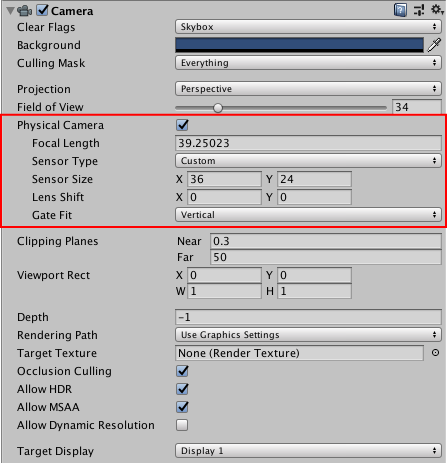

Unity提供了与大多数3D建模应用的物理相机设置相同的设置。控制摄像机所见的两个主要特性是**Focal Length**和**Sensor Size**。
* **Focal Length**:传感器和照相机镜头之间的距离。这决定了垂直视野。当Unity相机处于物理相机模式时，改变焦距也会相应改变视场。较小的焦距会产生较大的视野，反之亦然。
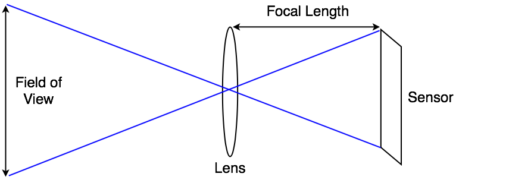
* *Sensor Size*:捕获图像的传感器的宽度和高度。这些决定了物理相机的aspect ratio。您可以从几个预置的传感器大小，以符合现实世界的相机格式，或设置自定义大小。当传感器的长宽比不同于渲染的长宽比时，就像在游戏视图中设置的那样，你可以控制Unity如何将摄像机图像与渲染图像进行匹配(参见下面的门匹配信息)。

### Lens Shifts
镜头偏移使相机的镜头从传感器水平和垂直偏移。这允许你改变焦点中心，并重新定位一个主题在渲染框架，很少或没有失真。
这种技术在建筑摄影中很常见。例如，如果你想拍摄一座高楼，你可以旋转相机。但这会扭曲图像，使平行线看起来像是收敛的。
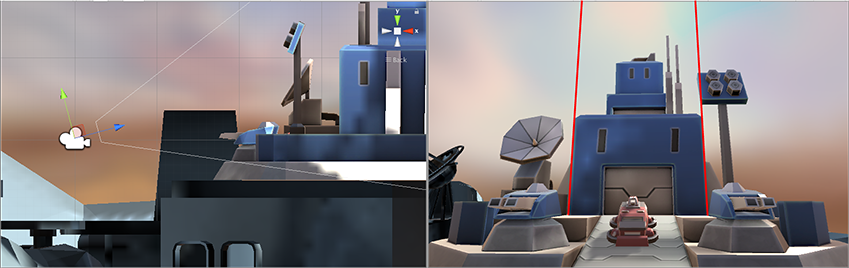
*将摄像机向上旋转以捕捉建筑物的顶部会使垂直线会聚*

如果你把镜头向上移动而不是旋转相机，你可以改变图像的组成，包括建筑物的顶部，但平行线保持直线。
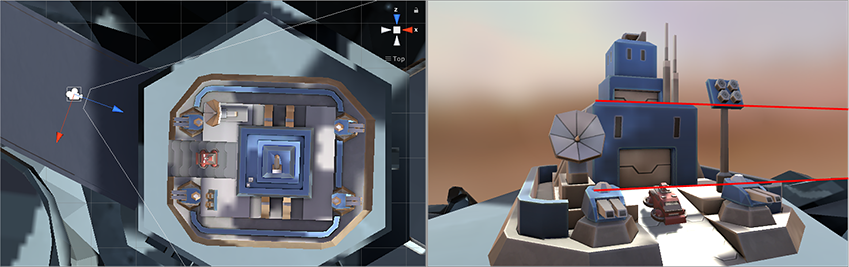
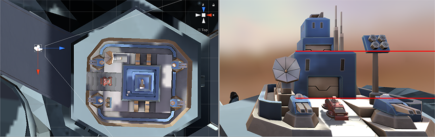
*旋转摄像头(顶部)来给建筑定格，会使水平线聚合。将镜头水平移动(底部)可以使图像重新构图，但会使水平线保持直线。*

#### Lens shifts and frustum obliqueness
镜头移动的一个副作用是，它使相机的**view frustum**倾斜。这意味着相机中心线和截锥体之间的夹角一边比另一边小。
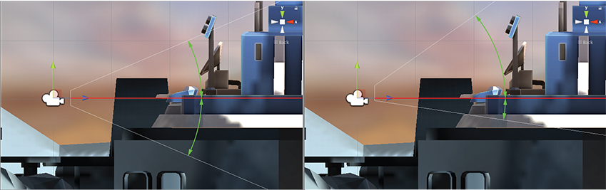
*上面的图片显示了相机在y轴镜头移动之前(左)和之后(右)的截距。向上移动镜头使视台倾斜。*

您可以使用它来创建基于透视图的视觉效果。例如，在一款赛车游戏中，你可能想要保持低视角。镜头移位是一种不用脚本实现斜截体的方法。
有关进一步信息，请参阅有关[Using an Oblique Frustum](../CameraTricks/UsingAnObliqueFrustum/README.md)。

### Gate Fit
摄像机组件的**Gate Fit**特性决定了当游戏视图和物理摄像机传感器具有不同的长宽比时会发生什么。
在**Physical Camera**模式下，相机有两个“门”。
* 根据你在方面下拉菜单中设置的分辨率，在游戏视图中呈现的区域被称为 “resolution gate”。
* 摄像机实际看到的区域，根据传感器大小属性定义，称为“film gate”。
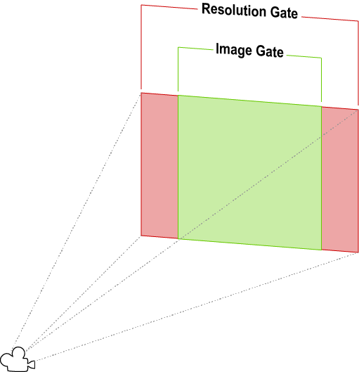
*当两个门有不同的长宽比时，分辨门与薄膜门的一个例子*

当两个门具有不同的长宽比时，Unity将分辨率门“适合”到胶片门。有几种适合模式，但它们都产生三种结果之一。
* **Cropping**:当胶片门超过了拟合后的分辨率门时，游戏视图将呈现尽可能多的符合其高宽比的摄像机图像，并将其余部分截断。
* **Overscanning**:当胶片门超过拟合后的分辨率门时，游戏视图仍然执行渲染场景部分的计算它们落在摄像机的视野之外。
* **Stretching**:游戏视图呈现完整的摄像机图像，水平或垂直拉伸以适应其长宽比。

在场景视图中查看大门，然后看看它们是如何组合在一起的。resolution gate 是相机的远削平面。film gate是截锥体底部的第二个矩形。
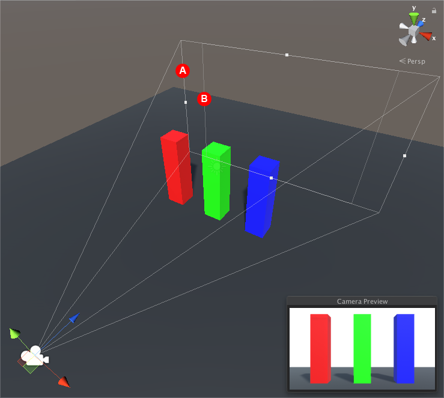
*在上面的例子中，相机视台底部的外矩形(A)是resolution gate。内部矩形(B)是 film gate*

#### Gate Fit Modes
你选择的**Gate Fit**模式决定了Unity如何调整分辨率栅格的大小(因此，也决定了相机的 view frustum)。film gate总是保持相同的大小。
下面的部分提供了关于每个门适配模式的更多细节。

##### Vertical
当**Gate Fit**设置为垂直时，Unity将resolution gate适配到胶片栅极的高度(Y轴)。您对传感器宽度(**Sensor Size > X**)所做的任何更改都不会影响所呈现的图像。

如果传感器的长宽比大于游戏视图的长宽比，则Unity会将渲染后的图像裁剪侧面:
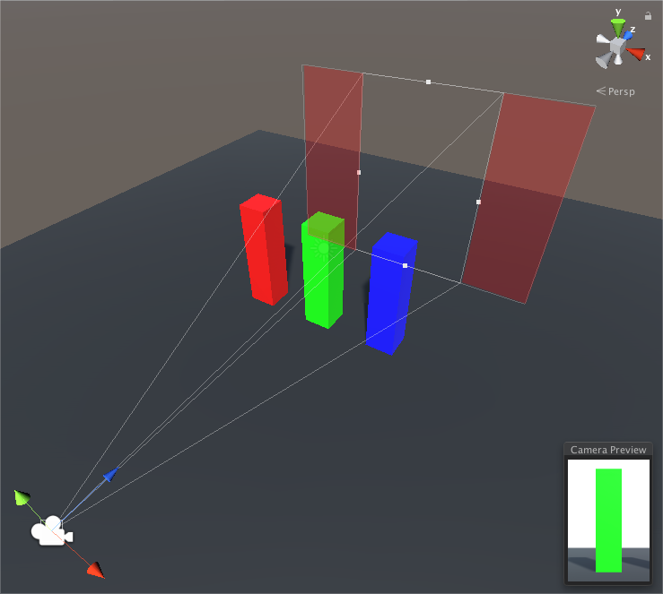
*Gate Fit set to Vertical: Resolution gate aspect ratio is 0.66:1 (600 x 900 px). Film gate aspect ratio is 1.37:1 (16mm). The red areas indicate where Unity crops the image in the Game view.*

如果传感器的高宽比小于游戏视图的高宽比，Unity会在侧边覆盖渲染后的图像:
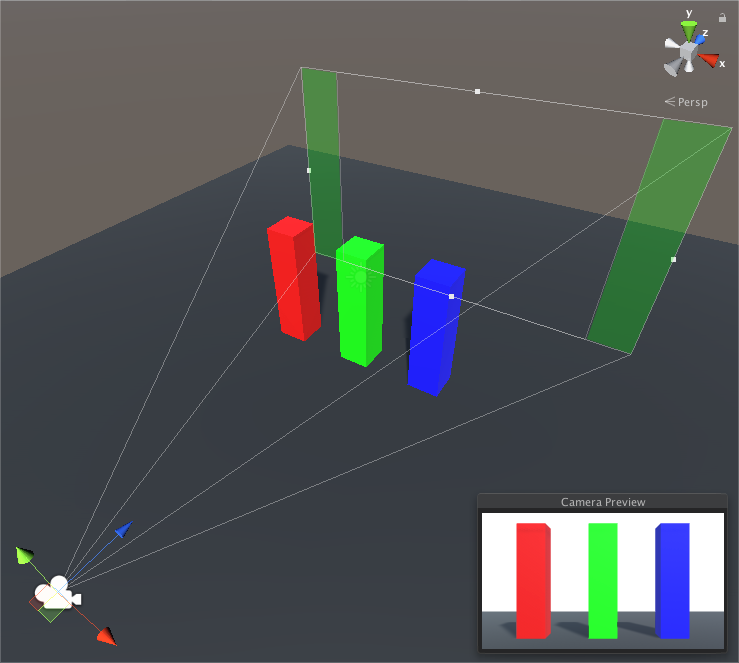
*Gate Fit set to Vertical: Resolution gate aspect ratio is 16:9. Film gate aspect ratio is 1.37:1 (16mm). The green areas indicate where Unity overscans the image in the Game view.*

##### Horizontal
当**Gate Fit**设置为水平时，Unity将分辨率栅极配合到薄膜栅极的宽度(X轴)。您对传感器高度(**Sensor Size > Y**)所做的任何更改都不会影响所呈现的图像。

如果传感器的高宽比大于游戏视图的高宽比，Unity会覆盖呈现的图像的顶部和底部:
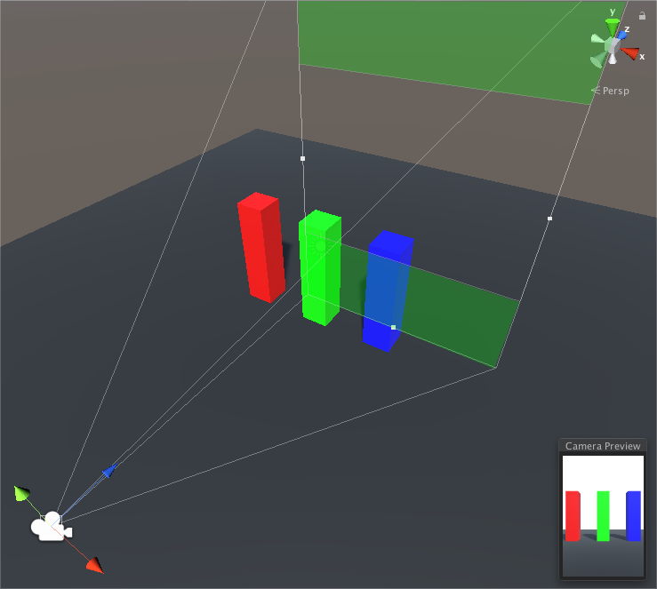
*Gate Fit is set to Horizontal: Resolution gate aspect ratio is 0.66:1 (600 x 900 px). Film gate aspect ratio is 1.37:1 (16mm). The green areas indicate where Unity overscans the image in the Game view.*

如果传感器的高宽比小于游戏视图的高宽比，渲染后的图像将被裁剪到顶部和底部。

*Gate Fit set to Horizontal: Resolution gate aspect ratio is 16:9. Film gate aspect ratio is 1.37:1 (16mm). The red areas indicate where Unity crops the image in the Game view.*

##### None
当Gate Fit设置为无时，Unity将分辨率栅极配合到胶片栅极的宽度和高度(X轴和Y轴)。Unity拉伸渲染的图像以适应游戏视图的高宽比。
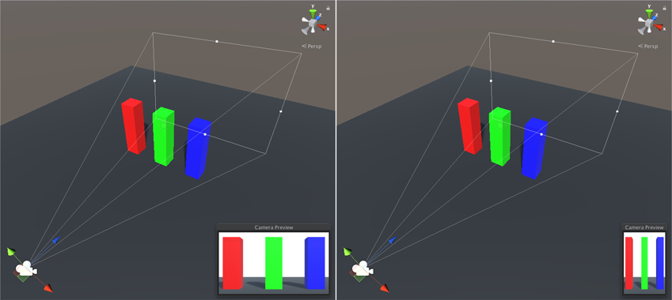
*No gate fit. The camera uses the film gate aspect ratio of 1.37:1 (16mm), and stretches the image horizontally to fit a Game view aspect ratio of 16:9 (left) and vertically to fit a game view aspect ratio of 0.66:1 (right)*

#### Fill and Overscan
当**Gate Fit**设置为**Fill**或**Overscan**时，Unity根据resolution gate极和film gate的纵横比，自动执行垂直或水平适配。
* **Fill**将 resolution gate 与 film gate 的小轴相匹配，并裁剪相机图像的其余部分。
* **Overscan**将 resolution gate 与 film gate 的大轴相匹配，并扫描相机图像边界之外的区域。