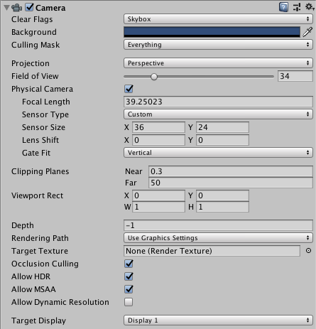

## Camera
相机是用来捕获并向玩家显示世界的设备。通过自定义和操纵摄像头，你可以让你的游戏表现真正独特。你可以在一个场景中拥有无限数量的摄像机。它们可以被设置为以任何顺序呈现，在屏幕上的任何位置，或者只呈现屏幕的某些部分。

### Properties
|Property:|Function:|
|:----------|:----------|
|**Clear Flags**|确定屏幕的哪些部分将被清除。这在使用多个摄像机绘制不同的游戏元素时非常方便。|
|**Background**	|在视图中的所有元素都已绘制且没有skybox后，应用于其余屏幕的颜色。|
|**Culling Mask**|包含或省略相机要渲染的对象层。在检查器中为对象分配层。|
|**Projection**|切换相机模拟透视的功能。|
|*Perspective*|摄像机将渲染透视完整的物体。|
|*Orthographic*|相机会均匀地渲染物体，没有透视感。注意:在 Orthographic 模式下不支持延迟渲染。向前呈现总是使用。|
|**Size**&nbsp;(when&nbsp;Orthographic&nbsp;is&nbsp;selected)|	设置为Orthographic时相机的视景尺寸。|
|**Field&nbsp;of&nbsp;view**&nbsp;(when&nbsp;Perspective&nbsp;is&nbsp;selected)|摄像机视角的宽度，以沿局部Y轴的角度度量。|
|**Physical Camera**|勾选此复选框以启用此相机的物理相机属性。  启用物理相机属性后，Unity使用模拟真实相机属性的属性来计算视场:**Focal Length**, **Sensor Size**,  **Lens Shift**。 物理相机属性是不可见的，直到您勾选此框。|
|&nbsp;&nbsp;&nbsp;&nbsp;*Focal Length*|设置相机传感器和相机镜头之间的距离，以毫米为单位。 数值越低，**Field of View**越宽，反之亦然。 当您更改此值时，Unity会自动更新相应的**Field of View**字段属性。|
|&nbsp;&nbsp;&nbsp;&nbsp;*Sensor Type*|	指定您希望摄像机模拟的真实摄像机格式。从列表中选择所需的格式。 当您选择相机格式时，Unity会自动将**Sensor Size**> **X和Y**属性设置为正确的值。 如果您手动更改传感器大小值，Unity会自动将此属性设置为自定义。|
|&nbsp;&nbsp;&nbsp;&nbsp;*Sensor Size*|设置相机传感器的尺寸，以毫米为单位。 当您选择**Sensor Type**时，Unity会自动设置**X和Y**值。如果需要，您可以输入自定义值。|
|&nbsp;&nbsp;&nbsp;&nbsp;&nbsp;&nbsp;&nbsp;&nbsp;&nbsp;&nbsp;&nbsp;&nbsp;&nbsp;&nbsp;&nbsp;&nbsp;*X*|传感器的宽|
|&nbsp;&nbsp;&nbsp;&nbsp;&nbsp;&nbsp;&nbsp;&nbsp;&nbsp;&nbsp;&nbsp;&nbsp;&nbsp;&nbsp;&nbsp;&nbsp;*Y*|传感器的高|
|&nbsp;&nbsp;&nbsp;&nbsp;*Lens Shift*|从中心水平或垂直移动镜头。值是传感器尺寸的倍数;例如，沿X轴移动0.5会使传感器的水平尺寸偏移一半。 你可以使用镜头移动来修正当相机与拍摄对象成一个角度时产生的失真(例如，会聚平行线)。 将镜头沿任一轴移动，使相机截锥体[倾斜](https://docs.unity3d.com/Manual/ObliqueFrustum.html)。|
|&nbsp;&nbsp;&nbsp;&nbsp;&nbsp;&nbsp;&nbsp;&nbsp;&nbsp;&nbsp;&nbsp;&nbsp;&nbsp;&nbsp;&nbsp;&nbsp;*X*|传感器水平偏移。|
|&nbsp;&nbsp;&nbsp;&nbsp;&nbsp;&nbsp;&nbsp;&nbsp;&nbsp;&nbsp;&nbsp;&nbsp;&nbsp;&nbsp;&nbsp;&nbsp;*Y*|传感器垂直偏移。|
|&nbsp;&nbsp;&nbsp;&nbsp;*Gate Fit*|改变**resolution gate**(游戏视图的size/aspect比)相对于**film gate**(物理相机传感器的size/aspect比)的大小的选项。 有关分辨率门和胶片门的进一步信息，请参阅关于[Physical Cameras](../../../GraphicsOverview/Cameras/UsingPhysicalCameras/README.md)的文档。|
|&nbsp;&nbsp;&nbsp;&nbsp;&nbsp;&nbsp;&nbsp;&nbsp;&nbsp;&nbsp;&nbsp;&nbsp;&nbsp;&nbsp;&nbsp;&nbsp;*Vertical*|将resolution gate适配film gate的高度。 如果传感器的长宽比大于游戏视图的长宽比，则Unity会将渲染后的图像裁剪到侧边。 如果传感器的高宽比小于游戏视图的高宽比，Unity会在侧面覆盖渲染的图像。 当您选择此设置时，更改传感器宽度(**Sensor Size > X property**)对呈现的图像没有影响。|
|&nbsp;&nbsp;&nbsp;&nbsp;&nbsp;&nbsp;&nbsp;&nbsp;&nbsp;&nbsp;&nbsp;&nbsp;&nbsp;&nbsp;&nbsp;&nbsp;Horizontal|将分辨率门调整到胶片门的宽度。 如果传感器的高宽比大于游戏视图的高宽比，Unity会覆盖呈现的图像的顶部和底部。 如果传感器的高宽比小于游戏视图的高宽比，Unity会将渲染后的图像裁剪到顶部和底部。 当您选择此设置时，更改传感器高度(**Sensor Size > Y**属性)对呈现的图像没有影响。|
|&nbsp;&nbsp;&nbsp;&nbsp;&nbsp;&nbsp;&nbsp;&nbsp;&nbsp;&nbsp;&nbsp;&nbsp;&nbsp;&nbsp;&nbsp;&nbsp;Fill|将分辨率门与胶片门的宽度或高度(以较小的为准)匹配。这将裁剪呈现的图像。|
|&nbsp;&nbsp;&nbsp;&nbsp;&nbsp;&nbsp;&nbsp;&nbsp;&nbsp;&nbsp;&nbsp;&nbsp;&nbsp;&nbsp;&nbsp;&nbsp;Overscan|将分辨率门与胶片门的宽度或高度(以较大的为准)匹配。这将覆盖呈现的图像。|
|&nbsp;&nbsp;&nbsp;&nbsp;&nbsp;&nbsp;&nbsp;&nbsp;&nbsp;&nbsp;&nbsp;&nbsp;&nbsp;&nbsp;&nbsp;&nbsp;None|忽略分辨率门，只使用胶片门。这将拉伸渲染后的图像以适应游戏视图的高宽比。|
|**Clipping Planes**|从摄像机到开始和停止渲染的距离。|
|&nbsp;&nbsp;&nbsp;&nbsp;*Near*|触发绘制离摄像机最近的点。|
|&nbsp;&nbsp;&nbsp;&nbsp;*Far*|触发绘制离摄像机最远的点。|
|**Viewport Rect**|四个值，表示该摄像机视图将在屏幕上的哪个位置绘制。以Viewport Coordinates(值0-1)测量。|
|&nbsp;&nbsp;&nbsp;&nbsp;*X*|将绘制摄像机视图的起始水平位置。|
|&nbsp;&nbsp;&nbsp;&nbsp;*Y*|将绘制摄像机视图的起始垂直位置。|
|&nbsp;&nbsp;&nbsp;&nbsp;*W(Width)*|屏幕上摄像机输出的宽度。|
|&nbsp;&nbsp;&nbsp;&nbsp;*H(Height)*|屏幕上摄像机输出的高度。|
|**Depth**|摄像机在绘制顺序中的位置。具有较大值的相机将绘制在具有较小值的相机的顶部。|
|**Rendering Path**|定义摄像机将使用什么呈现方法的选项。|
|&nbsp;&nbsp;&nbsp;&nbsp;*Use Player Settings*|这个相机将使用在**Player Settings**中设置的任何渲染路径。|
|&nbsp;&nbsp;&nbsp;&nbsp;*Vertex Lit*|这个相机渲染的所有物体都将被渲染成 Vertex-Lit 的物体。|
|&nbsp;&nbsp;&nbsp;&nbsp;*Forward*|所有的物体都将被渲染一次。|
|&nbsp;&nbsp;&nbsp;&nbsp;*Deferred Lighting*|所有对象将在没有照明的情况下绘制一次，然后所有对象的照明将一起呈现在呈现队列的末尾。注意:如果相机的投影模式设置为*Orthographic*模式，则会覆盖此值，并且相机将始终使用正向呈现。|
|**Target Texture**|引用[Render Texture](https://docs.unity3d.com/Manual/class-RenderTexture.html)它将包含摄像机视图的输出。设置此引用将禁用此相机呈现到屏幕的功能。|
|**Occlusion Culling**|为这个相机启用高动态范围渲染。详见[Occlusion Culling](../../../GraphicsOverview/Cameras/OcclusionCulling/README.md)|
|**Allow HDR**|为这个相机启用高动态范围渲染。详见[High Dynamic Range Rendering]([../../../GraphicsOverview/Cameras/OcclusionCulling/README.md](https://docs.unity3d.com/Manual/HDR.html))|
|**Allow MSAA**|启用此相机多采样**antialiasing**。|
|**Allow Dynamic Resolution**|启用此相机的动态分辨率呈现。详见[Dynamic Resolution](../../../GraphicsOverview/Cameras/DynamicResolution/README.md)|
|**Target Display**|定义要呈现给哪个外部设备。在1和8之间。|

### Details
摄像头对于向玩家展示你的游戏是必不可少的。它们可以被定制、脚本化或父类化，以实现任何可以想象到的效果。对于益智游戏，您可以保持相机静态以获得完整的益智视图。对于第一人称射击游戏，你需要将摄像机置于玩家角色的眼睛高度。对于赛车游戏，你可能会让摄像机跟随玩家的车辆。

您可以创建多个相机，并将每个相机分配到不同的**Depth**。摄像机从低**Depth**绘制到高**Depth**。换句话说，**Depth**为2的相机将被绘制在深度为1的相机的顶部。您可以调整规范化视图端口矩形属性的值，以调整相机视图在屏幕上的大小和位置。这可以创建多个迷你视图，如导弹摄像头，地图视图，后视镜等。

#### Render path
Unity支持不同的渲染路径。你应该根据你的游戏内容和目标平台/硬件选择你所使用的游戏。不同的渲染路径具有不同的特性和性能特征，这些特性和性能特征主要影响灯光和阴影。你的项目使用的渲染路径是在**Player settings**中选择的。另外，您可以为每个相机覆盖它。
有关渲染路径的更多信息，请查看[rendering paths](https://docs.unity3d.com/Manual/RenderingPaths.html)页面。

#### Clear Flags
每个相机在渲染视图时存储颜色和深度信息。屏幕中未绘制的部分是空的，默认情况下将显示skybox。当您使用多个相机时，每个相机在缓冲区中存储自己的颜色和深度信息，在每个相机呈现时积累更多的数据。当场景中的任何特定摄像机呈现其视图时，可以设置清除标志来清除缓冲区信息的不同集合。为此，请从以下四个选项中选择一个:
##### Skybox
这是默认设置。屏幕上任何空的部分都会显示当前相机的天空盒。如果当前的相机没有天空盒设置，它将默认选择的天空盒在 **Lighting Window** (menu: Window > Rendering > Lighting Settings)。然后它会回到**Background Color**。或者，可以将[Skybox component](https://docs.unity3d.com/Manual/class-Skybox.html)添加到相机中。如果你想创建一个新的天空盒，[你可以使用这个指南](https://docs.unity3d.com/Manual/HOWTO-UseSkybox.html)。

##### Solid color
屏幕上任何空的部分都会显示当前相机的**Background Color**。

#### Depth only
如果你想绘制玩家的枪而不让它夹在环境中，设置一个深度为0的相机来绘制环境，另一个深度为1的相机单独绘制武器。将武器相机的**Clear Flags**设置为**depth only**。这将在屏幕上保留环境的图形显示，但会丢弃关于每个对象在3-D空间中的位置的所有信息。当枪被绘制时，不透明的部分将完全覆盖绘制的任何东西，不管枪离墙有多近。

*The gun is drawn last, after clearing the depth buffer of the cameras before it*

##### Don’t clear
此模式不清除颜色或**depth buffer**。结果是每一帧都画在了下一帧上，产生了一种模糊的效果。这通常不会在游戏中使用，更可能与自定义着色器一起使用。
注意，在某些gpu(主要是移动gpu)上，不清除屏幕可能会导致在下一帧中未定义它的内容。在某些系统中，屏幕可能包含前一帧图像、纯黑屏或随机彩色像素

#### Clip Planes
远近剪辑平面属性决定了摄像机视图的起点和终点。这些平面与相机的方向垂直，并从相机的位置测量。近平面是将被渲染的最近的位置，远平面是最远的位置。
剪切平面也决定了场景中深度缓冲精度的分布。一般来说，为了获得更好的精度，你应该尽可能地移动近平面。
请注意，近处和远处的剪辑平面以及摄像机视场定义的平面描述了通常称为摄像机 *frustum* 的东西。Unity确保当渲染你的对象时那些完全在这个截锥体之外的对象不会被显示出来。这叫做*Frustum Culling*。不管你是否在你的游戏中使用*Occlusion Culling*，*Frustum Culling* 都会发生。
出于性能原因，您可能希望更早地剔除小对象。例如，小的岩石和碎片可以在比大型建筑物小得多的距离内隐身。要做到这一点，把小对象放在一个[单独的层](https://docs.unity3d.com/Manual/Layers.html)和设置每层筛选距离使用[Camera.layerCullDistances](https://docs.unity3d.com/ScriptReference/Camera-layerCullDistances.html)脚本函数。

#### Culling Mask
**Culling Mask**用于使用层有选择地呈现对象组。有关使用[层](https://docs.unity3d.com/Manual/Layers.html)的更多信息可以在这里找到。

#### Normalized Viewport Rectangles
**Normalized Viewport Rectangle**专门用于定义当前摄像机视图将被绘制到的屏幕的特定部分。您可以将地图视图放在屏幕的右下角，或者将导弹提示视图放在左上角。通过一些设计工作，您可以使用**Viewport Rectangle**来创建一些独特的行为。
使用**Normalized Viewport Rectangle**很容易创建一个两个人分屏的效果。创建两个相机后，将两个相机的H值都更改为0.5，然后将player one的Y值设置为0.5,player two的Y值设置为0。这将使玩家1的相机从屏幕的中间位置显示到顶部，而玩家2的相机从底部开始并在屏幕的中间位置停止。

*Two-player display created with the Normalized Viewport Rectangle property*

#### Orthographic
将相机标记为**Orthographic**将移除相机视图中的所有透视图。这在制作等距或2D游戏时非常有用。
请注意，雾是在*orthographic*相机模式下均匀渲染的，因此可能不会像预期的那样出现。这是因为*post-perspective*空间的Z坐标用于雾的“深度”。这不是严格准确的正投影相机，但它是用来在渲染期间的性能优化。

*Perspective camera.*

*Orthographic camera. Objects do not get smaller with distance here!*

#### Render Texture
这将把相机的视图放到一个纹理上然后可以应用于另一个对象。这使得创建体育场馆的视频监视器，监控摄像头，反射等变得很容易。

*A Render Texture used to create a live arena-cam*

#### Target display
一个相机最多有8个目标显示设置。相机可以控制渲染到一个多达8个显示器。它只支持PC、Mac和Linux。在游戏视图中，摄像机检查器中将显示所选择的显示。

## Hints
* 摄像头可以像其它**GameObject**(游戏物体)一样被实例化、父节点化和脚本化。
* 要增加赛车游戏中的速度感，请使用高**Field of View**。
* 如果你增加一个刚体，照相机可以用于**Rigidbody**组件。
* 在你的场景中，你可以拥有的相机数量是没有限制的。
* 正射影像机非常适合制作3D用户界面。
* 如果你正在体验深度伪影(彼此相邻的表面闪烁)，试着将**Near Plane**的设置尽可能的大。
* 相机不能同时渲染游戏屏幕和渲染纹理，只能是其中之一。
* 有一个选项可以将相机的视图渲染为纹理，称为渲染到纹理，以获得更有趣的效果。
* Unity带有预先安装的相机脚本，可以在**Components > Camera Control**中找到。尝试一下，看看什么是可能的。