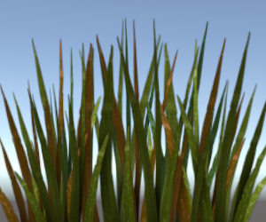

## ShaderLab: Blending
混合用于制作透明对象。

渲染图形时，毕竟是着色器已执行且所有纹理都已应用”，像素被写入到屏幕上。Blend命令控制它们与现有内容的组合方式。

## Syntax
`Blend Off`：关闭混合（这是默认设置）
`Blend SrcFactor DstFactor`：配置并启用混合。生成的颜色乘以SrcFactor。屏幕上已经存在的颜色乘以DstFactor，然后将两者相加。
`Blend SrcFactor DstFactor, SrcFactorA DstFactorA`：与上述相同，但使用不同的因子来混合Alpha通道。
`BlendOp Op`：不要将混合的颜色加在一起，而是对它们执行不同的操作。
`BlendOp OpColor, OpAlpha`：与上述相同，但对颜色（RGB）和alpha（A）通道使用不同的混合操作。

此外，您可以设置上渲染目标混合模式。使用多个渲染目标（MRT）渲染时，上面的常规语法为所有渲染目标设置相同的混合模式。以下语法可以为单个渲染目标设置不同的混合模式，其中N渲染目标索引（0..7）。此功能适用于大多数现代API / GPU（DX11 / 12，GLCore，Metal，PS4）：

* Blend N SrcFactor DstFactor
* Blend N SrcFactor DstFactor, SrcFactorA DstFactorA
* BlendOp N Op
* BlendOp N OpColor, OpAlpha

AlphaToMask On：打开 alpha-to-coverage。使用MSAA时，alpha-to-coverage将与像素着色器结果的alpha值成比例地修改多样本覆盖蒙版。与常规的alpha测试相比，它通常用于更少的锯齿轮廓。对植被和其他经过Alpha测试的着色器有用。

## Blend operations
可以使用以下混合操作：
|  OP | DESC |
|-----|------|
|Add  |source 与 destination 相加|
|Sub  |从 source 中减去 destination|
|RevSub|从 destination 中减去 source|
|Min  |使用 source 和 destination 中小的|
|Max  |使用 source 和 destination 中大的|
|LogicalClear	|逻辑操作: Clear (0) DX11.1 only.|
|LogicalSet	|逻辑操作: Set (1) DX11.1 only.|
|LogicalCopy	|逻辑操作: Copy (s) DX11.1 only.|
|LogicalCopyInverted	|逻辑操作: Copy inverted (!s) DX11.1 only.|
|LogicalNoop	|逻辑操作: Noop (d) DX11.1 only.|
|LogicalInvert	|逻辑操作: Invert (!d) DX11.1 only.|
|LogicalAnd	|逻辑操作: And (s & d) DX11.1 only.|
|LogicalNand	|逻辑操作: Nand !(s & d) DX11.1 only.|
|LogicalOr	|逻辑操作: Or (s | d) DX11.1 only.|
|LogicalNor	|逻辑操作: Nor !(s | d) DX11.1 only.|
|LogicalXor	|逻辑操作: Xor (s ^ d) DX11.1 only.|
|LogicalEquiv	|逻辑操作: Equivalence !(s ^ d) DX11.1 only.|
|LogicalAndReverse	|逻辑操作: Reverse And (s & !d) DX11.1 only.|
|LogicalAndInverted	|逻辑操作: Inverted And (!s & d) DX11.1 only.|
|LogicalOrReverse	|逻辑操作: Reverse Or (s | !d) DX11.1 only.|
|LogicalOrInverted	|逻辑操作: Inverted Or (!s | d) DX11.1 only.|

## Blend factors
下列所有属性对于**Blend**命令中的SrcFactor和DstFactor均有效。**Source**是指计算出的颜色，**Destination**是指屏幕上已经存在的颜色。如果**BlendOp**使用逻辑运算，则忽略混合因子。
|   Factor  | DESC |
|-----------|------|
|One                |one - 完全使用 source 或者 destination 颜色|
|Zero               |zero - 完全丢弃 source 或者 destination 颜色|
|SrcColor           |该阶段的值是与 source color 值相乘|
|SrcAlpha           |该阶段的值是与 source alpha 值相乘|
|DstColor           |该阶段的值是与 destination color 值相乘|
|DstAlpha           |该阶段的值是与 destination alpha 值相乘|
|OneMinusSrcColor   |该阶段的值是与 (1 - source color) 相乘|
|OneMinusSrcAlpha	|该阶段的值是与 (1 - source alpha) 相乘|
|OneMinusDstColor	|该阶段的值是与 (1 - destination color) 相乘|
|OneMinusDstAlpha	|该阶段的值是与 (1 - destination alpha) 相乘|

## Details
以下是最常见的**blend types**：
```
Blend SrcAlpha OneMinusSrcAlpha // Traditional transparency
Blend One OneMinusSrcAlpha // Premultiplied transparency
Blend One One // Additive
Blend OneMinusDstColor One // Soft Additive
Blend DstColor Zero // Multiplicative
Blend DstColor SrcColor // 2x Multiplicative
```

## Alpha blending, alpha testing, alpha-to-coverage
对于绘制大多数完全不透明或完全透明的对象,其中透明度由纹理的Alpha通道定义（例如，树叶，草，链栅栏等），通常使用几种方法：

### Alpha blending

*常规Alpha混合*

这通常意味着必须将对象视为“半透明”，因此不能使用某些渲染功能（例如：延迟的阴影，无法接收阴影）。凹面或重叠的alpha混合对象通常还具有绘制顺序问题。

通常，alpha混合着色器还会设置透明的[render queue](../../ShaderLabPassSubShaderTags/README.md)，并关闭深度写入。因此，着色器代码如下所示：
```
// inside SubShader
Tags { "Queue"="Transparent" "RenderType"="Transparent" "IgnoreProjector"="True" }

// inside Pass
ZWrite Off
Blend SrcAlpha OneMinusSrcAlpha
```

### Alpha testing/cutout

在像素着色器中通过使用 `clip()` HLSL指令，可以基于某些条件“丢弃”或不丢弃像素。这意味着该对象仍可以视为完全不透明，并且没有绘制顺序问题。但是，这意味着所有像素都是完全不透明或透明的，从而导致锯齿（“锯齿”）。

通常，经过Alpha测试的着色器也会设置剪切[render queue](../../ShaderLabPassSubShaderTags/README.md)，因此着色器代码如下所示：
```
// inside SubShader
Tags { "Queue"="AlphaTest" "RenderType"="TransparentCutout" "IgnoreProjector"="True" }

// inside CGPROGRAM in the fragment Shader:
clip(textureColor.a - alphaCutoffValue);
```

### Alpha-to-coverage

*AlphaToMask On, at 4xMSAA*

当使用多样本抗锯齿（MSAA，请参阅[QualitySettings](https://docs.unity3d.com/Manual/class-QualitySettings.html)）时，可以通过使用alpha-to-coverage GPU功能来改进alpha测试方法。根据使用的MSAA级别，这可以改善边缘外观。
此功能最适用于大多数不透明或透明，并且具有非常薄的“部分透明”区域（草，叶等）的纹理。
通常，从alpha-to-coverage的着色器也会设置 cutout [render queue](../../ShaderLabPassSubShaderTags/README.md)。因此，着色器代码如下所示：
```
// inside SubShader
Tags { "Queue"="AlphaTest" "RenderType"="TransparentCutout" "IgnoreProjector"="True" }

// inside Pass
AlphaToMask On
```

## Example
这是一个小示例着色器，它向屏幕上已有的任何内容添加了一个Texture：
```
Shader "Simple Additive" {
    Properties {
        _MainTex ("Texture to blend", 2D) = "black" {}
    }
    SubShader {
        Tags { "Queue" = "Transparent" }
        Pass {
            Blend One One
            SetTexture [_MainTex] { combine texture }
        }
    }
}
```