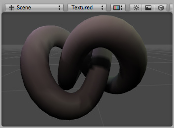
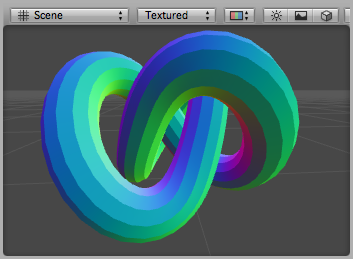
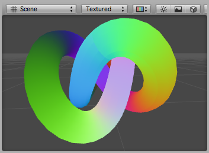

## Providing vertex data to vertex programs
 对于Cg/HLSL [vertex programs](../README.md)，[Mesh](https://docs.unity3d.com/Manual/class-Mesh.html)顶点数据作为输入传入到vertex shader函数。每个输入需要为它指定[语意](../ShaderSemantics/README.md);比如，`POSITION`输入是顶点坐标，`NORMAL`是顶点法线。
通常顶点输入数据在一个结构体中声明，而不是一个一个列出来。集中通用的顶点结构体被定义在[ UnityCG.cginc 包含文件](../Built-inShaderIncludeFiles/README.md)，并且绝大多数情况下使用这些就足够了。这些结构体是：
* appdata_base: position, normal 和 one texture coordinate.
* appdata_tan: position, tangent, normal 和 one texture coordinate.
* appdata_full: position, tangent, normal, four texture coordinates 和 color.

例子：该shader基于网格的法线着色，使用`appdata_base` 作为 vertex program 输入：
```
Shader "VertexInputSimple" {
    SubShader {
        Pass {
            CGPROGRAM
            #pragma vertex vert
            #pragma fragment frag
            #include "UnityCG.cginc"
         
            struct v2f {
                float4 pos : SV_POSITION;
                fixed4 color : COLOR;
            };
            
            v2f vert (appdata_base v)
            {
                v2f o;
                o.pos = UnityObjectToClipPos(v.vertex);
                o.color.xyz = v.normal * 0.5 + 0.5;
                o.color.w = 1.0;
                return o;
            }

            fixed4 frag (v2f i) : SV_Target { return i.color; }
            ENDCG
        }
    } 
}
```

要访问不同的顶点数据，您需要自己声明顶点结构，或将输入参数添加到 vertex shader。顶点数据由Cg / HLSL [语义标识](https://docs.unity3d.com/Manual/SL-ShaderSemantics.html) ，并且必须来自以下列表：
* POSITION 是顶点位置，通常是 float3或float4。
* NORMAL 是顶点法线，通常是float3。
* TEXCOORD0 是所述第一UV坐标，典型地float2，float3或float4。
* TEXCOORD1，TEXCOORD2 和 TEXCOORD3 分别是第2，第3和第4个UV坐标。
* TANGENT 是切线向量（用于法线贴图），通常为float4。
* COLOR 是每个顶点的颜色，通常是float4。
当网格数据包含的分量少于顶点着色器输入所需的分量时，除了 .w 分量均填充为零，默认分量为1。例如，网格纹理坐标通常是仅包含x和y分量的2D向量。如果顶点着色器声明了float4带有TEXCOORD0语义的输入，则顶点着色器接收的值包含（x，y，0,1）。

## Examples
### Visualizing UVs
以下着色器示例将顶点位置和第一个纹理坐标用作顶点着色器输入（在结构appdata中定义）。该着色器对于调试网格的UV坐标非常有用。
```
Shader "Debug/UV 1" {
SubShader {
    Pass {
        CGPROGRAM
        #pragma vertex vert
        #pragma fragment frag
        #include "UnityCG.cginc"

        // vertex input: position, UV
        struct appdata {
            float4 vertex : POSITION;
            float4 texcoord : TEXCOORD0;
        };

        struct v2f {
            float4 pos : SV_POSITION;
            float4 uv : TEXCOORD0;
        };
        
        v2f vert (appdata v) {
            v2f o;
            o.pos = UnityObjectToClipPos(v.vertex );
            o.uv = float4( v.texcoord.xy, 0, 0 );
            return o;
        }
        
        half4 frag( v2f i ) : SV_Target {
            half4 c = frac( i.uv );
            if (any(saturate(i.uv) - i.uv))
                c.b = 0.5;
            return c;
        }
        ENDCG
    }
}
}
```
在这里，UV坐标显示为红色和绿色，而另外的蓝色已应用于0到1范围之外的坐标：

*调试应用于环结模型的UV1着色器*

同样，此着色器可以可视化模型的第二个UV集：
```
Shader "Debug/UV 2" {
SubShader {
    Pass {
        CGPROGRAM
        #pragma vertex vert
        #pragma fragment frag
        #include "UnityCG.cginc"

        // vertex input: position, second UV
        struct appdata {
            float4 vertex : POSITION;
            float4 texcoord1 : TEXCOORD1;
        };

        struct v2f {
            float4 pos : SV_POSITION;
            float4 uv : TEXCOORD0;
        };
        
        v2f vert (appdata v) {
            v2f o;
            o.pos = UnityObjectToClipPos(v.vertex );
            o.uv = float4( v.texcoord1.xy, 0, 0 );
            return o;
        }
        
        half4 frag( v2f i ) : SV_Target {
            half4 c = frac( i.uv );
            if (any(saturate(i.uv) - i.uv))
                c.b = 0.5;
            return c;
        }
        ENDCG
    }
}
}
```

### Visualizing vertex colors
以下着色器将顶点位置和每个顶点的颜色用作顶点着色器输入（在结构appdata中定义）。
```
Shader "Debug/Vertex color" {
SubShader {
    Pass {
        CGPROGRAM
        #pragma vertex vert
        #pragma fragment frag
        #include "UnityCG.cginc"

        // vertex input: position, color
        struct appdata {
            float4 vertex : POSITION;
            fixed4 color : COLOR;
        };

        struct v2f {
            float4 pos : SV_POSITION;
            fixed4 color : COLOR;
        };
        
        v2f vert (appdata v) {
            v2f o;
            o.pos = UnityObjectToClipPos(v.vertex );
            o.color = v.color;
            return o;
        }
        
        fixed4 frag (v2f i) : SV_Target { return i.color; }
        ENDCG
    }
}
}
```

*Debug Colors着色器应用于已将光照烘焙为颜色的环结模型*

### Visualizing normals
以下着色器将顶点位置和法线用作顶点着色器输入（在结构appdata中定义）。法线的X，Y和Z分量显示为RGB颜色。因为正常分量在–1到1范围内，所以我们对其进行缩放和偏置，以便输出颜色在0到1范围内显示。
```
Shader "Debug/Normals" {
SubShader {
    Pass {
        CGPROGRAM
        #pragma vertex vert
        #pragma fragment frag
        #include "UnityCG.cginc"

        // vertex input: position, normal
        struct appdata {
            float4 vertex : POSITION;
            float3 normal : NORMAL;
        };

        struct v2f {
            float4 pos : SV_POSITION;
            fixed4 color : COLOR;
        };
        
        v2f vert (appdata v) {
            v2f o;
            o.pos = UnityObjectToClipPos(v.vertex );
            o.color.xyz = v.normal * 0.5 + 0.5;
            o.color.w = 1.0;
            return o;
        }
        
        fixed4 frag (v2f i) : SV_Target { return i.color; }
        ENDCG
    }
}
}
```

*调试法线着色器应用于圆环结模型。您可以看到模型具有硬阴影边缘。*

### Visualizing tangents and binormals
切线和副法线向量用于法线贴图。在Unity中，仅将切线矢量存储在顶点中，并且从法线和切线值导出副法线。

以下着色器将顶点位置和切线用作顶点着色器输入（在结构appdata中定义）。切线的x，y和z分量显示为RGB颜色。因为正常分量在–1到1的范围内，所以我们对其进行缩放和偏置以使输出颜色在0到1的可显示范围内。
```
Shader "Debug/Tangents" {
SubShader {
    Pass {
        CGPROGRAM
        #pragma vertex vert
        #pragma fragment frag
        #include "UnityCG.cginc"

        // vertex input: position, tangent
        struct appdata {
            float4 vertex : POSITION;
            float4 tangent : TANGENT;
        };

        struct v2f {
            float4 pos : SV_POSITION;
            fixed4 color : COLOR;
        };
        
        v2f vert (appdata v) {
            v2f o;
            o.pos = UnityObjectToClipPos(v.vertex );
            o.color = v.tangent * 0.5 + 0.5;
            return o;
        }
        
        fixed4 frag (v2f i) : SV_Target { return i.color; }
        ENDCG
    }
}
}
```

*调试切线着色器应用于圆环结模型。*

以下着色器可视化bitangents。它使用顶点位置，法线和切线值作为顶点输入。从法线和切线值计算出切线（有时称为双法线）。需要将其缩放并偏置到可显示的0到1范围内。
```
Shader "Debug/Bitangents" {
SubShader {
    Pass {
        Fog { Mode Off }
        CGPROGRAM
        #pragma vertex vert
        #pragma fragment frag
        #include "UnityCG.cginc"

        // vertex input: position, normal, tangent
        struct appdata {
            float4 vertex : POSITION;
            float3 normal : NORMAL;
            float4 tangent : TANGENT;
        };

        struct v2f {
            float4 pos : SV_POSITION;
            float4 color : COLOR;
        };
        
        v2f vert (appdata v) {
            v2f o;
            o.pos = UnityObjectToClipPos(v.vertex );
            // calculate bitangent
            float3 bitangent = cross( v.normal, v.tangent.xyz ) * v.tangent.w;
            o.color.xyz = bitangent * 0.5 + 0.5;
            o.color.w = 1.0;
            return o;
        }
        
        fixed4 frag (v2f i) : SV_Target { return i.color; }
        ENDCG
    }
}
}
```

*应用于圆环结模型的“调试Bitangents”着色器。*

## Further Reading
* [Shader Semantics](../ShaderSemantics/README.md)
* [Vertex and Fragment Program Examples](../VertexAndFragmentShaderExamples/README.md)
* [Built-in Shader Include Files](../Built-inShaderVariables/README.md)