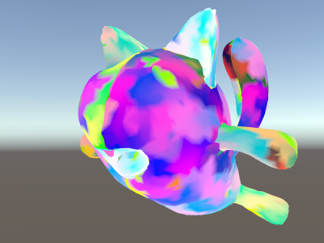

## Shader semantics
编写HLSL [shader programs](../README.md)时，输入输出变量需要通过**semantics**指定他们的意图。这是在HLSL shader language中基础概念；参考[Semantics documentation on MSDN](https://docs.microsoft.com/zh-cn/windows/win32/direct3dhlsl/dx-graphics-hlsl-semantics?redirectedfrom=MSDN)获取更多信息。

你可以下载下面的例子以[zipped Unity project](https://docs.unity3d.com/uploads/Examples/UnityShaderDocExamples.zip)的形式。

## Vertex shader input semantics
主**vertex shader**函数（使用 #pragma vertex 指令指定）需要在所有输入参数上具有语义。这些对应于单个[Mesh](https://docs.unity3d.com/Manual/class-Mesh.html)数据元素，例如顶点位置，法线网格和纹理坐标。有关更多详细信息，请参见[vertex program inputs](../ProvidingVertexDataToVertexPrograms/README.md)。

这是一个简单的顶点着色器的示例，以顶点位置和纹理坐标为输入。所述像素着色器将纹理坐标可视化为一种颜色。
```
Shader "Unlit/Show UVs"
{
    SubShader
    {
        Pass
        {
            CGPROGRAM
            #pragma vertex vert
            #pragma fragment frag

            struct v2f {
                float2 uv : TEXCOORD0;
                float4 pos : SV_POSITION;
            };

            v2f vert (
                float4 vertex : POSITION, // vertex position input
                float2 uv : TEXCOORD0 // first texture coordinate input
                )
            {
                v2f o;
                o.pos = UnityObjectToClipPos(vertex);
                o.uv = uv;
                return o;
            }
            
            fixed4 frag (v2f i) : SV_Target
            {
                return fixed4(i.uv, 0, 0);
            }
            ENDCG
        }
    }
}
```


代替逐一列出所有单独的输入，还可以声明它们的结构，并在该结构的每个单独的成员变量上指明语义。请参阅[shader program examples](../VertexAndFragmentShaderExamples/README.md) 以了解如何执行此操作。

## Fragment shader output semantics
通常，片段（像素）着色器输出一种颜色并具有 SV_Target语义。上例中的片段着色器正是这样做的：
```
fixed4 frag (v2f i) : SV_Target
```
该frag函数的返回类型为fixed4（低精度RGBA颜色）。由于它仅返回一个值，因此语义在函数本身上指出: SV_Target。也可以返回带有输出的结构。上面的片段着色器也可以用这种方式重写，并且将完全相同：
```
struct fragOutput {
    fixed4 color : SV_Target;
};            
fragOutput frag (v2f i)
{
    fragOutput o;
    o.color = fixed4(i.uv, 0, 0);
    return o;
}
```
从片段着色器返回结构对于不仅仅返回单一颜色的着色器非常有用。片段着色器输出支持的其他语义如下。

### SV_TargetN: Multiple render targets
SV_Target1，SV_Target2等：这些是着色器写入的其他颜色。在一次渲染中渲染到多个目标时使用（被称为多重渲染目标渲染技术，或MRT）。SV_Target0与相同SV_Target。

### SV_Depth: Pixel shader depth output
通常，片段着色器不会覆盖Z缓冲值，并且从常规三角形栅格化中使用默认值。然而，对于某些效果，输出自定义Z缓冲区深度值每像素是有用的。
请注意，在许多GPU上，这会关闭某些**深度缓冲区**优化，所以在没有充分理由的情况下不要覆盖Z缓冲区值。所产生的成本因`SV_Depth` GPU架构而异，但总体而言，它与alpha测试的成本（使用clip()HLSL 的内置功能）相当相似。在所有常规不透明着色器之后修改深度的渲染着色器（例如，通过使用`AlphaTest` [渲染队列](https://docs.unity3d.com/Manual/SL-SubShaderTags.html)）。

深度输出值必须为单个`float`。

## Vertex shader outputs and fragment shader inputs
顶点着色器需要输出顶点的最终裁剪空间位置，以便GPU知道在屏幕上的何处对其进行光栅化以及在什么深度进行光栅化。此输出需要具有`SV_POSITION`语义，并且必须是`float4`类型。
顶点着色器产生的任何其他输出（“内插器”或“变量”）都是您特定的着色器需要的。从顶点着色器输出的值将插值到渲染三角形的整个面，并且每个像素的值将作为输入传递给片段着色器
。
许多现代GPU并不真正在乎这些变量的语义。但是某些旧系统（最著名的是Direct3D 9上的着色器模型2 GPU）确实具有关于语义的特殊规则：
* TEXCOORD0，TEXCOORD1等用于指示任意高精度数据，诸如纹理坐标和位置。
* COLOR0和COLOR1上顶点的输出和输入端片段语义是低精度，0-1范围内的数据（如简单的颜色值）。

为了获得最佳的跨平台支持，请将顶点输出和片段输入标记为`TEXCOORDn`语义。
查看 [shader program examples](../VertexAndFragmentShaderExamples/README.md)获取更多示例。

### Interpolator count limits
总共可以使用多少个插值器变量将信息从顶点传递到片段着色器是有限制的。该限制取决于平台和GPU，一般准则为：
* **Up to 8 interpolators**：OpenGL ES 2.0（iOS / Android），Direct3D 11 9.x级别（Windows Phone）和Direct3 9着色器模型2.0（旧PC）。由于插值器的数量是有限的，但是每个插值器可以是4分量向量，因此某些着色器将所有内容打包在一起以保持在限制范围内。例如，可以在一个float4变量中传递两个纹理坐标（.xy代表一个坐标，.zw代表第二个坐标）。
* **Up to 10 interpolators**：Direct3D 9 shader model 3.0（#pragma target 3.0）。
* **Up to 16 interpolators**：OpenGL ES 3.0（iOS / Android），Metal（iOS）。
* **Up to 32 interpolators**：Direct3D 10着色器模型4.0（#pragma target 4.0）。

不管您使用哪种特定的目标硬件，出于性能原因，最好使用尽可能少的内插器。

## Other special semantics
### Screen space pixel position: VPOS
片段着色器可以接收作为特殊VPOS语义渲染的像素的位置。此功能仅从着色器模型3.0开始存在，因此着色器需要具有`#pragma target 3.0`编译指令。

在不同的平台上，屏幕空间位置输入的基本类型各不相同，因此，为了获得最大的可移植性，请为其使用`UNITY_VPOS_TYPE`类型（float4在大多数平台上，在Direct3D 9上为float2）。

另外，使用像素位置语义使得很难将剪辑空间位置（SV_POSITION）和VPOS都置于相同的顶点到片段结构中。因此，顶点着色器应将剪辑空间位置输出为单独的“输出”变量。请参见下面的示例着色器：
```
Shader "Unlit/Screen Position"
{
    Properties
    {
        _MainTex ("Texture", 2D) = "white" {}
    }
    SubShader
    {
        Pass
        {
            CGPROGRAM
            #pragma vertex vert
            #pragma fragment frag
            #pragma target 3.0

            // note: no SV_POSITION in this struct
            struct v2f {
                float2 uv : TEXCOORD0;
            };

            v2f vert (
                float4 vertex : POSITION, // vertex position input
                float2 uv : TEXCOORD0, // texture coordinate input
                out float4 outpos : SV_POSITION // clip space position output
                )
            {
                v2f o;
                o.uv = uv;
                outpos = UnityObjectToClipPos(vertex);
                return o;
            }

            sampler2D _MainTex;

            fixed4 frag (v2f i, UNITY_VPOS_TYPE screenPos : VPOS) : SV_Target
            {
                // screenPos.xy will contain pixel integer coordinates.
                // use them to implement a checkerboard pattern that skips rendering
                // 4x4 blocks of pixels

                // checker value will be negative for 4x4 blocks of pixels
                // in a checkerboard pattern
                screenPos.xy = floor(screenPos.xy * 0.25) * 0.5;
                float checker = -frac(screenPos.r + screenPos.g);

                // clip HLSL instruction stops rendering a pixel if value is negative
                clip(checker);

                // for pixels that were kept, read the texture and output it
                fixed4 c = tex2D (_MainTex, i.uv);
                return c;
            }
            ENDCG
        }
    }
}
```


### Face orientation: VFACE
片段着色器可以接收一个变量，该变量指示渲染的表面是否面向相机，或背对着相机。当渲染的图元应该两面可见时非常有用 - 经常在叶子和类似的薄物体上使用。VFACE语义输入变量在正面朝向三角形时为正值，背面朝向时为负值。

此功能仅从着色器模型3.0开始存在，因此着色器需要具有`#pragma target 3.0`编译指令。

```
Shader "Unlit/Face Orientation"
{
    Properties
    {
        _ColorFront ("Front Color", Color) = (1,0.7,0.7,1)
        _ColorBack ("Back Color", Color) = (0.7,1,0.7,1)
    }
    SubShader
    {
        Pass
        {
            Cull Off // turn off backface culling

            CGPROGRAM
            #pragma vertex vert
            #pragma fragment frag
            #pragma target 3.0

            float4 vert (float4 vertex : POSITION) : SV_POSITION
            {
                return UnityObjectToClipPos(vertex);
            }

            fixed4 _ColorFront;
            fixed4 _ColorBack;

            fixed4 frag (fixed facing : VFACE) : SV_Target
            {
                // VFACE input positive for frontbaces,
                // negative for backfaces. Output one
                // of the two colors depending on that.
                return facing > 0 ? _ColorFront : _ColorBack;
            }
            ENDCG
        }
    }
}
```
上面的着色器使用Cull状态关闭背面剔除（默认情况下根本不渲染背面三角形）。这是应用于一堆Quad
网格的着色器，它们以不同的方向旋转：


### Vertex ID: SV_VertexID
顶点着色器可以接收具有“顶点号”作为无符号整数的变量。当您要从texture或[ComputeBuffers](https://docs.unity3d.com/Manual/class-ComputeShader.html)获取其他每个顶点数据时，这特别有用。

此功能仅在DX10（着色器模型4.0）和GLCore / OpenGL ES 3中存在，因此着色器需要具有#pragma target 3.5编译指令。
```
Shader "Unlit/VertexID"
{
    SubShader
    {
        Pass
        {
            CGPROGRAM
            #pragma vertex vert
            #pragma fragment frag
            #pragma target 3.5

            struct v2f {
                fixed4 color : TEXCOORD0;
                float4 pos : SV_POSITION;
            };

            v2f vert (
                float4 vertex : POSITION, // vertex position input
                uint vid : SV_VertexID // vertex ID, needs to be uint
                )
            {
                v2f o;
                o.pos = UnityObjectToClipPos(vertex);
                // output funky colors based on vertex ID
                float f = (float)vid;
                o.color = half4(sin(f/10),sin(f/100),sin(f/1000),0) * 0.5 + 0.5;
                return o;
            }

            fixed4 frag (v2f i) : SV_Target
            {
                return i.color;
            }
            ENDCG
        }
    }
}
```

可以以[zipped Unity project](https://docs.unity3d.com/uploads/Examples/UnityShaderDocExamples.zip)下载上面显示的示例。