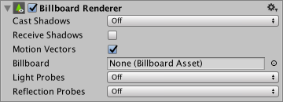

## Billboard Renderer
该Billboard Renderer渲染BillboardAssets，无论是从预制的资产（从SpeedTree出口）或从自定义创建文件（使用脚本在运行时或自定义编辑器创建，例如）。有关创建Billboard资产更多信息，，请参阅BillboardAssets手册页和BillboardAsset API参考。

广告牌是一种详细程度（LOD）方法，当它们在场景中较远时，可以以更简单的方式绘制复杂的3D网格。因为Mesh距离很远，它在屏幕上的大小很小，而且在相机中成为焦点的可能性很小。该视图中意味着通常不需要绘制完整细节。

|Property|Function|
|:-------|:-------|
|Cast Shadows|如果启用，则当投射阴影的光照在其上时，广告牌会创建阴影。|
|&nbsp;&nbsp;&nbsp;&nbsp;&nbsp;&nbsp;&nbsp;&nbsp;On|	启用阴影。|
|&nbsp;&nbsp;&nbsp;&nbsp;&nbsp;&nbsp;&nbsp;&nbsp;Off|禁用阴影。|
|&nbsp;&nbsp;&nbsp;&nbsp;&nbsp;&nbsp;&nbsp;&nbsp;Two Sided|允许从广告牌的任一侧投射阴影（即，不考虑背面剔除）。|
|&nbsp;&nbsp;&nbsp;&nbsp;&nbsp;&nbsp;&nbsp;&nbsp;Shadows Only|显示阴影，但不显示广告牌本身。|
|Receive Shadows|	选中此框可将阴影投射到广告牌上。|
|Motion Vectors|选中该框以启用渲染“广告牌的运动矢量到中的“相机运动矢量纹理”。有关更多信息，请参见Scripting API中的Renderer.motionVectors。|
|Billboard|如果您有预制的Billboard资产，请将其放置在此处以将其分配给此Billboard Renderer。|
|Light Probes|如果启用，并且场景中存在烘焙的光探测器，则Billboard Renderer会使用插值的光探测器进行照明。|
|&nbsp;&nbsp;&nbsp;&nbsp;&nbsp;&nbsp;&nbsp;&nbsp; Off|禁用光探头。|
|&nbsp;&nbsp;&nbsp;&nbsp;&nbsp;&nbsp;&nbsp;&nbsp;Blend Probes|从一个内插的光探头可以解释应用于广告牌的照明。|
|&nbsp;&nbsp;&nbsp;&nbsp;&nbsp;&nbsp;&nbsp;&nbsp;Use Proxy Volume|从插入的光探测器的3D网格解释应用于Billboard Renderer的照明。|
|Reflection Probes|如果启用，并且场景中存在“ 反射探针 ”，则为此GameObject选择一个反射纹理。Unity并设置为内置着色器。统一变量。|
|&nbsp;&nbsp;&nbsp;&nbsp;&nbsp;&nbsp;&nbsp;&nbsp;Off|禁用反射探针。|
|&nbsp;&nbsp;&nbsp;&nbsp;&nbsp;&nbsp;&nbsp;&nbsp;Blend Probes	|应用于广告牌的反射是从相邻的“反射探针”解释的，并且不会采用天空盒。。通常用于“室内”或场景的遮盖部分（例如洞穴和隧道）中的GameObject，因为天空是不可见的，因此不会被广告牌反射。|
|&nbsp;&nbsp;&nbsp;&nbsp;&nbsp;&nbsp;&nbsp;&nbsp;Blend Probes and Skybox|这类似于“混合探针”，但也允许在混合中使用天空盒。通常用于露天的GameObjects，那里的天空总是可见和反射的。|
|&nbsp;&nbsp;&nbsp;&nbsp;&nbsp;&nbsp;&nbsp;&nbsp;Simple|启用了反射探针，但是当有两个重叠的体积时，探针之间不会发生混合。|