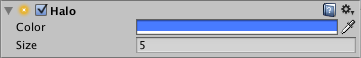

## Halo
**Halos** 是光源周围的明亮区域，用于给人以空气中小的灰尘颗粒的感觉。

## Properties

|Property|	Function|
|:----|:----|
|Color|	光晕颜色|
|Size|	光晕大小|

## Details
您可以将Halo组件添加到Light对象，然后设置其大小和颜色属性以提供所需的发光效果。通过启用Light组件中的Draw Halo属性显示光晕效果，而无需单独的Halo组件。

## Hints
* 要在场景视图中查看光晕，请检查“ 场景视图工具栏” 中的“ FX”按钮。
* 要覆盖用于Halos的着色器，请将Internal-Halo.shader着色器从内置着色器复制到“资产”文件夹中名为“资源”的文件夹中。