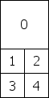
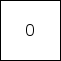

## Flare
耀斑对象是Lens Flare Components使用的源资产。Flare本身是纹理文件和确定Flare行为方式的特定信息的组合。然后，当您想在场景中使用耀斑时，您可以用GameObject
上的LensFlare 组件引用特定的Flare。

标准资产中有一些Flare样本。Unity 包。如果要向场景中添加其中一个，请将“ 镜头光晕”组件附加到GameObject，然后将要使用的“ 光晕”拖动到“镜头光晕” 的“ 光晕”属性中，就像分配“ 材质”到
网格渲染器一样。

耀斑通过在单个纹理上包含多个耀斑元素而起作用。在Flare中，您可以从任意纹理中选择要包含的元素。

## Properties

|Property|Function|
|:-------|:-------|
|Elements|耀斑中包含的耀斑图像数。|
|&nbsp;&nbsp;&nbsp;&nbsp;&nbsp;&nbsp;&nbsp;&nbsp;Image Index|从“ 闪光”纹理中使用哪个闪光图像此元素。有关更多信息，请参见下面的“Flare Textures”部分。|
|&nbsp;&nbsp;&nbsp;&nbsp;&nbsp;&nbsp;&nbsp;&nbsp;Position|该元素沿过对象的坐标到屏幕中心的直线的偏移。 0 - 对象位置， 1 - 屏幕中心。|
|&nbsp;&nbsp;&nbsp;&nbsp;&nbsp;&nbsp;&nbsp;&nbsp;Size|元素的尺寸|
|&nbsp;&nbsp;&nbsp;&nbsp;&nbsp;&nbsp;&nbsp;&nbsp;Color|元素的颜色|
|&nbsp;&nbsp;&nbsp;&nbsp;&nbsp;&nbsp;&nbsp;&nbsp; Use Light Color|如果将Flare连接到Light，则启用该功能将使用Light的颜色为Flare着色。|
|&nbsp;&nbsp;&nbsp;&nbsp;&nbsp;&nbsp;&nbsp;&nbsp;Rotate|如果启用，则“元素”的底部将始终面向屏幕中心，从而使“镜头光晕”在屏幕上四处移动时使元素旋转。|
|&nbsp;&nbsp;&nbsp;&nbsp;&nbsp;&nbsp;&nbsp;&nbsp;Zoom|如果启用，则元素在可见时将按比例放大，在不可见时将按比例缩小。|
|&nbsp;&nbsp;&nbsp;&nbsp;&nbsp;&nbsp;&nbsp;&nbsp;Fade|如果启用，元素将在可见时淡入全强度，在不可见时淡出。|
|Flare Texture|包含此Flare的Elements使用的图像的纹理。必须根据TextureLayout选项之一进行排列。|
|Texture Layout|	如何个别耀斑要素图像内布置Flare Texture（见纹理布局以获得更多的细节）。|
|Use Fog|如果启用，则眩光将随着距离雾而消失。通常用于小火炬。|

## Details
耀斑由沿着一条线排列的多个元素组成。通过将包含镜头光晕的GameObject的位置与屏幕中心进行比较来计算该线。该行超出了包含的GameObject和屏幕中心。所有Flare Elements都悬挂在该行上。

## Flare Textures
出于性能原因，一个耀斑的所有元素必须共享相同的纹理。该纹理包含不同图像的集合，这些图像可在单个Flare中用作元素。该纹理布局定义了如何元素都在布局耀斑纹理。

## Texture Layouts
这些是不同Flare Texture Layouts的选项。图像中的数字对应于每个Element的Image Index属性。

**1大4小**

设计用于大型太阳风格的耀斑，您需要其中一种元素比其他元素具有更高的保真度。设计用于与宽度两倍高的纹理。

**1大2中8小**

设计用于需要1个高清，2个中等和8个小图像的复杂耀斑。在标准资源“ 50毫米变焦光斑”中使用，其中两个中等元素是彩虹色的圆圈。设计用于与宽度两倍高的纹理。

**1纹理**

单个图像。

**2x2网格**

一个简单的2x2网格。

**3x3网格**

一个简单的3x3网格。

**4x4网格**

一个简单的4x4网格。

## Hints
* 如果您使用许多不同的耀斑，则使用包含所有元素的单个耀斑纹理将为您提供最佳渲染性能。
* 透镜耀斑被阻塞撞机。在Flare GameObject和Camera之间的对撞机即使在对撞机没有网格渲染器的情况下，“ 也会隐藏光斑。如果将中间的Collider标记为Trigger，则仅当Physics.queriesHitTriggers为true时，它将阻止光晕。
* 覆盖着色器用于眩光的，打开“ 图形”窗口并设置“ 镜头眩光”。要用作替代的着色器。