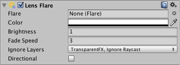

## Lens Flare
**Lens Flare**可模拟光线在相机镜头内部折射的效果。它们用于表示真正的明亮的灯光，或更巧妙地只是为场景添加更多的气氛。

设置镜头光晕的最简单方法是分配Light的Flare属性。Unity在Standard Assets软件包中包含几个预配置的Flare 。

否则，请通过**GameObject->Create Empty**创建一个空的GameObject，然后通过**Component-> Effects-> Len Flare**添加镜头耀斑组件。然后选择**Flare**的Inspector。

在“ 场景视图”中查看
 “镜头光晕”的效果中的“场景视图” 工具栏中的“ 效果”下拉菜单然后选择“喇叭口”选项。
 
 启用Fx按钮以在“场景视图”中查看镜头光晕

 ## Properties
|Property|Function|
|:-------|:-------|
|Flare|要渲染的耀斑。耀斑定义了镜头耀斑外观的所有方面。|
|Color|	可以对某些耀斑进行着色，以更好地适合您的场景心情。|
|Brightness|镜头光斑有多大和明亮。|
|Fade Speed|耀斑消失的速度有多快。|
|Ignore Layers|为不应遮盖耀斑的图层选择蒙版。|
|Directional|如果设置，则眩光将沿着游戏对象的正Z轴定向。它将看起来好像是无限远，并且不会跟踪对象的位置，仅跟踪Z轴的方向。|

## Details
您可以将耀斑直接设置为“ 光组件” 的属性，也可以将它们分别设置为“镜头耀斑”组件。如果将它们连接到灯光，它们将自动跟踪灯光的位置和方向。要获得更精确的控制，请使用此组件。

一个摄像头中的“ 光晕层光晕”组件”，使“耀斑”可见（默认情况下为true，因此您无需进行任何设置）。

## Hints
* 对镜头光晕的用法要保持离散。
* 如果使用非常明亮的镜头光晕，请确保其方向与场景的主光源相匹配。
* 要设计自己的Flare，您需要创建一些Flare资产。首先复制我们在标准资产的Lens Flares文件夹中提供的一些资产
，然后对其进行修改。
* 透镜耀斑被阻塞撞机。即使Collider不具有“ Mesh Renderer渲染器），“ Flare GameObject”和“ Camera”之间的Collider也会隐藏Flare。“ Mesh”渲染器。如果中间对撞机标记为“触发器”，则当且仅当Physics.queriesHitTriggers是正确的。

[Flare](Flare/README.md)