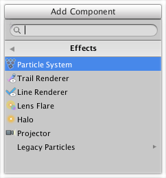

Visual Effects Reference

视觉效果可以应用于相机，游戏对象，光源和游戏的其他元素。本节提供在Unity编辑器中可用视觉效果的信息。

要访问Unity编辑器中可用的视觉效果，请在 Hierarchy 中选择要应用效果的对象，然后在  Inspector 中转到 **Add Component > Effects**。

在unity中可用的视觉效果

参考本节剩余部分了解各个组件的更多信息：
* Particle System (参考: [Particle system](../ParticleSystemsreference/README.md))
* [Trail Renderer](TrailRenderer/README.md)
* [Line Renderer](LineRenderer/README.md)
* [Lens Flare](LensFlare/README.md)
* [Halo](Halo/README.md)
* [Billboard Renderer](BillboardRenderer/README.md)
* [Billboard Asset](BillboardAsset/README.md)
* [Projector](Projector/README.md)
* Legacy Particles (参考: [Legacy Particles](https://docs.unity3d.com/Manual/comp-ParticlesLegacy.html?_ga=2.242953474.10219103.1571910535-1474088773.1571910535) in Graphics Reference Documentation)