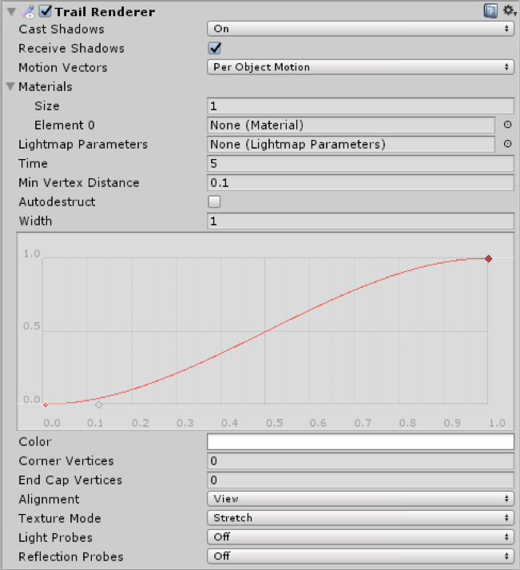
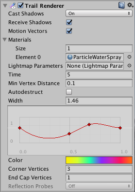
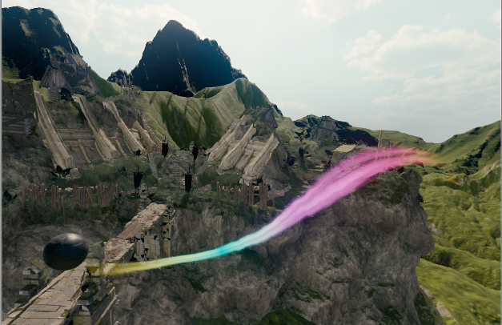

## Billboard Renderer
**Trail Renderer**用于在移动物体时产生拖尾效果。

## Properties

|Property|Function|
|:-------|:-------|
|Cast Shadows|确定路径是否投射阴影，是否应从路径的一侧或两侧投射阴影，或者路径是否应仅投射阴影而不以其他方式绘制。有关更多信息，请参阅Scripting API参考文档中的Renderer.shadowCastingMode。|
|Receive Shadows|是否接收阴影|
|Motion Vectors|如果启用，则该路径会将运动矢量渲染到“相机运动矢量”纹理中。有关更多信息，请参见Scripting API参考文档中的Renderer.motionVectors。|
|Materials|这些属性描述了用于渲染轨迹的一系列材料。粒子着色器最适合轨迹。|
|Lightmap Parameters|在此处引用“ 光照贴图参数资源”，以使路径与全局照明系统交互。|
|Time|定义拖尾的时间，单位为秒|
|Min Vertex Distance|路径的锚点之间的最小距离（请参见下面的详细信息）。|
|AutoDestruct|一旦闲置了Time秒，启用此功能即可销毁GameObject 。|
|Width|定义宽度值和曲线以控制路径在起点和终点之间的各个点的宽度。从轨迹的起点到终点应用曲线，并在每个顶点进行采样。曲线的总宽度由宽度值控制。|
|Color|定义渐变以控制路径沿其长度的颜色。|
|Corner Vertices|此属性指示在路径中绘制角时使用多少个额外的顶点。增大此值可使尾角变圆。|
|End Cap Vertices|此属性指示使用多少个额外的顶点在路径上创建端盖。增大此值可使轨迹线变圆。|
|Alignment|	设置为“ 视图”以使“路径”面向相机，或设置为“ 局部”以根据其“变换”组件的方向对其进行对齐。|
|Texture Mode|控制如何将纹理应用于路径。使用“ 拉伸 ”在路径的整个长度上应用“纹理”贴图，或使用“ 环绕 ”在路径的整个长度上重复“纹理”。使用“ 材质”中的“ 平铺”参数来控制重复率。|
|Light Probes|	基于探针的照明插值模式。|
|Reflection Probes|如果已启用并且场景中存在反射探针，则为此Trail Renderer选择一个反射纹理，并将其设置为内置的Shader均匀变量。|

## Details
轨迹渲染器在移动的GameObject后面渲染多边形的轨迹。这可用于给移动物体以增强的运动感，或突出显示移动物体的路径或位置。弹丸后面的轨迹为其轨迹增加了视觉清晰度；飞机机翼尖端的凝结尾迹是现实生活中发生的拖尾效应的一个示例。
Trail Renderer应该是附加的GameObject上使用的唯一渲染器。最好创建一个空的GameObject，并附加一个Trail Renderer作为唯一的渲染器。然后，您可以将Trail Renderer作为想要跟随的任何GameObject的父对象。

## Materials
Trail Renderer组件应使用具有粒子着色器的材质。用于材质的纹理应具有正方形尺寸（例如256x256或512x512）。对于数组中存在的每种“材质”，该轨迹都会渲染一次。

## Minimum vertex separation
**Min Vertex Distance**值决定包含拖尾的物体必须移动多远才能固化拖尾的线段。比如0.1会更频繁创建线段，拖尾更平滑。较大的值，比如1.5会产生外观上更多锯齿的线段。使用较低的值/平滑的轨迹时，性能会有一个小的折衷，因此请尝试使用尽可能大的值来实现您要创建的效果。此外，当顶点非常靠近且路径在短距离内显着改变方向时，宽的路径可能会显示视觉伪像。

## Hints
* 将粒子材质与Trail Renderer一起使用。
* Trail Renderers 必须布置在一系列帧；它们不能瞬间出现。
* Trail Renderers 旋转以显示朝向相机的脸部，类似于其他“粒子系统”。

## Trail Renderer example setup

在“检查器”窗口中显示的Trail Renderer组件，设置为创建彩色的轨迹，该轨迹变细然后变宽

由上述组件设置创建的结果跟踪