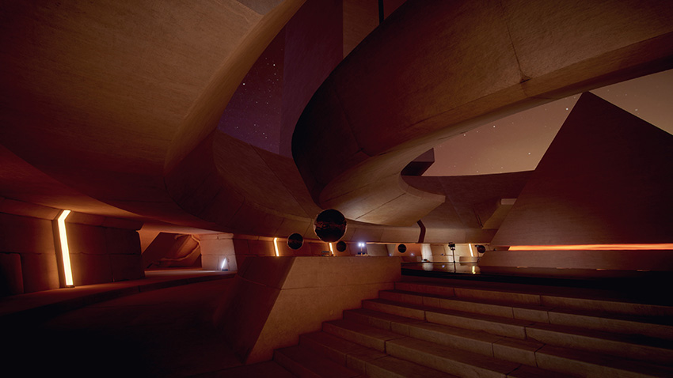

## Graphics

让你的游戏看起来就像你想象的 Real-time Global Illumination 和我们的 physically-based shader
。从明亮的白天，到霓虹灯的华灯之夜;从阳光井，到昏暗的午夜街道和阴暗的隧道-创造一个唤起的动态游戏，让玩家着迷的任何平台。

这部分解释了所有你需要知道的关于 Lighting, Cameras, Materials, Shaders & Textures, Particles & Visual Effects, 以及更多。

参见知识库[Graphics](https://support.unity3d.com/hc/en-us/categories/200434305-Graphics)部分。

在教程部分也有很多有用的[图形教程](http://unity3d.com/learn/tutorials/topics/graphics)。

**Related tutorials**: [Graphics](https://unity3d.com/learn/tutorials/topics/graphics)

有关故障排除、技巧和技巧，请参阅[知识库编辑器一节](https://support.unity3d.com/hc/en-us/categories/201964166-Unity-Editor)。