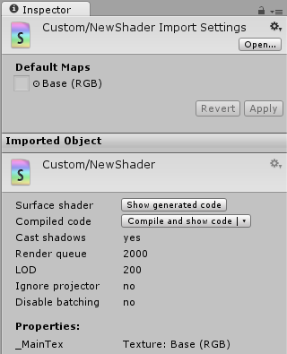
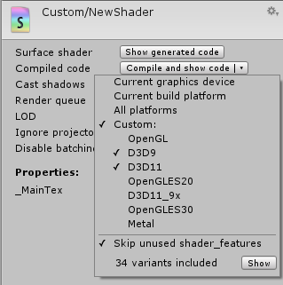

## Shader assets
着色器是包含用于图形卡执行的代码和指令的资源。 [材质](https://docs.unity3d.com/Manual/class-Material.html)引用着色器，并设置其参数（纹理，颜色等）。
Unity包含一些始终在您的项目中可用的内置着色器（例如， [Standard shader](https://docs.unity3d.com/Manual/shader-StandardShader.html)）。您还可以[编写自己的着色器](https://docs.unity3d.com/Manual/ShadersOverview.html)并应用[后处理效果](https://docs.unity3d.com/Manual/PostProcessingOverview.html)。

## Creating a new shader
要创建一个新的着色器，在主菜单中使用 **Assets > Create > Shader** 或 **Project View**上下文菜单。着色器是一个类似于c#脚本的文本文件，它是用Cg/HLSL和着色器语言的组合编写的(详细信息请参阅[编写着色器](https://docs.unity3d.com/Manual/ShadersOverview.html)页面)。

*Shader inspector*

### Shader import settings
该**inspector**部分，该内容允许为着色器指定默认纹理。每当使用此着色器创建新的[材质](https://docs.unity3d.com/Manual/class-Material.html)时，都会自动分配这些纹理。

### Shader Inspector
Shader Inspector显示有关着色器的基本信息（主要是  [shader tags](https://docs.unity3d.com/Manual/SL-SubShaderTags.html)），并允许编译和检查低级已编译代码。

对于[Surface Shaders](../WritingSurfaceShaders/README.md)，中的**Show generated code**按钮显示Unity生成的用于处理照明和阴影的所有代码。如果您确实要自定义生成的代码，则只需将其全部复制并粘贴回原始着色器文件并开始进行调整即可。

*Shader compilation popup menu.*

通过**Compile and show code**按钮的弹出菜单，可以检查所选平台的最终编译着色器代码（例如Direct3D9上的程序集或OpenGL ES的低级优化GLSL）。在优化着色器性能时，这非常有用。通常，您确实想知道最终生成了多少个低级指令。

生成的低级代码对于粘贴到GPU着色器性能分析工具（例如 [AMD GPU ShaderAnalyzer](http://developer.amd.com/tools-and-sdks/graphics-development/gpu-shaderanalyzer/) 或[PVRShaderEditor](http://community.imgtec.com/developers/powervr/tools/pvrshadereditor/)）中很有用。

## Shader compilation details
在着色器导入时间上，Unity不会编译整个着色器。这是因为大多数着色器内部都有很多变体，并且为所有可能的平台编译所有变体将花费很长时间。而是这样做：
* 在导入时，仅对着色器进行最少的处理（生成表面着色器等）。
* 实际上仅在需要时才编译着色器变体。
* 与通常在导入时编译100–10000个内部着色器的工作不同，这通常只需要少量的编译即可。

在游戏构建时，所有“尚未编译”的着色器变体都会被编译，因此即使编辑器没有碰巧使用它们，它们也位于游戏数据中。

但是，这确实意味着着色器中可能存在错误，因为在导入着色器时未检测到错误。例如，您正在使用Direct3D 11运行编辑器，但是如果为OpenGL编译，着色器会出错。或着色器的某些[变体](../WritingVertexAndFragmentShaders/MakingMultipleShaderProgramVariants/README.md)不适合着色器模型2.0的指令限制等。如果编辑器需要这些错误，这些错误将显示在检查器中；否则，错误将显示在检查器中。但是，对于需要的平台手动完全编译着色器也是一个好习惯，以检查错误。这可以使用着色器检查器中的**Compile and show code**弹出菜单来完成。

着色器编译是使用名为`UnityShaderCompilerUnity`的后台进程执行的，该进程在需要编译着色器时由Unity启动。可以启动多个编译器进程（通常在计算机中每个CPU内核一个进程），以便在播放器构建时可以并行完成着色器编译。尽管编辑器不编译着色器，但是编译器进程不执行任何操作，也不消耗计算机资源，因此无需担心它们。当Unity编辑器退出时，它们也会关闭。

各个着色器变体编译结果存储在项目中的`Library/ShaderCache`文件夹下。这意味着100％相同的着色器或其片段将重用以前编译的结果。这也意味着，如果您有很多经常更改的着色器，则着色器缓存文件夹可能会变得很大。删除它始终是安全的；这只会导致重新编译着色器变体。

## Further reading
* [Material assets](https://docs.unity3d.com/Manual/class-Material.html)
* [Writing Shaders overview.](https://docs.unity3d.com/Manual/ShadersOverview.html)
* [Shader reference.](../README.md)