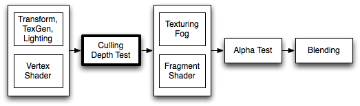

## ShaderLab: Culling & Depth Testing

剔除是一种优化，不会使多边形背对观察者。所有多边形都有正面和背面。剔除利用了大多数对象都是封闭的事实。如果您有一个立方体，您将永远看不到背离您的侧面（在它的前面总是有一个面向您的侧面），因此我们不需要绘制背对背的侧面。因此，术语：背面剔除。

另一个是渲染看起来正确的特性是深度测试。深度测试确保在一个场景中只绘制最近的物体表面
。

## Syntax
### Cull
```
Cull Back | Front | Off
```
控制应剔除多边形的哪些面（不绘制）

* **Back**不要渲染背面朝向观察者的多边形（默认）。
* **Front**不要渲染正面朝向观察者的多边形。用于将物体由内向外翻转。
* **Off**关禁用剔除-绘制所有面。用于特殊效果。

### ZWrite
```
ZWrite On | Off
```
控制是否将来自此对象的像素写入深度缓冲区(默认)。如果你画的是实心物体，把这个开着。如果你正在绘制半透明效果，切换到ZWrite Off。

### ZTest
```
ZTest Less | Greater | LEqual | GEqual | Equal | NotEqual | Always
```
如何进行深度测试。默认是LEqual(从现有对象或在现有对象的距离处绘制对象;隐藏在它们后面对象)。

### Offset
```
Offset Factor, Units
```
允许使用两个参数指定深度偏移。因素和单位。相对于多边形的X或Y，因子缩放了最大Z斜率，而单位缩放了最小可解析深度缓冲值。这允许你强迫一个多边形画在另一个上面，尽管它们实际上是在相同的位置。例如偏移量0，-1忽略多边形的斜率而将其拉近，而偏移量-1，-1在观察掠射角时将使多边形更近。

## Examples
该对象将仅呈现对象的背面：
```
Shader "Show Insides" {
    SubShader {
        Pass {
            Material {
                Diffuse (1,1,1,1)
            }
            Lighting On
            Cull Front
        }
    }
}
```
尝试将其应用于立方体，并注意在绕其旋转时几何体的感觉如何。这是因为您只看到立方体的内部。

### Transparent shader with depth writes
通常，[semitransparent shaders](https://docs.unity3d.com/Manual/shader-TransparentFamily.html)不会写入深度缓冲区。但是，这会产生绘制顺序问题，尤其是对于复杂的非凸网格。如果要像这样淡入和淡出网格，请使用着色器
中的“在渲染透明度之前填充深度缓冲区”，这可能会很有用。
```
Shader "Transparent/Diffuse ZWrite" {
Properties {
    _Color ("Main Color", Color) = (1,1,1,1)
    _MainTex ("Base (RGB) Trans (A)", 2D) = "white" {}
}
SubShader {
    Tags {"Queue"="Transparent" "IgnoreProjector"="True" "RenderType"="Transparent"}
    LOD 200

    // extra pass that renders to depth buffer only
    Pass {
        ZWrite On
        ColorMask 0
    }

    // paste in forward rendering passes from Transparent/Diffuse
    UsePass "Transparent/Diffuse/FORWARD"
}
Fallback "Transparent/VertexLit"
}
```

### Debugging Normals
下一个更有趣;首先我们用普通的顶点光照渲染对象，然后我们用亮粉色渲染背景。它的效果是在法线需要翻转的任何地方高亮显示。如果你看到物理控制的物体被任何网格“吸入”，试着分配这个着色器给它们。如果任何粉红色的部分是可见的，这些部分将拉入任何不幸的足够接触它。
我们开始吧：
```
Shader "Reveal Backfaces" {
    Properties {
        _MainTex ("Base (RGB)", 2D) = "white" { }
    }
    SubShader {
        // Render the front-facing parts of the object.
        // We use a simple white material, and apply the main texture.
        Pass {
            Material {
                Diffuse (1,1,1,1)
            }
            Lighting On
            SetTexture [_MainTex] {
                Combine Primary * Texture
            }
        }

        // Now we render the back-facing triangles in the most
        // irritating color in the world: BRIGHT PINK!
        Pass {
            Color (1,0,1,1)
            Cull Front
        }
    }
}
```

### Glass Culling
控制剔除比调试背面更有用。如果您有透明的对象，您通常希望显示对象的背面。如果你渲染时没有剔除任何东西，你很可能会有一些后面的面覆盖了一些前面的面。
这是一个简单的着色器，将工作的凸对象(球体，立方体，汽车挡风玻璃)。
```
Shader "Simple Glass" {
    Properties {
        _Color ("Main Color", Color) = (1,1,1,0)
        _SpecColor ("Spec Color", Color) = (1,1,1,1)
        _Emission ("Emmisive Color", Color) = (0,0,0,0)
        _Shininess ("Shininess", Range (0.01, 1)) = 0.7
        _MainTex ("Base (RGB)", 2D) = "white" { }
    }

    SubShader {
        // We use the material in many passes by defining them in the subshader.
        // Anything defined here becomes default values for all contained passes.
        Material {
            Diffuse [_Color]
            Ambient [_Color]
            Shininess [_Shininess]
            Specular [_SpecColor]
            Emission [_Emission]
        }
        Lighting On
        SeparateSpecular On

        // Set up alpha blending
        Blend SrcAlpha OneMinusSrcAlpha

        // Render the back facing parts of the object.
        // If the object is convex, these will always be further away
        // than the front-faces.
        Pass {
            Cull Front
            SetTexture [_MainTex] {
                Combine Primary * Texture
            }
        }
        // Render the parts of the object facing us.
        // If the object is convex, these will be closer than the
        // back-faces.
        Pass {
            Cull Back
            SetTexture [_MainTex] {
                Combine Primary * Texture
            }
        }
    }
}
```