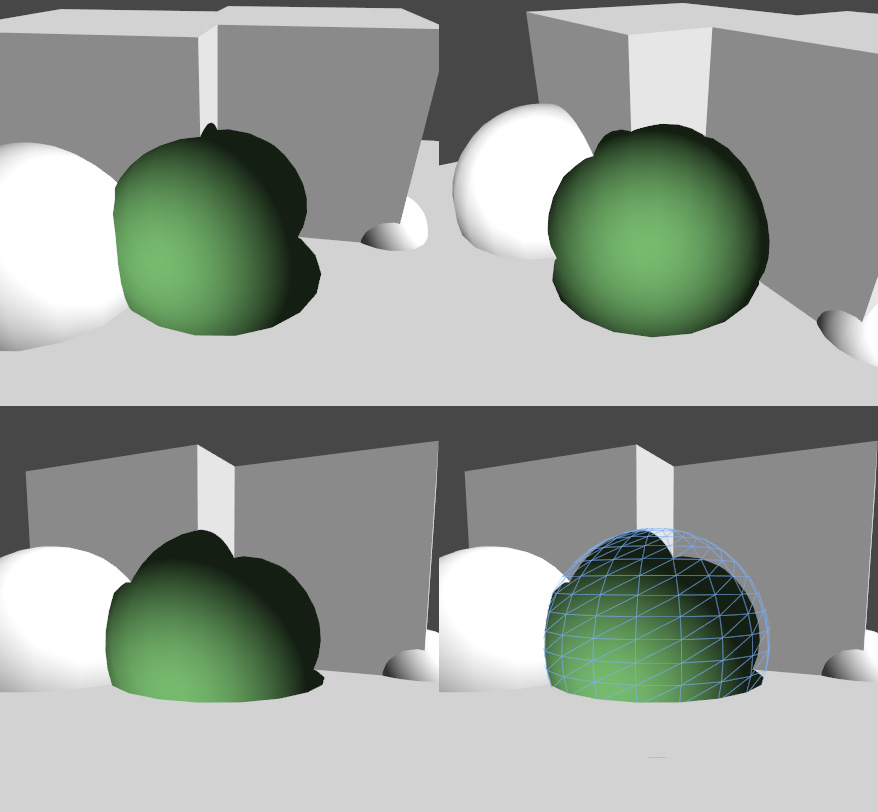

## ShaderLab: Stencil
**stencil buffer**能被用于通用的逐像素遮罩，保留或者丢弃像素。
模板缓冲区通常为每像素8位整数。可以将值写入、递增或递减。随后的 draw calls 可以针对该值进行测试，在运行像素着色器之前以决定是否应该丢弃像素。

### Syntax
#### Ref
```
Ref referenceValue
```
用于比较的值(如果 Comp 不是 always)或者写入 buffer 的值(如果是 Pass, Fail 或者 ZFail 被替换)。 0–255 整数。

#### ReadMask
```
ReadMask readMask
```
一个8位掩码，0–255 整数。在将参考值与缓冲区内容（referenceValue＆readMask）compareFunction（stencilBufferValue＆readMask）比较时使用。默认：255。

#### WriteMask
```
WriteMask writeMask
```
一个8位掩码，作为0-255的整数，写入缓冲区时使用。注意，与其他写掩码一样，它指定模板缓冲区的哪些位将受到写的影响(即WriteMask 0表示没有位受到影响，不是0被写入)。默认值:255。

#### Comp
```
Comp comparisonFunction
```
改函数用于比较 reference value 和 当前 buffer 的内容。默认为：always。

#### Pass
```
Pass stencilOperation
```
当模版测试（深度测试）通过后对buffer的内容执行什么操作。默认为：keep。

#### Fail
```
Fail stencilOperation
```
当模版测试失败后对buffer的内容执行什么操作。默认为：keep。

#### ZFail
```
ZFail stencilOperation
```
当模版测试通过，但是深度测试失败后对buffer的内容执行什么操作。默认为：keep。

Comp、Pass、Fail和ZFail将应用于正面的几何图形，除非指定了Cull Front，在这种情况下它是背面的几何图形。您还可以通过定义CompFront、PassFront、FailFront、ZFailFront(用于正面的几何图形)和CompBack、PassBack、FailBack、ZFailBack(用于背面的几何图形)来显式指定双面模版状态。


#### Comparison Function
比较函数是下列中的一个：
| Function | DESC |
|:---------|:-----|
|Greater    |仅渲染参考值大于缓冲区中的值的像素。|
|GEqual     |仅渲染参考值大于或等于缓冲区中值的像素。|
|Less       |仅渲染参考值小于缓冲区中的值的像素。|
|LEqual     |仅渲染参考值小于或等于缓冲区中值的像素。|
|Equal      |仅渲染参考值等于缓冲区中值的像素。|
|NotEqual   |仅渲染参考值与缓冲区中的值不同的像素。|
|Always     |使模板测试始终通过。|
|Never      |使模板测试始终失败。|

#### Stencil Operation
模版操作是下列中的一个：
| Operation | DESC |
|:--------- |:-----|
|Keep       |保留缓冲区的当前内容。|
|Zero       |将0写入缓冲区。|
|Replace    |将参考值写入缓冲区。|
|IncrSat    |递增缓冲区中的当前值。如果该值已经是255，则保持为255。|
|DecrSat    |减少缓冲区中的当前值。如果该值已经为0，则保持为0|
|Invert     |取反所有位。|
|IncrWrap   |递增缓冲区中的当前值。如果该值已经是255，则它将变为0。|
|DecrWrap   |减少缓冲区中的当前值。如果该值已经为0，则变为255。|

### Deferred rendering path
模版功能对于在Unity中使用[Deferred Shading](../../../../../RenderingPipelineDetails/DeferredShadingRenderingPath/README.md)渲染的对象时限制的。这是因为 stencil buffer 在 G-buffer pass 和 lighting pass 期间用于其他目的，并且 Unity 定义的 stencil state 被忽略。
同样，你也不能基于模板测试屏蔽掉Unity在deferred rendering path中渲染的GameObjects，因为他们仍然可以修改GameObjects在稍后的帧中渲染的缓冲内容。在 Unity 中，forward rendering path 在 deferred path 后渲染游戏对象，如透明的游戏对象或没有表面着色器的游戏对象，将其模板状态设置为预期的状态。

Unity在递延渲染中使用这些位来操作模板缓存:
* Bit #7 (value=128) 指示任何非背景对象。
* Bit #6 (value=64) 指示非照明对象。
* Bit #5 (value=32) Unity不使用位.
* Bit #4 (value=16) 用于照明遍历期间的光形状剔除，因此Unity仅对与光接触的像素执行照明着色器，而不对表面几何形状在光体积后面的像素执行照明着色器。
* Unity将最低的四个位（值1,2,4,8）用于光层筛选遮罩。

您可以使用模板读写掩码在未使用的位元范围内进行操作，也可以使用[Camera.clearStencilAfterLightingPass](https://docs.unity3d.com/ScriptReference/Camera-clearStencilAfterLightingPass.html)在 lighting pass 后，强制相机清理 stencil buffer。


### Example
第一个示例着色器将在深度测试通过后写入值“ 2”。模板测试设置为始终通过。
```cs
Shader "Red" {
    SubShader {
        Tags { "RenderType"="Opaque" "Queue"="Geometry"}
        Pass {
            Stencil {
                Ref 2
                Comp always
                Pass replace
            }
        
            CGPROGRAM
            #pragma vertex vert
            #pragma fragment frag
            struct appdata {
                float4 vertex : POSITION;
            };
            struct v2f {
                float4 pos : SV_POSITION;
            };
            v2f vert(appdata v) {
                v2f o;
                o.pos = UnityObjectToClipPos(v.vertex);
                return o;
            }
            half4 frag(v2f i) : SV_Target {
                return half4(1,0,0,1);
            }
            ENDCG
        }
    } 
}
```

第二个shader只有在第一个shader (red) 通过时通过，因为它检测与值“2”相等。它会在 Z test 失败时减小值。
```cs
Shader "Green" {
    SubShader {
        Tags { "RenderType"="Opaque" "Queue"="Geometry+1"}
        Pass {
            Stencil {
                Ref 2
                Comp equal
                Pass keep 
                ZFail decrWrap
            }
        
            CGPROGRAM
            #pragma vertex vert
            #pragma fragment frag
            struct appdata {
                float4 vertex : POSITION;
            };
            struct v2f {
                float4 pos : SV_POSITION;
            };
            v2f vert(appdata v) {
                v2f o;
                o.pos = UnityObjectToClipPos(v.vertex);
                return o;
            }
            half4 frag(v2f i) : SV_Target {
                return half4(0,1,0,1);
            }
            ENDCG
        }
    } 
}
```

第三个shader只有在模版值为“1”时通过，所以只有在 red 和 green 交叉处的像素 - 也就是说，模板被红色着色器设置为“2”，被绿色着色器减少为“1”。
```cs
Shader "Blue" {
    SubShader {
        Tags { "RenderType"="Opaque" "Queue"="Geometry+2"}
        Pass {
            Stencil {
                Ref 1
                Comp equal
            }
        
            CGPROGRAM
            #include "UnityCG.cginc"
            #pragma vertex vert
            #pragma fragment frag
            struct appdata {
                float4 vertex : POSITION;
            };
            struct v2f {
                float4 pos : SV_POSITION;
            };
            v2f vert(appdata v) {
                v2f o;
                o.pos = UnityObjectToClipPos(v.vertex);
                return o;
            }
            half4 frag(v2f i) : SV_Target {
                return half4(0,0,1,1);
            }
            ENDCG
        }
    }
}
```
结果为：


另一个更直接的例子。球体首先用这个着色器来标记模板缓冲区中的适当区域:
```cs
Shader "HolePrepare" {
    SubShader {
        Tags { "RenderType"="Opaque" "Queue"="Geometry+1"}
        ColorMask 0
        ZWrite off
        Stencil {
            Ref 1
            Comp always
            Pass replace
        }

        CGINCLUDE
            struct appdata {
                float4 vertex : POSITION;
            };
            struct v2f {
                float4 pos : SV_POSITION;
            };
            v2f vert(appdata v) {
                v2f o;
                o.pos = UnityObjectToClipPos(v.vertex);
                return o;
            }
            half4 frag(v2f i) : SV_Target {
                return half4(1,1,0,1);
            }
        ENDCG

        Pass {
            Cull Front
            ZTest Less
        
            CGPROGRAM
            #pragma vertex vert
            #pragma fragment frag
            ENDCG
        }
        Pass {
            Cull Back
            ZTest Greater
        
            CGPROGRAM
            #pragma vertex vert
            #pragma fragment frag
            ENDCG
        }
    } 
}
```

然后再次渲染为一个相当标准的表面着色器，除了正面剔除，禁用深度测试和模板测试丢弃之前标记的像素:
```cs
Shader "Hole" {
    Properties {
        _Color ("Main Color", Color) = (1,1,1,0)
    }
    SubShader {
        Tags { "RenderType"="Opaque" "Queue"="Geometry+2"}

        ColorMask RGB
        Cull Front
        ZTest Always
        Stencil {
            Ref 1
            Comp notequal 
        }

        CGPROGRAM
        #pragma surface surf Lambert
        float4 _Color;
        struct Input {
            float4 color : COLOR;
        };
        void surf (Input IN, inout SurfaceOutput o) {
            o.Albedo = _Color.rgb;
            o.Normal = half3(0,0,-1);
            o.Alpha = 1;
        }
        ENDCG
    } 
}
```
结果为：

