 这儿是一些Surface Shaders的例子。下面的这些例子集中于内置的光照模型，关于如何实现自定义光照模型在 Surface Shader Lighting Examples。

 ## Simple
 我们将从一个非常简单的着色器开始，并以此为基础。这是一个将表面颜色设置为“白色”的着色器。它使用内置的Lambert（漫反射）照明模型。
 ```
  Shader "Example/Diffuse Simple" {
    SubShader {
      Tags { "RenderType" = "Opaque" }
      CGPROGRAM
      #pragma surface surf Lambert
      struct Input {
          float4 color : COLOR;
      };
      void surf (Input IN, inout SurfaceOutput o) {
          o.Albedo = 1;
      }
      ENDCG
    }
    Fallback "Diffuse"
  }
 ```
 这是在设置了两个光源的模型上的外观：
 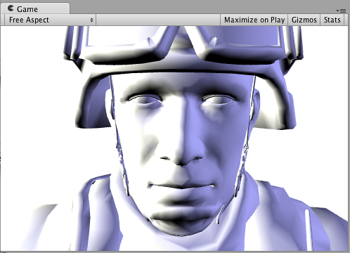

 ## Texture
 全白色的对象非常无聊，因此让我们添加一个Texture。我们将向着色器添加一个Properties块，以便在Material中获得一个Texture选择器。其他更改在下面以粗体显示。
 ```
  Shader "Example/Diffuse Texture" {
    Properties {
      _MainTex ("Texture", 2D) = "white" {}
    }
    SubShader {
      Tags { "RenderType" = "Opaque" }
      CGPROGRAM
      #pragma surface surf Lambert
      struct Input {
          float2 uv_MainTex;
      };
      sampler2D _MainTex;
      void surf (Input IN, inout SurfaceOutput o) {
          o.Albedo = tex2D (_MainTex, IN.uv_MainTex).rgb;
      }
      ENDCG
    } 
    Fallback "Diffuse"
  }
 ```
 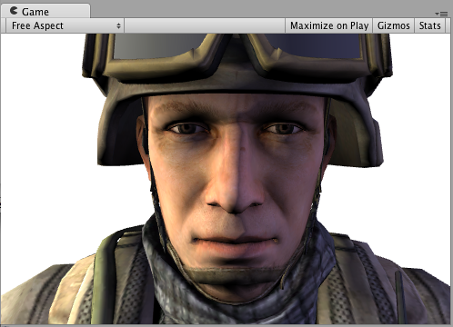

## Normal mapping
```
Shader "Example/Diffuse Bump" {
    Properties {
      _MainTex ("Texture", 2D) = "white" {}
      _BumpMap ("Bumpmap", 2D) = "bump" {}
    }
    SubShader {
      Tags { "RenderType" = "Opaque" }
      CGPROGRAM
      #pragma surface surf Lambert
      struct Input {
        float2 uv_MainTex;
        float2 uv_BumpMap;
      };
      sampler2D _MainTex;
      sampler2D _BumpMap;
      void surf (Input IN, inout SurfaceOutput o) {
        o.Albedo = tex2D (_MainTex, IN.uv_MainTex).rgb;
        o.Normal = UnpackNormal (tex2D (_BumpMap, IN.uv_BumpMap));
      }
      ENDCG
    } 
    Fallback "Diffuse"
  }
```
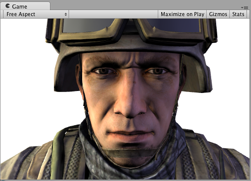

## Rim Lighting
现在，尝试添加一些Rim Lighting以突出显示GameObject的边缘。我们将基于表面法线和视图方向之间的角度添加一些发射光。为此，我们将使用内置的viewDirSurface Shader变量。
```
Shader "Example/Rim" {
    Properties {
      _MainTex ("Texture", 2D) = "white" {}
      _BumpMap ("Bumpmap", 2D) = "bump" {}
      _RimColor ("Rim Color", Color) = (0.26,0.19,0.16,0.0)
      _RimPower ("Rim Power", Range(0.5,8.0)) = 3.0
    }
    SubShader {
      Tags { "RenderType" = "Opaque" }
      CGPROGRAM
      #pragma surface surf Lambert
      struct Input {
          float2 uv_MainTex;
          float2 uv_BumpMap;
          float3 viewDir;
      };
      sampler2D _MainTex;
      sampler2D _BumpMap;
      float4 _RimColor;
      float _RimPower;
      void surf (Input IN, inout SurfaceOutput o) {
          o.Albedo = tex2D (_MainTex, IN.uv_MainTex).rgb;
          o.Normal = UnpackNormal (tex2D (_BumpMap, IN.uv_BumpMap));
          half rim = 1.0 - saturate(dot (normalize(IN.viewDir), o.Normal));
          o.Emission = _RimColor.rgb * pow (rim, _RimPower);
      }
      ENDCG
    } 
    Fallback "Diffuse"
  }
```
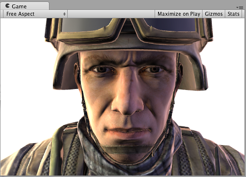

## Detail Texture
为了获得不同的效果，让我们添加一个与基础纹理相结合的“细节纹理”。细节纹理通常在材质中使用相同的UV，但使用不同的平铺，因此我们需要使用不同的输入UV坐标。
```
  Shader "Example/Detail" {
    Properties {
      _MainTex ("Texture", 2D) = "white" {}
      _BumpMap ("Bumpmap", 2D) = "bump" {}
      _Detail ("Detail", 2D) = "gray" {}
    }
    SubShader {
      Tags { "RenderType" = "Opaque" }
      CGPROGRAM
      #pragma surface surf Lambert
      struct Input {
          float2 uv_MainTex;
          float2 uv_BumpMap;
          float2 uv_Detail;
      };
      sampler2D _MainTex;
      sampler2D _BumpMap;
      sampler2D _Detail;
      void surf (Input IN, inout SurfaceOutput o) {
          o.Albedo = tex2D (_MainTex, IN.uv_MainTex).rgb;
          o.Albedo *= tex2D (_Detail, IN.uv_Detail).rgb * 2;
          o.Normal = UnpackNormal (tex2D (_BumpMap, IN.uv_BumpMap));
      }
      ENDCG
    } 
    Fallback "Diffuse"
  }
```
使用纹理检查器并不总是很实用，但是在此示例中，它用于说明会发生什么：
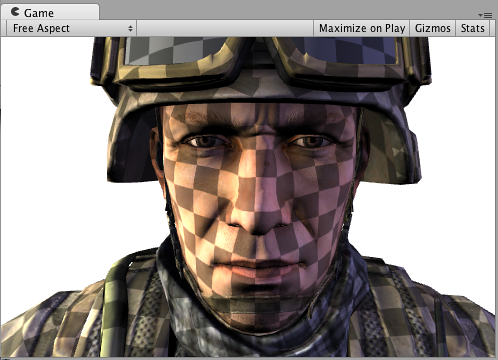

## Detail Texture in Screen Space
屏幕空间中的“细节纹理”对于士兵的头部模型没有实际意义，但在此处用于说明如何使用内置screenPos输入：
```
  Shader "Example/ScreenPos" {
    Properties {
      _MainTex ("Texture", 2D) = "white" {}
      _Detail ("Detail", 2D) = "gray" {}
    }
    SubShader {
      Tags { "RenderType" = "Opaque" }
      CGPROGRAM
      #pragma surface surf Lambert
      struct Input {
          float2 uv_MainTex;
          float4 screenPos;
      };
      sampler2D _MainTex;
      sampler2D _Detail;
      void surf (Input IN, inout SurfaceOutput o) {
          o.Albedo = tex2D (_MainTex, IN.uv_MainTex).rgb;
          float2 screenUV = IN.screenPos.xy / IN.screenPos.w;
          screenUV *= float2(8,6);
          o.Albedo *= tex2D (_Detail, screenUV).rgb * 2;
      }
      ENDCG
    } 
    Fallback "Diffuse"
  }
```

法线贴图已从上面的着色器中删除，只是为了使其更短：
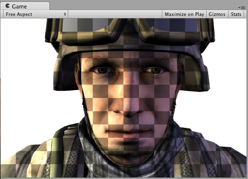

## Cubemap Reflection
这是一个使用内置worldRefl输入进行立方反射的着色器。它与内置的 Reflective/Diffuse非常相似：
```
  Shader "Example/WorldRefl" {
    Properties {
      _MainTex ("Texture", 2D) = "white" {}
      _Cube ("Cubemap", CUBE) = "" {}
    }
    SubShader {
      Tags { "RenderType" = "Opaque" }
      CGPROGRAM
      #pragma surface surf Lambert
      struct Input {
          float2 uv_MainTex;
          float3 worldRefl;
      };
      sampler2D _MainTex;
      samplerCUBE _Cube;
      void surf (Input IN, inout SurfaceOutput o) {
          o.Albedo = tex2D (_MainTex, IN.uv_MainTex).rgb * 0.5;
          o.Emission = texCUBE (_Cube, IN.worldRefl).rgb;
      }
      ENDCG
    } 
    Fallback "Diffuse"
  }
```
因为它将反射颜色指定为Emission，所以我们得到了一个非常闪亮的士兵：
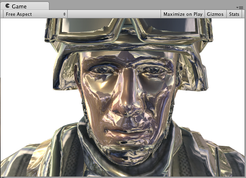
如果要进行受法线贴图影响的反射，则需要稍微复杂一些：INTERNAL_DATA需要将其添加到Input结构中，并WorldReflectionVector在编写法线输出后用于计算每像素反射向量的函数。
```
  Shader "Example/WorldRefl Normalmap" {
    Properties {
      _MainTex ("Texture", 2D) = "white" {}
      _BumpMap ("Bumpmap", 2D) = "bump" {}
      _Cube ("Cubemap", CUBE) = "" {}
    }
    SubShader {
      Tags { "RenderType" = "Opaque" }
      CGPROGRAM
      #pragma surface surf Lambert
      struct Input {
          float2 uv_MainTex;
          float2 uv_BumpMap;
          float3 worldRefl;
          INTERNAL_DATA
      };
      sampler2D _MainTex;
      sampler2D _BumpMap;
      samplerCUBE _Cube;
      void surf (Input IN, inout SurfaceOutput o) {
          o.Albedo = tex2D (_MainTex, IN.uv_MainTex).rgb * 0.5;
          o.Normal = UnpackNormal (tex2D (_BumpMap, IN.uv_BumpMap));
          o.Emission = texCUBE (_Cube, WorldReflectionVector (IN, o.Normal)).rgb;
      }
      ENDCG
    } 
    Fallback "Diffuse"
  }
```
这是一个法线铁塔与的闪亮士兵：
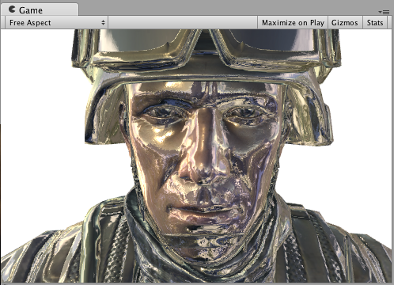

## Slices via World Space Position
这是一个通过丢弃水平线附近的像素切片的士兵。
```
  Shader "Example/Slices" {
    Properties {
      _MainTex ("Texture", 2D) = "white" {}
      _BumpMap ("Bumpmap", 2D) = "bump" {}
    }
    SubShader {
      Tags { "RenderType" = "Opaque" }
      Cull Off
      CGPROGRAM
      #pragma surface surf Lambert
      struct Input {
          float2 uv_MainTex;
          float2 uv_BumpMap;
          float3 worldPos;
      };
      sampler2D _MainTex;
      sampler2D _BumpMap;
      void surf (Input IN, inout SurfaceOutput o) {
          clip (frac((IN.worldPos.y+IN.worldPos.z*0.1) * 5) - 0.5);
          o.Albedo = tex2D (_MainTex, IN.uv_MainTex).rgb;
          o.Normal = UnpackNormal (tex2D (_BumpMap, IN.uv_BumpMap));
      }
      ENDCG
    } 
    Fallback "Diffuse"
  }
```
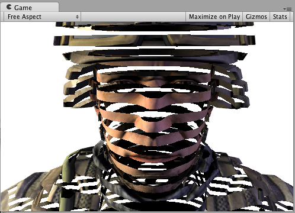

## Normal Extrusion with Vertex Modifier
可以使用 “vertex modifier” 函数修改 vertex Shader 中输入的顶点数据。这被用在比如程序动画和法线挤出。Surface Shader的编译指令`vertex:functionName`用于这个，函数参数为 `inout appdata_full`。
下面的shader是跟随法线移动顶点，移动量为材质上指定的值：
```
  Shader "Example/Normal Extrusion" {
    Properties {
      _MainTex ("Texture", 2D) = "white" {}
      _Amount ("Extrusion Amount", Range(-1,1)) = 0.5
    }
    SubShader {
      Tags { "RenderType" = "Opaque" }
      CGPROGRAM
      #pragma surface surf Lambert vertex:vert
      struct Input {
          float2 uv_MainTex;
      };
      float _Amount;
      void vert (inout appdata_full v) {
          v.vertex.xyz += v.normal * _Amount;
      }
      sampler2D _MainTex;
      void surf (Input IN, inout SurfaceOutput o) {
          o.Albedo = tex2D (_MainTex, IN.uv_MainTex).rgb;
      }
      ENDCG
    } 
    Fallback "Diffuse"
  }
```
沿着法线移动顶点制造一个胖的士兵：
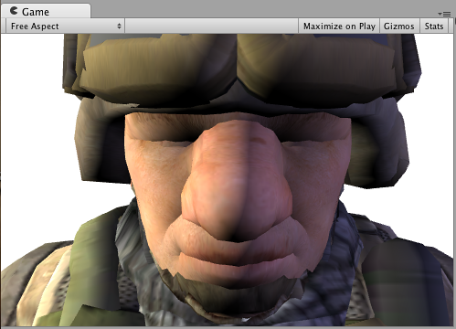

## Custom data computed per-vertex
使用 “vertex modifier” 函数也能在 vertex Shader 中计算自定义的数据，然后将该数据传入 Surface Shader 中的函数 per-pixel 中。编译指令为`vertex:functionName`，函数带有两个参数`inout appdata_full`和`out Input`。可以填充任意的非内置的值。

**注意：**在这种方式，自定义的输入成员不能以 'uv' 开头，否则不会正常工作。
下面的例子自定义了 `float3 customColor` 的成员，在 vertex function 中计算。
```
  Shader "Example/Custom Vertex Data" {
    Properties {
      _MainTex ("Texture", 2D) = "white" {}
    }
    SubShader {
      Tags { "RenderType" = "Opaque" }
      CGPROGRAM
      #pragma surface surf Lambert vertex:vert
      struct Input {
          float2 uv_MainTex;
          float3 customColor;
      };
      void vert (inout appdata_full v, out Input o) {
          UNITY_INITIALIZE_OUTPUT(Input,o);
          o.customColor = abs(v.normal);
      }
      sampler2D _MainTex;
      void surf (Input IN, inout SurfaceOutput o) {
          o.Albedo = tex2D (_MainTex, IN.uv_MainTex).rgb;
          o.Albedo *= IN.customColor;
      }
      ENDCG
    } 
    Fallback "Diffuse"
  }
```
该例子中的 customColor 设置为法线的绝对值：
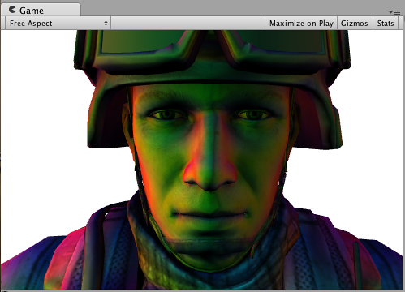
更多实用顶点数据计算没有在内置Input变量中提供，或者优化Shader计算。比如，在per-vertex计算物体的边缘光而不是在per-pixel中。

## Final Color Modifier
Shader 可以使用 “final color modifier”  函数修改最终的颜色计算。Surface Shader的编译指令为`finalcolor:functionName`，函数的参数为`Input IN, SurfaceOutput o, inout fixed4 color`。
下面是一个应用颜色到最终颜色的简单shader。这个把颜色应用到 Albedo 颜色不同，这个颜色会影响来至于Lightmaps, Light Probes 和 similar extra sources的所有颜色。
```
  Shader "Example/Tint Final Color" {
    Properties {
      _MainTex ("Texture", 2D) = "white" {}
      _ColorTint ("Tint", Color) = (1.0, 0.6, 0.6, 1.0)
    }
    SubShader {
      Tags { "RenderType" = "Opaque" }
      CGPROGRAM
      #pragma surface surf Lambert finalcolor:mycolor
      struct Input {
          float2 uv_MainTex;
      };
      fixed4 _ColorTint;
      void mycolor (Input IN, SurfaceOutput o, inout fixed4 color)
      {
          color *= _ColorTint;
      }
      sampler2D _MainTex;
      void surf (Input IN, inout SurfaceOutput o) {
           o.Albedo = tex2D (_MainTex, IN.uv_MainTex).rgb;
      }
      ENDCG
    } 
    Fallback "Diffuse"
  }
```
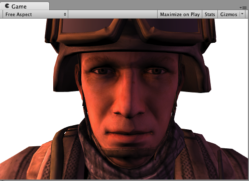

## Custom Fog with Final Color Modifier
在向前渲染中，一个常用的 final color modifier 用例是实现完全自定义的Fog。Fog需要影响最终计算出来的 pixel Shader 颜色，这完全就是 final color modifier 的作用。
下面是一个机遇距离屏幕中心的雾的应用。这把顶点修改器与自定义顶点数据（fog）和最终颜色修改器结合在一起。在前向渲染附加通道中使用时，雾需要淡化为黑色。本示例处理该问题并执行的检查UNITY_PASS_FORWARDADD。
```
  Shader "Example/Fog via Final Color" {
    Properties {
      _MainTex ("Texture", 2D) = "white" {}
      _FogColor ("Fog Color", Color) = (0.3, 0.4, 0.7, 1.0)
    }
    SubShader {
      Tags { "RenderType" = "Opaque" }
      CGPROGRAM
      #pragma surface surf Lambert finalcolor:mycolor vertex:myvert
      struct Input {
          float2 uv_MainTex;
          half fog;
      };
      void myvert (inout appdata_full v, out Input data)
      {
          UNITY_INITIALIZE_OUTPUT(Input,data);
          float4 hpos = UnityObjectToClipPos(v.vertex);
          hpos.xy/=hpos.w;
          data.fog = min (1, dot (hpos.xy, hpos.xy)*0.5);
      }
      fixed4 _FogColor;
      void mycolor (Input IN, SurfaceOutput o, inout fixed4 color)
      {
          fixed3 fogColor = _FogColor.rgb;
          #ifdef UNITY_PASS_FORWARDADD
          fogColor = 0;
          #endif
          color.rgb = lerp (color.rgb, fogColor, IN.fog);
      }
      sampler2D _MainTex;
      void surf (Input IN, inout SurfaceOutput o) {
           o.Albedo = tex2D (_MainTex, IN.uv_MainTex).rgb;
      }
      ENDCG
    } 
    Fallback "Diffuse"
  }
```
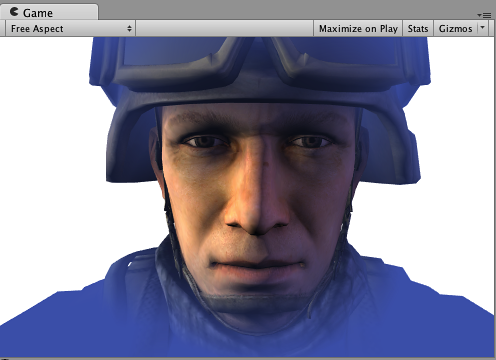

## Linear Fog

```
Shader "Example/Linear Fog" {
  Properties {
    _MainTex ("Base (RGB)", 2D) = "white" {}
  }
  SubShader {
    Tags { "RenderType"="Opaque" }
    LOD 200
    
    CGPROGRAM
    #pragma surface surf Lambert finalcolor:mycolor vertex:myvert
    #pragma multi_compile_fog

    sampler2D _MainTex;
    uniform half4 unity_FogStart;
    uniform half4 unity_FogEnd;

    struct Input {
      float2 uv_MainTex;
      half fog;
    };

    void myvert (inout appdata_full v, out Input data) {
      UNITY_INITIALIZE_OUTPUT(Input,data);
      float pos = length(UnityObjectToViewPos(v.vertex).xyz);
      float diff = unity_FogEnd.x - unity_FogStart.x;
      float invDiff = 1.0f / diff;
      data.fog = clamp ((unity_FogEnd.x - pos) * invDiff, 0.0, 1.0);
    }
    void mycolor (Input IN, SurfaceOutput o, inout fixed4 color) {
      #ifdef UNITY_PASS_FORWARDADD
        UNITY_APPLY_FOG_COLOR(IN.fog, color, float4(0,0,0,0));
      #else
        UNITY_APPLY_FOG_COLOR(IN.fog, color, unity_FogColor);
      #endif
    }

    void surf (Input IN, inout SurfaceOutput o) {
      half4 c = tex2D (_MainTex, IN.uv_MainTex);
      o.Albedo = c.rgb;
      o.Alpha = c.a;
    }
    ENDCG
  } 
  FallBack "Diffuse"
}
```

## Decals
贴花通常用于在运行时向材质添加细节（例如，子弹冲击）。它们在延迟渲染中特别有用，因为它们会在GBuffer亮起之前对其进行更改，从而节省了性能。

在典型情况下，贴图应该在不透明的对象之后渲染，并且不应该是阴影投射器，如下面示例中的ShaderLab“标签”所示。
```
Shader "Example/Decal" {
  Properties {
    _MainTex ("Base (RGB)", 2D) = "white" {}
  }
  SubShader {
    Tags { "RenderType"="Opaque" "Queue"="Geometry+1" "ForceNoShadowCasting"="True" }
    LOD 200
    Offset -1, -1
    
    CGPROGRAM
    #pragma surface surf Lambert decal:blend
    
    sampler2D _MainTex;
    
    struct Input {
      float2 uv_MainTex;
    };
    
    void surf (Input IN, inout SurfaceOutput o) {
        half4 c = tex2D (_MainTex, IN.uv_MainTex);
        o.Albedo = c.rgb;
        o.Alpha = c.a;
      }
    ENDCG
    }
}
```