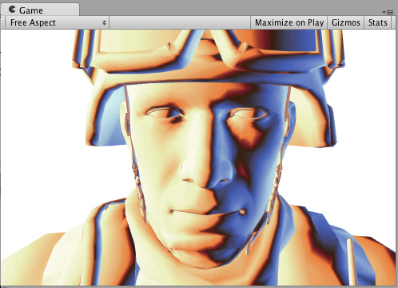
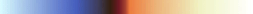
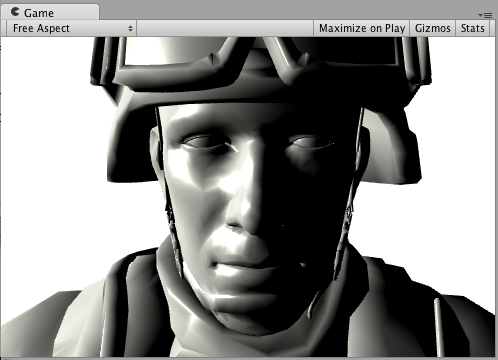

## Surface Shader lighting examples

该页面提供了Surface Shaders的自定义[ Surface Shader lighting models](../CustomLightingmodelsinSurfaceShaders/README.md)的示例，。对于更通用的Surface Shader指南，请参见表面着色器示例。

由于Deferred Lighting在某些自定义的逐材质照明模型中不能很好地发挥作用，因此以下大多数示例使着色器编译为正向渲染。
。

## Diffuse

以下是使用内置Lambert照明模型的着色器的示例：

```
  Shader "Example/Diffuse Texture" {
    Properties {
      _MainTex ("Texture", 2D) = "white" {}
    }
    SubShader {
      Tags { "RenderType" = "Opaque" }
      CGPROGRAM
      #pragma surface surf Lambert
      
      struct Input {
          float2 uv_MainTex;
      };
      
      sampler2D _MainTex;
      
      void surf (Input IN, inout SurfaceOutput o) {
          o.Albedo = tex2D (_MainTex, IN.uv_MainTex).rgb;
      }
      ENDCG
    }
    Fallback "Diffuse"
  }
```
这是在场景中有一个定向光的情况下使用纹理和不使用纹理的情况：


以下示例显示了如何通过编写自定义光照模型而不是使用内置的Lambert模型来获得相同的结果。

为此，您需要使用许多Surface Shader光照模型函数。这是一个简单的兰伯特。注意只有CGPROGRAM部分改变了；周围的着色器代码完全相同：
```
    Shader "Example/Diffuse Texture" {
        Properties {
            _MainTex ("Texture", 2D) = "white" {}
        }
        SubShader {
        Tags { "RenderType" = "Opaque" }
        CGPROGRAM
          #pragma surface surf SimpleLambert
  
          half4 LightingSimpleLambert (SurfaceOutput s, half3 lightDir, half atten) {
              half NdotL = dot (s.Normal, lightDir);
              half4 c;
              c.rgb = s.Albedo * _LightColor0.rgb * (NdotL * atten);
              c.a = s.Alpha;
              return c;
          }
  
        struct Input {
            float2 uv_MainTex;
        };
        
        sampler2D _MainTex;
        
        void surf (Input IN, inout SurfaceOutput o) {
            o.Albedo = tex2D (_MainTex, IN.uv_MainTex).rgb;
        }
        ENDCG
        }
        Fallback "Diffuse"
    }
```
此简单的漫反射照明模型使用该LightingSimpleLambert功能。它通过计算表面法线和光方向之间的点积，然后应用光衰减和颜色来计算照明。

## Diffuse Wrap
下面的示例显示了Wrapped Diffuse，即Diffuse照明的一种修改形式，其中照明“环绕”对象的边缘。这对于模拟地下散射效果很有用。只有CGPROGRAM部分更改，因此再次省略了周围的着色器代码：
```
    ...ShaderLab code...
    CGPROGRAM
    #pragma surface surf WrapLambert

    half4 LightingWrapLambert (SurfaceOutput s, half3 lightDir, half atten) {
        half NdotL = dot (s.Normal, lightDir);
        half diff = NdotL * 0.5 + 0.5;
        half4 c;
        c.rgb = s.Albedo * _LightColor0.rgb * (diff * atten);
        c.a = s.Alpha;
        return c;
    }

    struct Input {
        float2 uv_MainTex;
    };
    
    sampler2D _MainTex;
        void surf (Input IN, inout SurfaceOutput o) {
        o.Albedo = tex2D (_MainTex, IN.uv_MainTex).rgb;
    }
    ENDCG
    ...ShaderLab code...
```
这是在场景中有一个定向光的情况下使用纹理和不使用纹理时的外观：


## Toon Ramp
以下示例显示了一个“渐变”照明模型，该模型使用“纹理”渐变来定义曲面如何响应灯光和法线之间的角度。这可以用于多种效果，并且在与Toon照明一起使用时特别有效。
```
    ...ShaderLab code...
    CGPROGRAM
    #pragma surface surf Ramp

    sampler2D _Ramp;

    half4 LightingRamp (SurfaceOutput s, half3 lightDir, half atten) {
        half NdotL = dot (s.Normal, lightDir);
        half diff = NdotL * 0.5 + 0.5;
        half3 ramp = tex2D (_Ramp, float2(diff)).rgb;
        half4 c;
        c.rgb = s.Albedo * _LightColor0.rgb * ramp * atten;
        c.a = s.Alpha;
        return c;
    }

    struct Input {
        float2 uv_MainTex;
    };
    
    sampler2D _MainTex;
    
    void surf (Input IN, inout SurfaceOutput o) {
        o.Albedo = tex2D (_MainTex, IN.uv_MainTex).rgb;
    }
    ENDCG
    ...ShaderLab code...
```
这是在场景中有一个定向光的情况下使用纹理和不使用纹理时的外观：




## Simple Specular
以下示例显示了一个简单的镜面照明模型，类似于内置的BlinnPhong照明模型。

```
    ...ShaderLab code...
    CGPROGRAM
    #pragma surface surf SimpleSpecular

    half4 LightingSimpleSpecular (SurfaceOutput s, half3 lightDir, half3 viewDir, half atten) {
        half3 h = normalize (lightDir + viewDir);

        half diff = max (0, dot (s.Normal, lightDir));

        float nh = max (0, dot (s.Normal, h));
        float spec = pow (nh, 48.0);

        half4 c;
        c.rgb = (s.Albedo * _LightColor0.rgb * diff + _LightColor0.rgb * spec) * atten;
        c.a = s.Alpha;
        return c;
    }

    struct Input {
        float2 uv_MainTex;
    };
    
    sampler2D _MainTex;
    
    void surf (Input IN, inout SurfaceOutput o) {
        o.Albedo = tex2D (_MainTex, IN.uv_MainTex).rgb;
    }
    ENDCG
    ...ShaderLab code...
```
这是在场景中有一个定向光的情况下使用纹理和不使用纹理时的外观：



## Custom GI
我们将从模仿Unity内置GI的着色器开始：
```
    Shader "Example/CustomGI_ToneMapped" {
        Properties {
            _MainTex ("Albedo (RGB)", 2D) = "white" {}
        }
        SubShader {
            Tags { "RenderType"="Opaque" }
            
            CGPROGRAM
            #pragma surface surf StandardDefaultGI
    
            #include "UnityPBSLighting.cginc"
    
            sampler2D _MainTex;
    
            inline half4 LightingStandardDefaultGI(SurfaceOutputStandard s, half3 viewDir, UnityGI gi)
            {
                return LightingStandard(s, viewDir, gi);
            }
    
            inline void LightingStandardDefaultGI_GI(
                SurfaceOutputStandard s,
                UnityGIInput data,
                inout UnityGI gi)
            {
                LightingStandard_GI(s, data, gi);
            }
    
            struct Input {
                float2 uv_MainTex;
            };
    
            void surf (Input IN, inout SurfaceOutputStandard o) {
                o.Albedo = tex2D(_MainTex, IN.uv_MainTex);
            }
            ENDCG
        }
        FallBack "Diffuse"
    }
```
现在，让我们在GI的顶部添加一些色调映射：
```
    Shader "Example/CustomGI_ToneMapped" {
        Properties {
            _MainTex ("Albedo (RGB)", 2D) = "white" {}
            _Gain("Lightmap tone-mapping Gain", Float) = 1
            _Knee("Lightmap tone-mapping Knee", Float) = 0.5
            _Compress("Lightmap tone-mapping Compress", Float) = 0.33
        }
        SubShader {
            Tags { "RenderType"="Opaque" }
            
            CGPROGRAM
            #pragma surface surf StandardToneMappedGI
    
            #include "UnityPBSLighting.cginc"
    
            half _Gain;
            half _Knee;
            half _Compress;
            sampler2D _MainTex;
    
            inline half3 TonemapLight(half3 i) {
                i *= _Gain;
                return (i > _Knee) ? (((i - _Knee)*_Compress) + _Knee) : i;
            }
    
            inline half4 LightingStandardToneMappedGI(SurfaceOutputStandard s, half3 viewDir, UnityGI gi)
            {
                return LightingStandard(s, viewDir, gi);
            }
    
            inline void LightingStandardToneMappedGI_GI(
                SurfaceOutputStandard s,
                UnityGIInput data,
                inout UnityGI gi)
            {
                LightingStandard_GI(s, data, gi);
    
                gi.light.color = TonemapLight(gi.light.color);
                #ifdef DIRLIGHTMAP_SEPARATE
                    #ifdef LIGHTMAP_ON
                        gi.light2.color = TonemapLight(gi.light2.color);
                    #endif
                    #ifdef DYNAMICLIGHTMAP_ON
                        gi.light3.color = TonemapLight(gi.light3.color);
                    #endif
                #endif
                gi.indirect.diffuse = TonemapLight(gi.indirect.diffuse);
                gi.indirect.specular = TonemapLight(gi.indirect.specular);
            }
    
            struct Input {
                float2 uv_MainTex;
            };
    
            void surf (Input IN, inout SurfaceOutputStandard o) {
                o.Albedo = tex2D(_MainTex, IN.uv_MainTex);
            }
            ENDCG
        }
        FallBack "Diffuse"
    }
```