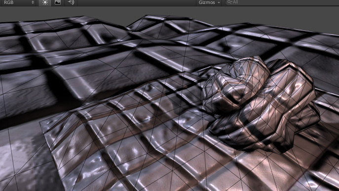
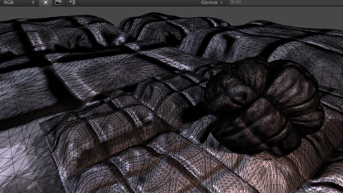
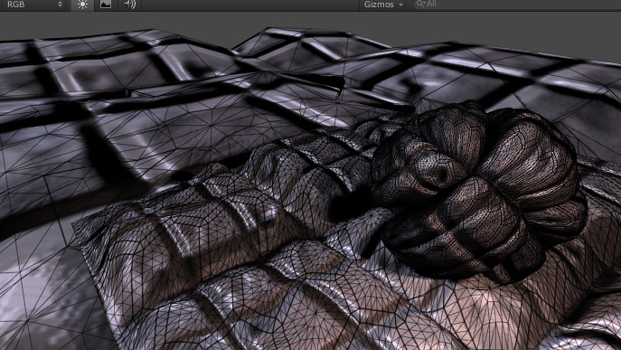
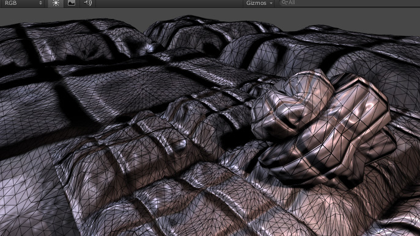
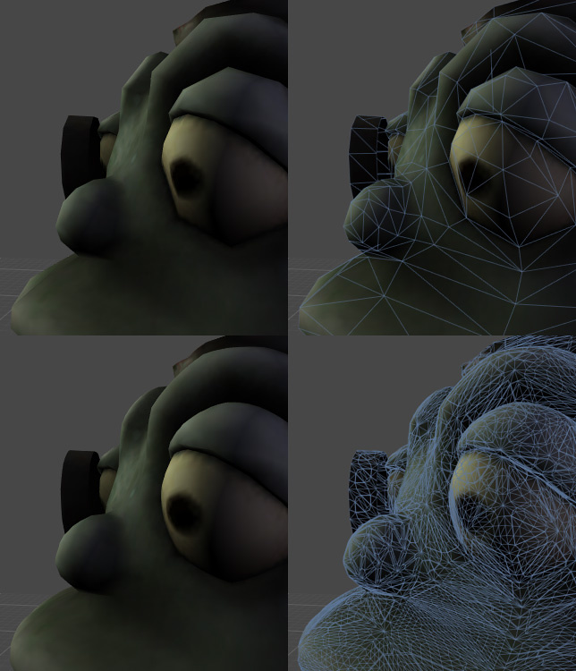

## Surface Shaders with DX11 / OpenGL Core Tessellation

Surface Shaders 有一些对  DirectX 11 / OpenGL Core GPU Tessellation 的支持。想法是：
* Tessellation 由tessellate:FunctionName修饰符指定。该函数计算三角形边缘和内部细分因子。
* 使用Tessellation时，在改shader中，对于每个生成的顶点“vertex modifier” (vertex:FunctionName) 在tessellation之后调用，在这里，您通常要进行贴图置换。
* 在没有贴图置换时，Surface shaders可以选择 phong tessellation 计算来光滑模型表面。

镶嵌细分支持的当前限制：

* 仅三角形域-没有四边形，无等值线镶嵌。
* 使用细分时，着色器将自动编译到Shader Model 4.6目标中，从而阻止了对在较旧的图形目标上运行的支持。

## No GPU tessellation, displacement in the vertex modifier
下一个示例显示了一个曲面着色器，该着色器在不使用细分的情况下进行了一些贴图置换。它仅基于来自置换贴图的量沿其法线移动顶点：
```
    Shader "Tessellation Sample" {
        Properties {
            _MainTex ("Base (RGB)", 2D) = "white" {}
            _DispTex ("Disp Texture", 2D) = "gray" {}
            _NormalMap ("Normalmap", 2D) = "bump" {}
            _Displacement ("Displacement", Range(0, 1.0)) = 0.3
            _Color ("Color", color) = (1,1,1,0)
            _SpecColor ("Spec color", color) = (0.5,0.5,0.5,0.5)
        }
        SubShader {
            Tags { "RenderType"="Opaque" }
            LOD 300
            
            CGPROGRAM
            #pragma surface surf BlinnPhong addshadow fullforwardshadows vertex:disp nolightmap
            #pragma target 4.6

            struct appdata {
                float4 vertex : POSITION;
                float4 tangent : TANGENT;
                float3 normal : NORMAL;
                float2 texcoord : TEXCOORD0;
            };

            sampler2D _DispTex;
            float _Displacement;

            void disp (inout appdata v)
            {
                float d = tex2Dlod(_DispTex, float4(v.texcoord.xy,0,0)).r * _Displacement;
                v.vertex.xyz += v.normal * d;
            }

            struct Input {
                float2 uv_MainTex;
            };

            sampler2D _MainTex;
            sampler2D _NormalMap;
            fixed4 _Color;

            void surf (Input IN, inout SurfaceOutput o) {
                half4 c = tex2D (_MainTex, IN.uv_MainTex) * _Color;
                o.Albedo = c.rgb;
                o.Specular = 0.2;
                o.Gloss = 1.0;
                o.Normal = UnpackNormal(tex2D(_NormalMap, IN.uv_MainTex));
            }
            ENDCG
        }
        FallBack "Diffuse"
    }
```

上面的着色器是相当标准的：
* 顶点修改器disp采样贴图置换，并沿其法线移动顶点。
* 它使用自定义的“顶点数据输入”结构（appdata）而不是默认值appdata_full。这并不是必须的，但是对于tessellation 尽可能使用更小的结构体是效率更高。
* 由于我们的顶点数据没有第二个UV坐标，因此我们添加了nolightmap指令以排除光照贴图。

下图显示了一些应用此着色器的简单的GameObjects信息。


## Fixed amount of tessellation

如果你的模型的面在屏幕上的大小大致相同，那么在网格中添加一个固定数量的tesselation
（同样的曲面细分水平在整个网格上）。
下面的示例脚本应用了固定数量的曲面细分。
```
    Shader "Tessellation Sample" {
        Properties {
            _Tess ("Tessellation", Range(1,32)) = 4
            _MainTex ("Base (RGB)", 2D) = "white" {}
            _DispTex ("Disp Texture", 2D) = "gray" {}
            _NormalMap ("Normalmap", 2D) = "bump" {}
            _Displacement ("Displacement", Range(0, 1.0)) = 0.3
            _Color ("Color", color) = (1,1,1,0)
            _SpecColor ("Spec color", color) = (0.5,0.5,0.5,0.5)
        }
        SubShader {
            Tags { "RenderType"="Opaque" }
            LOD 300
            
            CGPROGRAM
            #pragma surface surf BlinnPhong addshadow fullforwardshadows vertex:disp tessellate:tessFixed nolightmap
            #pragma target 4.6

            struct appdata {
                float4 vertex : POSITION;
                float4 tangent : TANGENT;
                float3 normal : NORMAL;
                float2 texcoord : TEXCOORD0;
            };

            float _Tess;

            float4 tessFixed()
            {
                return _Tess;
            }

            sampler2D _DispTex;
            float _Displacement;

            void disp (inout appdata v)
            {
                float d = tex2Dlod(_DispTex, float4(v.texcoord.xy,0,0)).r * _Displacement;
                v.vertex.xyz += v.normal * d;
            }

            struct Input {
                float2 uv_MainTex;
            };

            sampler2D _MainTex;
            sampler2D _NormalMap;
            fixed4 _Color;

            void surf (Input IN, inout SurfaceOutput o) {
                half4 c = tex2D (_MainTex, IN.uv_MainTex) * _Color;
                o.Albedo = c.rgb;
                o.Specular = 0.2;
                o.Gloss = 1.0;
                o.Normal = UnpackNormal(tex2D(_NormalMap, IN.uv_MainTex));
            }
            ENDCG
        }
        FallBack "Diffuse"
    }
```

在上面的例子中，tessFixed tessellation函数返回四个tessellation 因子作为一个单独的float4 值：三个因子为三角形的每边，以及一个因子为三角形内。

该示例返回在“材质”属性中设置的常量值。


## Distance-based tessellation
您还可以根据与摄像机距离来更改tessellation级别。例如，您可以定义两个距离值：
* tessellation 级别最大时的距离（例如10米）。
* tessellation 级别逐渐减小的距离（例如10米）。
```
    Shader "Tessellation Sample" {
        Properties {
            _Tess ("Tessellation", Range(1,32)) = 4
            _MainTex ("Base (RGB)", 2D) = "white" {}
            _DispTex ("Disp Texture", 2D) = "gray" {}
            _NormalMap ("Normalmap", 2D) = "bump" {}
            _Displacement ("Displacement", Range(0, 1.0)) = 0.3
            _Color ("Color", color) = (1,1,1,0)
            _SpecColor ("Spec color", color) = (0.5,0.5,0.5,0.5)
        }
        SubShader {
            Tags { "RenderType"="Opaque" }
            LOD 300
            
            CGPROGRAM
            #pragma surface surf BlinnPhong addshadow fullforwardshadows vertex:disp tessellate:tessDistance nolightmap
            #pragma target 4.6
            #include "Tessellation.cginc"

            struct appdata {
                float4 vertex : POSITION;
                float4 tangent : TANGENT;
                float3 normal : NORMAL;
                float2 texcoord : TEXCOORD0;
            };

            float _Tess;

            float4 tessDistance (appdata v0, appdata v1, appdata v2) {
                float minDist = 10.0;
                float maxDist = 25.0;
                return UnityDistanceBasedTess(v0.vertex, v1.vertex, v2.vertex, minDist, maxDist, _Tess);
            }

            sampler2D _DispTex;
            float _Displacement;

            void disp (inout appdata v)
            {
                float d = tex2Dlod(_DispTex, float4(v.texcoord.xy,0,0)).r * _Displacement;
                v.vertex.xyz += v.normal * d;
            }

            struct Input {
                float2 uv_MainTex;
            };

            sampler2D _MainTex;
            sampler2D _NormalMap;
            fixed4 _Color;

            void surf (Input IN, inout SurfaceOutput o) {
                half4 c = tex2D (_MainTex, IN.uv_MainTex) * _Color;
                o.Albedo = c.rgb;
                o.Specular = 0.2;
                o.Gloss = 1.0;
                o.Normal = UnpackNormal(tex2D(_NormalMap, IN.uv_MainTex));
            }
            ENDCG
        }
        FallBack "Diffuse"
    }
```
tessellation 函数在细分前，将三角形的三个顶点作为它的三个参数。
Unity需要此来计算tessellation级别，该级别取决于顶点位置。
该示例包括一个内置的帮助文件Tessellation.cginc，然后从该文件中调用UnityDistanceBasedTess函数执行所有工作。此函数计算每个顶点到相机的距离，并得出最终的tessellation因子。


## Edge length based tessellation
仅当三角形的大小非常相似时，基于距离的细分才有效。在上图中，具有小三角形的游戏对象被细分太多，然而有大三角形的游戏对象的细分不够。
改善此问题的一种方法是根据屏幕上的三角形边缘长度计算tessellation级别。Unity应将较大的细分因子应用于更长的边。
```
Shader "Tessellation Sample" {
        Properties {
            _EdgeLength ("Edge length", Range(2,50)) = 15
            _MainTex ("Base (RGB)", 2D) = "white" {}
            _DispTex ("Disp Texture", 2D) = "gray" {}
            _NormalMap ("Normalmap", 2D) = "bump" {}
            _Displacement ("Displacement", Range(0, 1.0)) = 0.3
            _Color ("Color", color) = (1,1,1,0)
            _SpecColor ("Spec color", color) = (0.5,0.5,0.5,0.5)
        }
        SubShader {
            Tags { "RenderType"="Opaque" }
            LOD 300
            
            CGPROGRAM
            #pragma surface surf BlinnPhong addshadow fullforwardshadows vertex:disp tessellate:tessEdge nolightmap
            #pragma target 4.6
            #include "Tessellation.cginc"

            struct appdata {
                float4 vertex : POSITION;
                float4 tangent : TANGENT;
                float3 normal : NORMAL;
                float2 texcoord : TEXCOORD0;
            };

            float _EdgeLength;

            float4 tessEdge (appdata v0, appdata v1, appdata v2)
            {
                return UnityEdgeLengthBasedTess (v0.vertex, v1.vertex, v2.vertex, _EdgeLength);
            }

            sampler2D _DispTex;
            float _Displacement;

            void disp (inout appdata v)
            {
                float d = tex2Dlod(_DispTex, float4(v.texcoord.xy,0,0)).r * _Displacement;
                v.vertex.xyz += v.normal * d;
            }

            struct Input {
                float2 uv_MainTex;
            };

            sampler2D _MainTex;
            sampler2D _NormalMap;
            fixed4 _Color;

            void surf (Input IN, inout SurfaceOutput o) {
                half4 c = tex2D (_MainTex, IN.uv_MainTex) * _Color;
                o.Albedo = c.rgb;
                o.Specular = 0.2;
                o.Gloss = 1.0;
                o.Normal = UnpackNormal(tex2D(_NormalMap, IN.uv_MainTex));
            }
            ENDCG
        }
        FallBack "Diffuse"
    }
```
在此示例中，调用Tessellation.cginc中的UnityEdgeLengthBasedTess函数来完成所有工作。

出于性能原因，UnityEdgeLengthBasedTessCull 该函数执行补面片在截锥体内。这使得着色器的价格更加昂贵，但在摄像头的视图之外，为网格的某些部分节省了大量的GPU。

## Phong Tessellation

[Phong Tessellation](https://www.google.lt/search?q=phong+tessellation)修改了被细分的面片的位置，这样得到的表面就会跟随网格法线。这是一种非常有效的方法，可以使低多边形变得更加平滑。
Unity的表面着色器可以使用tessphong:VariableName的编译指令自动计算Phong tessellation。这里有一个 shader：
```
    Shader "Phong Tessellation" {
        Properties {
            _EdgeLength ("Edge length", Range(2,50)) = 5
            _Phong ("Phong Strengh", Range(0,1)) = 0.5
            _MainTex ("Base (RGB)", 2D) = "white" {}
            _Color ("Color", color) = (1,1,1,0)
        }
        SubShader {
            Tags { "RenderType"="Opaque" }
            LOD 300
            
            CGPROGRAM
            #pragma surface surf Lambert vertex:dispNone tessellate:tessEdge tessphong:_Phong nolightmap
            #include "Tessellation.cginc"

            struct appdata {
                float4 vertex : POSITION;
                float3 normal : NORMAL;
                float2 texcoord : TEXCOORD0;
            };

            void dispNone (inout appdata v) { }

            float _Phong;
            float _EdgeLength;

            float4 tessEdge (appdata v0, appdata v1, appdata v2)
            {
                return UnityEdgeLengthBasedTess (v0.vertex, v1.vertex, v2.vertex, _EdgeLength);
            }

            struct Input {
                float2 uv_MainTex;
            };

            fixed4 _Color;
            sampler2D _MainTex;

            void surf (Input IN, inout SurfaceOutput o) {
                half4 c = tex2D (_MainTex, IN.uv_MainTex) * _Color;
                o.Albedo = c.rgb;
                o.Alpha = c.a;
            }

            ENDCG
        }
        FallBack "Diffuse"
    }
```
下面是一个常规着色器（上一行）和一个使用Phong tessellation（下一行）的比较。即使没有任何位移映射，曲面也会变得更圆滑。
