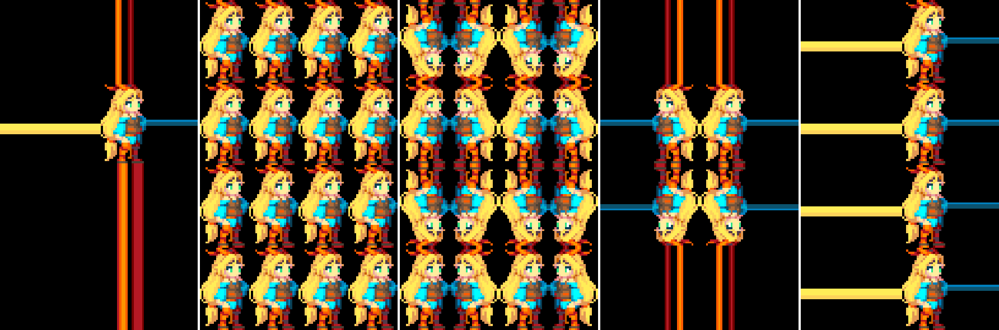

## Using sampler states
### Coupled textures and samplers
绝大部分时间，在shader中对纹理的采样，纹理的采样状态都来自于[texture settings](https://docs.unity3d.com/Manual/class-TextureImporter.html) - 本质上，纹理和采样器耦合在一起。使用DX9样式的着色器语法时，这是默认行为：
```
sampler2D _MainTex;
// ...
half4 color = tex2D(_MainTex, uv);
```
使用sampler2D，sampler3D，samplerCUBE HLSL关键字声明纹理和采样器。
在大多数情况下，这就是您想要的，并且是较旧的图形API（OpenGL ES）唯一受支持的选项。

## Separate textures and samplers
许多图形API和GPU允许使用的采样器少于纹理，并且耦合的纹理+采样器语法可能不允许编写更复杂的着色器。例如，Direct3D 11允许在单个着色器中使用多达128种纹理，但最多只能使用16个采样器。

Unity允许使用DX11样式的HLSL语法声明纹理和采样器，并使用特殊的命名约定来匹配它们：名称为“ sampler” + TextureName形式的采样器将从该纹理获取采样状态。

上一节中的着色器代码段可以用DX11样式的HLSL语法重写，并且将执行相同的操作：
```
Texture2D _MainTex;
SamplerState sampler_MainTex; // "sampler" + “_MainTex”
// ...
half4 color = _MainTex.Sample(sampler_MainTex, uv);
```
但是，以这种方式可以将着色器写入其他样本中的“重用”采样器，同时对多个纹理进行采样。在下面的示例中，对三个纹理进行了采样，但是所有这些仅使用一个采样器：
```
Texture2D _MainTex;
Texture2D _SecondTex;
Texture2D _ThirdTex;
SamplerState sampler_MainTex; // "sampler" + “_MainTex”
// ...
half4 color = _MainTex.Sample(sampler_MainTex, uv);
color += _SecondTex.Sample(sampler_MainTex, uv);
color += _ThirdTex.Sample(sampler_MainTex, uv);
```
但是请注意，DX11样式的HLSL语法在某些较旧的平台（例如OpenGL ES 2.0）上不起作用，有关详细信息，请参见[shading language ](../ShadingLanguageUsedInUnity/README.md)。您可能要指定#pragma target 3.5（请参阅[shader compilation targets ](../ShaderCompilationTargetLevels/README.md)，以跳过使用着色器的旧平台。
Unity提供了多个着色器宏，以使用这种“单独的采样器”方法来帮助声明和采样纹理，请参阅[ built-in macros](../PredefinedShaderPreprocessorMacros/README.md)。可以使用上述宏以这种方式重写上面的示例：
```
UNITY_DECLARE_TEX2D(_MainTex);
UNITY_DECLARE_TEX2D_NOSAMPLER(_SecondTex);
UNITY_DECLARE_TEX2D_NOSAMPLER(_ThirdTex);
// ...
half4 color = UNITY_SAMPLE_TEX2D(_MainTex, uv);
color += UNITY_SAMPLE_TEX2D_SAMPLER(_SecondTex, _MainTex, uv);
color += UNITY_SAMPLE_TEX2D_SAMPLER(_ThirdTex, _MainTex, uv);
```
上面的代码可以在Unity支持的所有平台上进行编译，但是在老的平台上可能回退到使用三个采样器，比如DX9。

## Inline sampler states
除了识别命名为“sampler”+TextureName的HLSL SamplerState 对象外，Unity 还能识别在sampler 名字中的其他模式。这对于直接在着色器中声明简单的硬编码采样状态很有用。一个例子：
```
Texture2D _MainTex;
SamplerState my_point_clamp_sampler;
// ...
half4 color = _MainTex.Sample(my_point_clamp_sampler, uv);
```
“my_point_clamp_sampler” 名字将被识别为一个使用Point (nearest) texture filtering 和  Clamp texture wrapping mode 的 sampler 。
sampler名称被识别为“内联”采样器状态（不区分大小写）：
* “Point”, “Linear” 或者 “Trilinear”（必须）设置纹理的过滤模式。
* “Clamp”, “Repeat”, “Mirror” 或者 “MirrorOnce” (必须) 设置纹理包围模式。
  * 包围模式可以指定每个轴（UVW）。例如：“ClampU_RepeatV”。
* “Compare” （可选）设置sampler深度比较。和 HLSL SamplerComparisonState 类型和SampleCmp / SampleCmpLevelZero 函数一起使用。

这是一个使用 sampler_linear_repeat 和 sampler_point_repeat 采样状态采样纹理的例子，说明名字如何控制采样模式：


这是一个使用 SmpClampPoint, SmpRepeatPoint, SmpMirrorPoint, SmpMirrorOncePoint, Smp_ClampU_RepeatV_Point 采样状态的例子，说明名字如何控制包围模式。在最后一个例子，horizontal (U) and vertical (V) 轴分别设置了不同的包围模式。在所有例子中，纹理坐标范围为–2.0 到 +2.0。


就像单独的纹理+采样器语法一样，某些平台不支持内联采样器状态。目前，它们是在Direct3D 11/12，PS4，XboxOne和Metal上实现的。

请注意，大多数移动GPU / API均不支持“ MirrorOnce”纹理包裹模式，当不存在支持时，它将回退至“镜像”模式。 