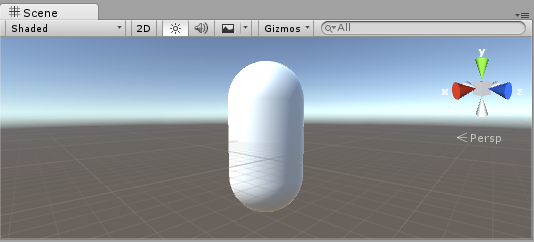
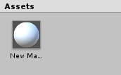
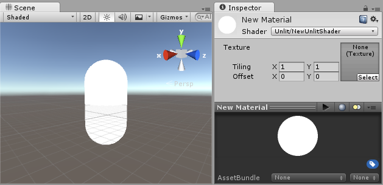
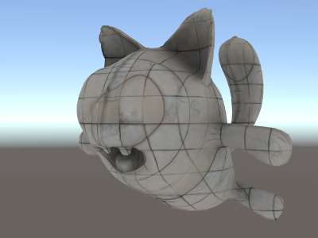

## Vertex and fragment shader examples
此页面包含顶点和片段程序示例。有关着色器的基本介绍，请参见着色器教程： [第1 部分](https://docs.unity3d.com/Manual/ShaderTut1.html)和[第2部分](https://docs.unity3d.com/Manual/ShaderTut2.html)。有关编写常规材质着色器的简便方法，请参见[Surface Shaders](../../README.md)
。
您可以将以下示例作为[zipped Unity project](https://docs.unity3d.com/uploads/Examples/UnityShaderDocExamples.zip)下载。

## Setting up the scene
如果您不熟悉Unity的场景视图，层次结构视图， 项目视图和检查器,现在是阅读手册前几节的好时机, 从[Unity Basics](https://docs.unity3d.com/Manual/UnityBasics.html)开始。
第一步是创建一些对象，这些对象将用于测试着色器。在主菜单中选择**Game Object** >**3D Object**> **Capsule**。然后放置相机，使其显示胶囊。在“层次结构”中双击“胶囊”以将场景视图聚焦，然后选择“主摄影机”对象，然后 从主菜单中单击**Game object**对象 >**Align with View**。


通过选择“项目视图”菜单中的**Create**>**Material**ch创建[Material](https://docs.unity3d.com/Manual/Materials.html)。名为*New Material*的新材料将出现在“项目视图”中。


## Creating a shader
现在以类似的方式创建一个新的[Shader](https://docs.unity3d.com/Manual/Shaders.html)资源。从项目视图的菜单中选择**Create** >**Shader**>**Unlit Shader**。这将创建一个基本的着色器，该着色器仅显示纹理而没有任何光照。

其他条目在 **Create** > **Shader** 创建准系统着色器或者其他类型，比如一个基础的[surface shader](../../WritingSurfaceShaders/README.md)。

## Linking the mesh, material and shader
通过材质检查器使材质使用shader，或在“项目视图”中将shader资源拖动到材质资源上。材质检查器在使用此着色器时将显示白色球形。

现在将材质拖到Unity“ 场景”中的网格对象三，通过**场景**或**层次结构**视图。或者，选择对象，然后在检查器中网格渲染器（Mesh Renderer）组件的“material”插槽使用该材质。

设置好这些内容之后，您现在就可以开始查看着色器代码了，您将在“场景视图”中的胶囊上看到更改着色器的结果。

## Main parts of the shader
要开始检查着色器的代码，请在“项目视图”中双击着色器资源。着色器代码将在您的脚本编辑器（MonoDevelop或Visual Studio）中打开。
着色器从以下代码开始：
```
Shader "Unlit/NewUnlitShader"
{
    Properties
    {
        _MainTex ("Texture", 2D) = "white" {}
    }
    SubShader
    {
        Tags { "RenderType"="Opaque" }
        LOD 100

        Pass
        {
            CGPROGRAM
            #pragma vertex vert
            #pragma fragment frag
            // make fog work
            #pragma multi_compile_fog
            
            #include "UnityCG.cginc"

            struct appdata
            {
                float4 vertex : POSITION;
                float2 uv : TEXCOORD0;
            };

            struct v2f
            {
                float2 uv : TEXCOORD0;
                UNITY_FOG_COORDS(1)
                float4 vertex : SV_POSITION;
            };

            sampler2D _MainTex;
            float4 _MainTex_ST;
            
            v2f vert (appdata v)
            {
                v2f o;
                o.vertex = UnityObjectToClipPos(v.vertex);
                o.uv = TRANSFORM_TEX(v.uv, _MainTex);
                UNITY_TRANSFER_FOG(o,o.vertex);
                return o;
            }
            
            fixed4 frag (v2f i) : SV_Target
            {
                // sample the texture
                fixed4 col = tex2D(_MainTex, i.uv);
                // apply fog
                UNITY_APPLY_FOG(i.fogCoord, col);
                return col;
            }
            ENDCG
        }
    }
}
```
最初的着色器看起来不是很简单！但是请放心，我们将逐步介绍每个部分。
让我们看一下我们简单着色器的主要部分。

* `Shader`
[Shader](https://docs.unity3d.com/Manual/SL-Shader.html)命令包含一个带有着色器名称的字符串。在[材质](https://docs.unity3d.com/Manual/class-Material.html)检查器中选择材质球时，可以使用正斜杠字符“ /”将其放置在子菜单中。

* `Properties`
该[Properties](https://docs.unity3d.com/Manual/SL-Properties.html)块包含着色器变量（纹理，颜色等），这些变量将保存为材质的一部分，并显示在材质检查器中。在我们unlit shader模板中，声明了一个纹理属性。

* `SubShader`
一个着色器可以包含一个或多个[SubShader](https://docs.unity3d.com/Manual/SL-SubShader.html)，主要用于实现shader对不同的GPU支持。在本教程中，我们对此并不太担心，因此我们所有的着色器将仅包含一个SubShader。

* `Pass`
每个SubShader由多个[Pass](https://docs.unity3d.com/Manual/SL-Pass.html)组成，并且每个Pass代表材质渲染的同一对象的着色器的顶点和片段执行的代码。许多简单的着色器仅使用一个pass，但与照明交互的着色器可能需要更多（有关详细信息，请参见 [Lighting Pipeline ](https://docs.unity3d.com/Manual/SL-RenderPipeline.html)）。Pass中的命令通常会设置固定功能状态，例如混合模式。

* `__CGPROGRAM__ .. ENDCG`
这些关键字将顶点和片段着色器内的HLSL代码部分包围起来。通常，这是大多数有趣的代码所在的地方。有关详细信息，请参见 [vertex and fragment](../REAMD.md)。

## Simple unlit shader
unlit shader template做的事情比只显示一个有纹理的对象需要做的事情要多一些。例如，它支持材质中的雾和纹理平铺/偏移字段。让我们简化着色器到最低限度，并添加更多的注释:
```
Shader "Unlit/SimpleUnlitTexturedShader"
{
    Properties
    {
        // we have removed support for texture tiling/offset,
        // so make them not be displayed in material inspector
        [NoScaleOffset] _MainTex ("Texture", 2D) = "white" {}
    }
    SubShader
    {
        Pass
        {
            CGPROGRAM
            // use "vert" function as the vertex shader
            #pragma vertex vert
            // use "frag" function as the pixel (fragment) shader
            #pragma fragment frag

            // vertex shader inputs
            struct appdata
            {
                float4 vertex : POSITION; // vertex position
                float2 uv : TEXCOORD0; // texture coordinate
            };

            // vertex shader outputs ("vertex to fragment")
            struct v2f
            {
                float2 uv : TEXCOORD0; // texture coordinate
                float4 vertex : SV_POSITION; // clip space position
            };

            // vertex shader
            v2f vert (appdata v)
            {
                v2f o;
                // transform position to clip space
                // (multiply with model*view*projection matrix)
                o.vertex = mul(UNITY_MATRIX_MVP, v.vertex);
                // just pass the texture coordinate
                o.uv = v.uv;
                return o;
            }
            
            // texture we will sample
            sampler2D _MainTex;

            // pixel shader; returns low precision ("fixed4" type)
            // color ("SV_Target" semantic)
            fixed4 frag (v2f i) : SV_Target
            {
                // sample texture and return it
                fixed4 col = tex2D(_MainTex, i.uv);
                return col;
            }
            ENDCG
        }
    }
}
```

**Vertex Shader**是对3D模型的每个顶点运行的程序。通常它并没有做任何特别有趣的事情。在这里，我们只是将顶点位置从对象空间转换为所谓的“剪辑空间”，这就是被GPU用来吧对象光栅化在屏幕上。我们还传递未修改的输入纹理坐标-我们将需要它来采样片段着色器中的纹理。

**Fragment Shader**是对物体显示在屏幕上的每个像素运行的程序，通常用于计算和输出每个像素的颜色。通常有数百万个像素在屏幕上，并对它们全部执行片段着色器！优化片段着色器是整个游戏性能工作的重要组成部分。

某些变量或函数定义后跟**Semantic Signifier** -例如：POSITION或：SV_Target。这些语义指示符将这些变量的“含义”传达给GPU。有关详细信息，请参见着[色器语义页面](https://docs.unity3d.com/Manual/SL-ShaderSemantics.html)。

当在具有良好纹理的良好模型上使用时，我们的简单着色器看起来非常不错！


## Even simpler single color shader
让我们进一步简化着色器–我们将创建一个以单一颜色绘制整个对象的着色器。这不是很有用，但是我们在这里学习。
```
Shader "Unlit/SingleColor"
{
    Properties
    {
        // Color property for material inspector, default to white
        _Color ("Main Color", Color) = (1,1,1,1)
    }
    SubShader
    {
        Pass
        {
            CGPROGRAM
            #pragma vertex vert
            #pragma fragment frag
            
            // vertex shader
            // this time instead of using "appdata" struct, just spell inputs manually,
            // and instead of returning v2f struct, also just return a single output
            // float4 clip position
            float4 vert (float4 vertex : POSITION) : SV_POSITION
            {
                return mul(UNITY_MATRIX_MVP, vertex);
            }
            
            // color from the material
            fixed4 _Color;

            // pixel shader, no inputs needed
            fixed4 frag () : SV_Target
            {
                return _Color; // just return it
            }
            ENDCG
        }
    }
}
```
这次，着色器功能不是手动使用输入（appdata）和输出（v2f）的结构，而是仅手动拼出输入。两种方式都能起作用，以及选择使用哪种方式取决于您的编码样式和首选项。


## Using mesh normals for fun and profit
让我们继续使用在世界空间中显示网格法线的着色器。无需再费周折：
```
Shader "Unlit/WorldSpaceNormals"
{
    // no Properties block this time!
    SubShader
    {
        Pass
        {
            CGPROGRAM
            #pragma vertex vert
            #pragma fragment frag
            // include file that contains UnityObjectToWorldNormal helper function
            #include "UnityCG.cginc"

            struct v2f {
                // we'll output world space normal as one of regular ("texcoord") interpolators
                half3 worldNormal : TEXCOORD0;
                float4 pos : SV_POSITION;
            };

            // vertex shader: takes object space normal as input too
            v2f vert (float4 vertex : POSITION, float3 normal : NORMAL)
            {
                v2f o;
                o.pos = UnityObjectToClipPos(vertex);
                // UnityCG.cginc file contains function to transform
                // normal from object to world space, use that
                o.worldNormal = UnityObjectToWorldNormal(normal);
                return o;
            }
            
            fixed4 frag (v2f i) : SV_Target
            {
                fixed4 c = 0;
                // normal is a 3D vector with xyz components; in -1..1
                // range. To display it as color, bring the range into 0..1
                // and put into red, green, blue components
                c.rgb = i.worldNormal*0.5+0.5;
                return c;
            }
            ENDCG
        }
    }
}
```

除了产生漂亮的颜色外，法线还用于各种图形效果–照明，反射，轮廓等。

在上面的着色器中，我们开始使用Unity的内置[shader include files.](https://docs.unity3d.com/Manual/SL-BuiltinIncludes.html)之一。在这里，使用了**UnityCG.cginc**，其中包含一个方便的函数**UnityObjectToWorldNormal**。我们还使用了实用程序函数**UnityObjectToClipPos**，该函数将顶点从对象空间转换为屏幕。这只是使代码更易于阅读，并且在某些情况下更有效。
我们已经看到，数据可以在所谓的“interpolators”（有时也称为“varyings”）中从顶点传递到片段着色器中。在HLSL着色语言中，它们通常使用TEXCOORDn语义标记，并且它们每个最多可以包含4个分量的向量（有关详细信息，请参见[semantics](https://docs.unity3d.com/Manual/SL-ShaderSemantics.html)）。
此外，我们还学习了一种简单的技术，可以将归一化的向量（在–1.0到+1.0范围内）可视化为颜色：将它们乘以一半并加一半即可。在[vertex program inputs](../ProvidingVertexDataToVertexPrograms/README.md)页面中查看更多顶点数据可视化示例。

## Environment reflection using world-space normals
当在场景中使用[Skybox](https://docs.unity3d.com/Manual/class-Skybox.html)作为反射源（请参见[Lighting Window](https://docs.unity3d.com/Manual/GlobalIllumination.html)），然后本质上是包含天空盒数据的“默认” [Reflection Probe](https://docs.unity3d.com/Manual/class-ReflectionProbe.html)被创建。反射探针在内部是[Cubemap](https://docs.unity3d.com/Manual/class-Cubemap.html)纹理。我们将扩展上面世界空间法线着色器以对其进行查看。
现在，该代码已开始涉及到一点难度。当然，如果要使着色器能够自动处理灯光，阴影，反射和照明系统的其余部分，则使用[Surface Shaders](../../README.md)会更容易。本示例旨在向您展示如何以“手动”方式使用照明系统的各个部分。
```
Shader "Unlit/SkyReflection"
{
    SubShader
    {
        Pass
        {
            CGPROGRAM
            #pragma vertex vert
            #pragma fragment frag
            #include "UnityCG.cginc"

            struct v2f {
                half3 worldRefl : TEXCOORD0;
                float4 pos : SV_POSITION;
            };

            v2f vert (float4 vertex : POSITION, float3 normal : NORMAL)
            {
                v2f o;
                o.pos = UnityObjectToClipPos(vertex);
                // compute world space position of the vertex
                float3 worldPos = mul(_Object2World, vertex).xyz;
                // compute world space view direction
                float3 worldViewDir = normalize(UnityWorldSpaceViewDir(worldPos));
                // world space normal
                float3 worldNormal = UnityObjectToWorldNormal(normal);
                // world space reflection vector
                o.worldRefl = reflect(-worldViewDir, worldNormal);
                return o;
            }
        
            fixed4 frag (v2f i) : SV_Target
            {
                // sample the default reflection cubemap, using the reflection vector
                half4 skyData = UNITY_SAMPLE_TEXCUBE(unity_SpecCube0, i.worldRefl);
                // decode cubemap data into actual color
                half3 skyColor = DecodeHDR (skyData, unity_SpecCube0_HDR);
                // output it!
                fixed4 c = 0;
                c.rgb = skyColor;
                return c;
            }
            ENDCG
        }
    }
}
```


上面的示例使用了内置的[shader include files.](https://docs.unity3d.com/Manual/SL-BuiltinIncludes.html)中的一些内容：
* **unity_SpecCube0，unity_SpecCube0_HDR，Object2World，UNITY_MATRIX_MVP**从 [built-in shader variables](https://docs.unity3d.com/Manual/SL-UnityShaderVariables.html)。**unity_SpecCube0**包含活动反射探针的数据。
* **UNITY_SAMPLE_TEXCUBE**是一个[built-in macro](https://docs.unity3d.com/Manual/SL-BuiltinMacros.html)，用于对立方体贴图进行采样。大多数常规立方体贴图都是使用标准HLSL语法声明和使用的（samplerCUBE和texCUBE），但是Unity中的反射探针立方体贴图是以特殊方式声明的，以保存在采样器插槽上。如果您不知道这是什么，请放心，只需知道要使用unity_SpecCube0 cubemap ，就必须使用UNITY_SAMPLE_TEXCUBE宏。
* **UnityWorldSpaceViewDir** 从功能 **UnityCG.cginc**，并**DecodeHDR**功能从同一文件。后者用于从反射探针数据中获取实际颜色-因为Unity以特殊编码的方式存储反射探针立方体贴图。
* **reflect** 只是内置的HLSL函数，用于计算围绕给定法线的矢量反射。

## Environment reflection with a normal map
通常是法线贴图用于创建对象的其他细节，而无需创建其他几何图形。让我们看一下如何制作具有法线贴图纹理的可反映环境的着色器。
现在数学开始真正涉及到了，所以我们将分几步来做。在上面的着色器中，反射方向是按顶点计算的（在顶点着色器中），而片段着色器仅执行反射探针立方体贴图查找。但是，一旦我们开始使用法线贴图，就需要基于每个像素计算表面法线本身，这意味着我们还必须计算每个像素对环境的反射方式！
因此，首先，让我们重写上面的着色器以执行相同的操作，不同的是我们将一些计算移至片段着色器，因此它们是按像素计算的：
```
Shader "Unlit/SkyReflection Per Pixel"
{
    SubShader
    {
        Pass
        {
            CGPROGRAM
            #pragma vertex vert
            #pragma fragment frag
            #include "UnityCG.cginc"

            struct v2f {
                float3 worldPos : TEXCOORD0;
                half3 worldNormal : TEXCOORD1;
                float4 pos : SV_POSITION;
            };

            v2f vert (float4 vertex : POSITION, float3 normal : NORMAL)
            {
                v2f o;
                o.pos = UnityObjectToClipPos(vertex);
                o.worldPos = mul(_Object2World, vertex).xyz;
                o.worldNormal = UnityObjectToWorldNormal(normal);
                return o;
            }
        
            fixed4 frag (v2f i) : SV_Target
            {
                // compute view direction and reflection vector
                // per-pixel here
                half3 worldViewDir = normalize(UnityWorldSpaceViewDir(i.worldPos));
                half3 worldRefl = reflect(-worldViewDir, i.worldNormal);

                // same as in previous shader
                half4 skyData = UNITY_SAMPLE_TEXCUBE(unity_SpecCube0, worldRefl);
                half3 skyColor = DecodeHDR (skyData, unity_SpecCube0_HDR);
                fixed4 c = 0;
                c.rgb = skyColor;
                return c;
            }
            ENDCG
        }
    }
}
```
它本身并不能给我们太多–着色器看起来完全一样，只是现在着色器运行速度较慢，因为它对屏幕上的每个像素执行更多的计算，而不仅仅是针对模型的每个顶点。但是，我们很快就会需要这些计算。更高的图形保真度通常需要更复杂的着色器。

我们现在也必须学习新事物。所谓的“切线空间”。法线贴图纹理通常在坐标空间中表示，可以将其视为“跟随模型的表面”。在我们的着色器中，我们将需要知道切线空间基础向量，从纹理中读取法线向量，将其转换为世界空间，然后从上述着色器中进行所有数学运算。让我们开始吧！
```
Shader "Unlit/SkyReflection Per Pixel"
{
    Properties {
        // normal map texture on the material,
        // default to dummy "flat surface" normalmap
        _BumpMap("Normal Map", 2D) = "bump" {}
    }
    SubShader
    {
        Pass
        {
            CGPROGRAM
            #pragma vertex vert
            #pragma fragment frag
            #include "UnityCG.cginc"

            struct v2f {
                float3 worldPos : TEXCOORD0;
                // these three vectors will hold a 3x3 rotation matrix
                // that transforms from tangent to world space
                half3 tspace0 : TEXCOORD1; // tangent.x, bitangent.x, normal.x
                half3 tspace1 : TEXCOORD2; // tangent.y, bitangent.y, normal.y
                half3 tspace2 : TEXCOORD3; // tangent.z, bitangent.z, normal.z
                // texture coordinate for the normal map
                float2 uv : TEXCOORD4;
                float4 pos : SV_POSITION;
            };

            // vertex shader now also needs a per-vertex tangent vector.
            // in Unity tangents are 4D vectors, with the .w component used to
            // indicate direction of the bitangent vector.
            // we also need the texture coordinate.
            v2f vert (float4 vertex : POSITION, float3 normal : NORMAL, float4 tangent : TANGENT, float2 uv : TEXCOORD0)
            {
                v2f o;
                o.pos = UnityObjectToClipPos(vertex);
                o.worldPos = mul(_Object2World, vertex).xyz;
                half3 wNormal = UnityObjectToWorldNormal(normal);
                half3 wTangent = UnityObjectToWorldDir(tangent.xyz);
                // compute bitangent from cross product of normal and tangent
                half tangentSign = tangent.w * unity_WorldTransformParams.w;
                half3 wBitangent = cross(wNormal, wTangent) * tangentSign;
                // output the tangent space matrix
                o.tspace0 = half3(wTangent.x, wBitangent.x, wNormal.x);
                o.tspace1 = half3(wTangent.y, wBitangent.y, wNormal.y);
                o.tspace2 = half3(wTangent.z, wBitangent.z, wNormal.z);
                o.uv = uv;
                return o;
            }

            // normal map texture from shader properties
            sampler2D _BumpMap;
        
            fixed4 frag (v2f i) : SV_Target
            {
                // sample the normal map, and decode from the Unity encoding
                half3 tnormal = UnpackNormal(tex2D(_BumpMap, i.uv));
                // transform normal from tangent to world space
                half3 worldNormal;
                worldNormal.x = dot(i.tspace0, tnormal);
                worldNormal.y = dot(i.tspace1, tnormal);
                worldNormal.z = dot(i.tspace2, tnormal);

                // rest the same as in previous shader
                half3 worldViewDir = normalize(UnityWorldSpaceViewDir(i.worldPos));
                half3 worldRefl = reflect(-worldViewDir, worldNormal);
                half4 skyData = UNITY_SAMPLE_TEXCUBE(unity_SpecCube0, worldRefl);
                half3 skyColor = DecodeHDR (skyData, unity_SpecCube0_HDR);
                fixed4 c = 0;
                c.rgb = skyColor;
                return c;
            }
            ENDCG
        }
    }
}
```
那确实很累人。但是，请看，法线贴图反射！


## Adding more textures
让我们添加更多的纹理到上面的法线贴图，天空反射的着色器。我们将添加基本的颜色纹理，在第一个没有灯光的例子中可以看到，并添加一个遮挡贴图来加深空洞。
```
Shader "Unlit/More Textures"
{
    Properties {
        // three textures we'll use in the material
        _MainTex("Base texture", 2D) = "white" {}
        _OcclusionMap("Occlusion", 2D) = "white" {}
        _BumpMap("Normal Map", 2D) = "bump" {}
    }
    SubShader
    {
        Pass
        {
            CGPROGRAM
            #pragma vertex vert
            #pragma fragment frag
            #include "UnityCG.cginc"

            // exactly the same as in previous shader
            struct v2f {
                float3 worldPos : TEXCOORD0;
                half3 tspace0 : TEXCOORD1;
                half3 tspace1 : TEXCOORD2;
                half3 tspace2 : TEXCOORD3;
                float2 uv : TEXCOORD4;
                float4 pos : SV_POSITION;
            };
            v2f vert (float4 vertex : POSITION, float3 normal : NORMAL, float4 tangent : TANGENT, float2 uv : TEXCOORD0)
            {
                v2f o;
                o.pos = UnityObjectToClipPos(vertex);
                o.worldPos = mul(_Object2World, vertex).xyz;
                half3 wNormal = UnityObjectToWorldNormal(normal);
                half3 wTangent = UnityObjectToWorldDir(tangent.xyz);
                half tangentSign = tangent.w * unity_WorldTransformParams.w;
                half3 wBitangent = cross(wNormal, wTangent) * tangentSign;
                o.tspace0 = half3(wTangent.x, wBitangent.x, wNormal.x);
                o.tspace1 = half3(wTangent.y, wBitangent.y, wNormal.y);
                o.tspace2 = half3(wTangent.z, wBitangent.z, wNormal.z);
                o.uv = uv;
                return o;
            }

            // textures from shader properties
            sampler2D _MainTex;
            sampler2D _OcclusionMap;
            sampler2D _BumpMap;
        
            fixed4 frag (v2f i) : SV_Target
            {
                // same as from previous shader...
                half3 tnormal = UnpackNormal(tex2D(_BumpMap, i.uv));
                half3 worldNormal;
                worldNormal.x = dot(i.tspace0, tnormal);
                worldNormal.y = dot(i.tspace1, tnormal);
                worldNormal.z = dot(i.tspace2, tnormal);
                half3 worldViewDir = normalize(UnityWorldSpaceViewDir(i.worldPos));
                half3 worldRefl = reflect(-worldViewDir, worldNormal);
                half4 skyData = UNITY_SAMPLE_TEXCUBE(unity_SpecCube0, worldRefl);
                half3 skyColor = DecodeHDR (skyData, unity_SpecCube0_HDR);                
                fixed4 c = 0;
                c.rgb = skyColor;

                // modulate sky color with the base texture, and the occlusion map
                fixed3 baseColor = tex2D(_MainTex, i.uv).rgb;
                fixed occlusion = tex2D(_OcclusionMap, i.uv).r;
                c.rgb *= baseColor;
                c.rgb *= occlusion;

                return c;
            }
            ENDCG
        }
    }
}
```
气球猫看起来不错！


## Texturing shader examples
### Procedural checkerboard pattern
这是一个基于网格的纹理坐标输出棋盘图案的着色器：
```
Shader "Unlit/Checkerboard"
{
    Properties
    {
        _Density ("Density", Range(2,50)) = 30
    }
    SubShader
    {
        Pass
        {
            CGPROGRAM
            #pragma vertex vert
            #pragma fragment frag
            #include "UnityCG.cginc"

            struct v2f
            {
                float2 uv : TEXCOORD0;
                float4 vertex : SV_POSITION;
            };

            float _Density;

            v2f vert (float4 pos : POSITION, float2 uv : TEXCOORD0)
            {
                v2f o;
                o.vertex = UnityObjectToClipPos(pos);
                o.uv = uv * _Density;
                return o;
            }
            
            fixed4 frag (v2f i) : SV_Target
            {
                float2 c = i.uv;
                c = floor(c) / 2;
                float checker = frac(c.x + c.y) * 2;
                return checker;
            }
            ENDCG
        }
    }
}
```
[Properties](https://docs.unity3d.com/Manual/SL-Properties.html)块中的“密度”滑块控制棋盘的密度。在顶点着色器中，将网格UV乘以密度值，以使它们从0到1的范围到0到密度的范围。假设密度设置为30-对于要渲染的网格的各个位置，这将使i.uv输入到片段着色器中的浮点值从0到30。

然后，片段着色器代码使用HLSL的内置floor函数仅获取输入坐标的整数部分，并将其除以2。回想一下，输入坐标是从0到30的数字。这使得它们全部被“量化”为0、0.5、1、1.5、2、2.5等值。这是在输入坐标的x和y分量上完成的。

接下来，我们将这些x和y坐标相加（每个坐标仅具有0、0.5、1、1.5，...的可能值），并且仅使用另一个内置的HLSL函数frac取小数部分。结果只能是0.0或0.5。然后，将其乘以2以使其为0.0或1.0，然后将其输出为颜色（这将分别产生黑色或白色）。


### Tri-planar texturing
对于复杂或程序化的网格，不使用常规的UV坐标来创建纹理，有时只从三个主要方向“投射”纹理是有用的。这就是所谓的“三平面”纹理。这个想法是使用表面法线来衡量三个纹理方向。着色器如下:
```
Shader "Unlit/Triplanar"
{
    Properties
    {
        _MainTex ("Texture", 2D) = "white" {}
        _Tiling ("Tiling", Float) = 1.0
        _OcclusionMap("Occlusion", 2D) = "white" {}
    }
    SubShader
    {
        Pass
        {
            CGPROGRAM
            #pragma vertex vert
            #pragma fragment frag
            #include "UnityCG.cginc"

            struct v2f
            {
                half3 objNormal : TEXCOORD0;
                float3 coords : TEXCOORD1;
                float2 uv : TEXCOORD2;
                float4 pos : SV_POSITION;
            };

            float _Tiling;

            v2f vert (float4 pos : POSITION, float3 normal : NORMAL, float2 uv : TEXCOORD0)
            {
                v2f o;
                o.pos = UnityObjectToClipPos(pos);
                o.coords = pos.xyz * _Tiling;
                o.objNormal = normal;
                o.uv = uv;
                return o;
            }

            sampler2D _MainTex;
            sampler2D _OcclusionMap;
            
            fixed4 frag (v2f i) : SV_Target
            {
                // use absolute value of normal as texture weights
                half3 blend = abs(i.objNormal);
                // make sure the weights sum up to 1 (divide by sum of x+y+z)
                blend /= dot(blend,1.0);
                // read the three texture projections, for x,y,z axes
                fixed4 cx = tex2D(_MainTex, i.coords.yz);
                fixed4 cy = tex2D(_MainTex, i.coords.xz);
                fixed4 cz = tex2D(_MainTex, i.coords.xy);
                // blend the textures based on weights
                fixed4 c = cx * blend.x + cy * blend.y + cz * blend.z;
                // modulate by regular occlusion map
                c *= tex2D(_OcclusionMap, i.uv);
                return c;
            }
            ENDCG
        }
    }
}
```


## Calculating lighting
通常，当您想要与Unity的光照管道一起使用的着色器时，可以编写一个[Surface Shaders](../../README.md)。这为您完成了大多数“繁重的工作”，并且着色器代码仅需要定义表面属性。

但是，在某些情况下，您希望绕过标准的表面着色器路径。要么是因为出于性能原因，您只想支持整个光照管道的有限子集，要么是因为您想做的定制工作不是“标准光照”。以下示例将说明如何从手动编写的顶点着色器和片段着色器获取光照数据。查看表面着色器（通过[shader inspector](https://docs.unity3d.com/Manual/class-Shader.html)）生成的代码也是一个很好的学习资源。

### Simple diffuse lighting
我们需要做的第一件事是明确我们的着色器确实需要将照明信息传递给它。Unity的[渲染管道](https://docs.unity3d.com/Manual/SL-RenderPipeline.html)支持各种渲染方式。在这里，我们将使用默认的[forward rendering](https://docs.unity3d.com/Manual/RenderTech-ForwardRendering.html)。

我们将从仅支持一个定向光开始。Unity中的前向渲染通过渲染主要的定向光照，环境光照贴图和反射来工作，该过程称为**ForwardBase**。在着色器中，这通过添加[pass tag](https://docs.unity3d.com/Manual/SL-PassTags.html)来指示：Tags {“ LightMode” =“ ForwardBase”}。这将使平行光数据通过一些[内置变量](https://docs.unity3d.com/Manual/SL-UnityShaderVariables.html)传递到着色器中。

这是用于计算每个顶点的简单漫射光照并使用单个主纹理的着色器：
```
Shader "Lit/Simple Diffuse"
{
    Properties
    {
        [NoScaleOffset] _MainTex ("Texture", 2D) = "white" {}
    }
    SubShader
    {
        Pass
        {
            // indicate that our pass is the "base" pass in forward
            // rendering pipeline. It gets ambient and main directional
            // light data set up; light direction in _WorldSpaceLightPos0
            // and color in _LightColor0
            Tags {"LightMode"="ForwardBase"}
        
            CGPROGRAM
            #pragma vertex vert
            #pragma fragment frag
            #include "UnityCG.cginc" // for UnityObjectToWorldNormal
            #include "UnityLightingCommon.cginc" // for _LightColor0

            struct v2f
            {
                float2 uv : TEXCOORD0;
                fixed4 diff : COLOR0; // diffuse lighting color
                float4 vertex : SV_POSITION;
            };

            v2f vert (appdata_base v)
            {
                v2f o;
                o.vertex = UnityObjectToClipPos(v.vertex);
                o.uv = v.texcoord;
                // get vertex normal in world space
                half3 worldNormal = UnityObjectToWorldNormal(v.normal);
                // dot product between normal and light direction for
                // standard diffuse (Lambert) lighting
                half nl = max(0, dot(worldNormal, _WorldSpaceLightPos0.xyz));
                // factor in the light color
                o.diff = nl * _LightColor0;
                return o;
            }
            
            sampler2D _MainTex;

            fixed4 frag (v2f i) : SV_Target
            {
                // sample texture
                fixed4 col = tex2D(_MainTex, i.uv);
                // multiply by lighting
                col *= i.diff;
                return col;
            }
            ENDCG
        }
    }
}
```
这会使对象对光的方向做出反应-对象面向光的的部分被照亮，而背向光的部分则根本不被照亮。

### Diffuse lighting with ambient
上面的示例未考虑任何环境照明或光探头。让我们解决这个问题！事实证明，我们可以通过仅添加一行代码来做到这一点。环境光和[光线探针](https://docs.unity3d.com/Manual/LightProbes.html)数据以球谐函数形式传递给着色器，[include file](https://docs.unity3d.com/Manual/SL-BuiltinIncludes.html) UnityCG.cginc的**ShadeSH9**函数通过给定世界空间法线执行所有计算工作。
```
Shader "Lit/Diffuse With Ambient"
{
    Properties
    {
        [NoScaleOffset] _MainTex ("Texture", 2D) = "white" {}
    }
    SubShader
    {
        Pass
        {
            Tags {"LightMode"="ForwardBase"}
        
            CGPROGRAM
            #pragma vertex vert
            #pragma fragment frag
            #include "UnityCG.cginc"
            #include "UnityLightingCommon.cginc"

            struct v2f
            {
                float2 uv : TEXCOORD0;
                fixed4 diff : COLOR0;
                float4 vertex : SV_POSITION;
            };

            v2f vert (appdata_base v)
            {
                v2f o;
                o.vertex = UnityObjectToClipPos(v.vertex);
                o.uv = v.texcoord;
                half3 worldNormal = UnityObjectToWorldNormal(v.normal);
                half nl = max(0, dot(worldNormal, _WorldSpaceLightPos0.xyz));
                o.diff = nl * _LightColor0;

                // the only difference from previous shader:
                // in addition to the diffuse lighting from the main light,
                // add illumination from ambient or light probes
                // ShadeSH9 function from UnityCG.cginc evaluates it,
                // using world space normal
                o.diff.rgb += ShadeSH9(half4(worldNormal,1));
                return o;
            }
            
            sampler2D _MainTex;

            fixed4 frag (v2f i) : SV_Target
            {
                fixed4 col = tex2D(_MainTex, i.uv);
                col *= i.diff;
                return col;
            }
            ENDCG
        }
    }
}
```
实际上，此着色器开始看起来与内置的[Legacy Diffuse](https://docs.unity3d.com/Manual/shader-NormalDiffuse.html)着色器非常相似！


### Implementing shadow casting
我们的着色器当前既不能接收阴影也不能投射阴影。让我们首先实现阴影投射。

为了投射阴影，着色器必须在其任何子着色器或任何fallback中具有**ShadowCaster** [pass type](https://docs.unity3d.com/Manual/SL-PassTags.html)。ShadowCaster传递用于将对象渲染到阴影图中，通常非常简单-顶点着色器仅需要评估顶点位置，而片段着色器几乎不执行任何操作。阴影图只是**深度缓冲区**，因此即使片段着色器输出的颜色也并不重要。

这意味着对于许多着色器，阴影投射器遍历将几乎完全相同（除非对象具有基于顶点着色器的自定义变形，或具有alpha cutout/半透明部分）。最简单的方法是通过[UsePass](https://docs.unity3d.com/Manual/SL-UsePass.html) shader命令：

```
Pass
{
    // regular lighting pass
}
// pull in shadow caster from VertexLit built-in shader
UsePass "Legacy Shaders/VertexLit/SHADOWCASTER"
```
但是我们在这里学习，所以让我们做同样的事情“手”可以这么说。对于更短的代码，我们已经用只处理无纹理环境的代码替换了照明通道(“ForwardBase”)。在它下面，有一个“ShadowCaster”的 Pass，使物体支持阴影投射。
```
Shader "Lit/Shadow Casting"
{
    SubShader
    {
        // very simple lighting pass, that only does non-textured ambient
        Pass
        {
            Tags {"LightMode"="ForwardBase"}
            CGPROGRAM
            #pragma vertex vert
            #pragma fragment frag
            #include "UnityCG.cginc"
            struct v2f
            {
                fixed4 diff : COLOR0;
                float4 vertex : SV_POSITION;
            };
            v2f vert (appdata_base v)
            {
                v2f o;
                o.vertex = UnityObjectToClipPos(v.vertex);
                half3 worldNormal = UnityObjectToWorldNormal(v.normal);
                // only evaluate ambient
                o.diff.rgb = ShadeSH9(half4(worldNormal,1));
                o.diff.a = 1;
                return o;
            }
            fixed4 frag (v2f i) : SV_Target
            {
                return i.diff;
            }
            ENDCG
        }

        // shadow caster rendering pass, implemented manually
        // using macros from UnityCG.cginc
        Pass
        {
            Tags {"LightMode"="ShadowCaster"}

            CGPROGRAM
            #pragma vertex vert
            #pragma fragment frag
            #pragma multi_compile_shadowcaster
            #include "UnityCG.cginc"

            struct v2f { 
                V2F_SHADOW_CASTER;
            };

            v2f vert(appdata_base v)
            {
                v2f o;
                TRANSFER_SHADOW_CASTER_NORMALOFFSET(o)
                return o;
            }

            float4 frag(v2f i) : SV_Target
            {
                SHADOW_CASTER_FRAGMENT(i)
            }
            ENDCG
        }
    }
}
```
现在，下面有一个平面，使用一个常规的内置Diffuse着色，以便我们可以看到阴影有效（请记住，当前的着色器尚不支持接收阴影！）。

我们使用 **#pragma multi_compile_shadowcaster** 指令。这将导致着色器被编译为几个变体，并为每个变体定义了不同的预处理器宏（有关详细信息，请参见[multiple shader variants](https://docs.unity3d.com/Manual/SL-MultipleProgramVariants.html)）。当渲染到阴影贴图中时，点光源与其他光源类型的情况需要稍微不同的着色器代码，这就是为什么需要此指令的原因。

### Receiving shadows
要实现对接收阴影的支持，需要将基础照明通道编译为多种变体，以正确处理“无阴影的定向光”和“有阴影的定向光”的情况。**#pragma multi_compile_fwdbase**指令可以执行此操作（有关详细信息，请参见 [multiple shader variants](https://docs.unity3d.com/Manual/SL-MultipleProgramVariants.html)）。实际上，它还有很多其他功能：它还可以编译不同光照图类型的变体，实时GI处于打开或关闭状态等。当前我们不需要所有这些，因此我们将显式跳过这些变体。

然后，为了获得实际的阴影计算，我们将 **#include AutoLight.cginc** 着色器[包含文件](https://docs.unity3d.com/Manual/SL-BuiltinIncludes.html)并使用其中的SHADOW_COORDS，TRANSFER_SHADOW，SHADOW_ATTENUATION宏。

这是着色器：
```
Shader "Lit/Diffuse With Shadows"
{
    Properties
    {
        [NoScaleOffset] _MainTex ("Texture", 2D) = "white" {}
    }
    SubShader
    {
        Pass
        {
            Tags {"LightMode"="ForwardBase"}
            CGPROGRAM
            #pragma vertex vert
            #pragma fragment frag
            #include "UnityCG.cginc"
            #include "Lighting.cginc"

            // compile shader into multiple variants, with and without shadows
            // (we don't care about any lightmaps yet, so skip these variants)
            #pragma multi_compile_fwdbase nolightmap nodirlightmap nodynlightmap novertexlight
            // shadow helper functions and macros
            #include "AutoLight.cginc"

            struct v2f
            {
                float2 uv : TEXCOORD0;
                SHADOW_COORDS(1) // put shadows data into TEXCOORD1
                fixed3 diff : COLOR0;
                fixed3 ambient : COLOR1;
                float4 pos : SV_POSITION;
            };
            v2f vert (appdata_base v)
            {
                v2f o;
                o.pos = UnityObjectToClipPos(v.vertex);
                o.uv = v.texcoord;
                half3 worldNormal = UnityObjectToWorldNormal(v.normal);
                half nl = max(0, dot(worldNormal, _WorldSpaceLightPos0.xyz));
                o.diff = nl * _LightColor0.rgb;
                o.ambient = ShadeSH9(half4(worldNormal,1));
                // compute shadows data
                TRANSFER_SHADOW(o)
                return o;
            }

            sampler2D _MainTex;

            fixed4 frag (v2f i) : SV_Target
            {
                fixed4 col = tex2D(_MainTex, i.uv);
                // compute shadow attenuation (1.0 = fully lit, 0.0 = fully shadowed)
                fixed shadow = SHADOW_ATTENUATION(i);
                // darken light's illumination with shadow, keep ambient intact
                fixed3 lighting = i.diff * shadow + i.ambient;
                col.rgb *= lighting;
                return col;
            }
            ENDCG
        }

        // shadow casting support
        UsePass "Legacy Shaders/VertexLit/SHADOWCASTER"
    }
}
```
看，我们现在有阴影了！


## Other shader examples
### Fog
```
Shader "Custom/TextureCoordinates/Fog" {
    SubShader {
        Pass {
            CGPROGRAM
            #pragma vertex vert
            #pragma fragment frag
            
            //Needed for fog variation to be compiled.
            #pragma multi_compile_fog

            #include "UnityCG.cginc"

            struct vertexInput {
                float4 vertex : POSITION;
                float4 texcoord0 : TEXCOORD0;
            };

            struct fragmentInput{
                float4 position : SV_POSITION;
                float4 texcoord0 : TEXCOORD0;
                
                //Used to pass fog amount around number should be a free texcoord.
                UNITY_FOG_COORDS(1)
            };

            fragmentInput vert(vertexInput i){
                fragmentInput o;
                o.position = UnityObjectToClipPos(i.vertex);
                o.texcoord0 = i.texcoord0;
                
                //Compute fog amount from clip space position.
                UNITY_TRANSFER_FOG(o,o.position);
                return o;
            }

            fixed4 frag(fragmentInput i) : SV_Target {
                fixed4 color = fixed4(i.texcoord0.xy,0,0);
                
                //Apply fog (additive pass are automatically handled)
                UNITY_APPLY_FOG(i.fogCoord, color); 
                
                //to handle custom fog color another option would have been 
                //#ifdef UNITY_PASS_FORWARDADD
                //  UNITY_APPLY_FOG_COLOR(i.fogCoord, color, float4(0,0,0,0));
                //#else
                //  fixed4 myCustomColor = fixed4(0,0,1,0);
                //  UNITY_APPLY_FOG_COLOR(i.fogCoord, color, myCustomColor);
                //#endif
                
                return color;
            }
            ENDCG
        }
    }
}
```

你可以以[zipped Unity project](https://docs.unity3d.com/uploads/Examples/UnityShaderDocExamples.zip)下载上面的例子。

## Further reading
* [Writing Vertex and Fragment Programs.](../README.md)
* [Shader Semantics.](../ShaderSemantics/README.md)
* [Writing Surface Shaders.](../../WritingSurfaceShaders/README.md)
* [Shader Reference.](../../README.md)