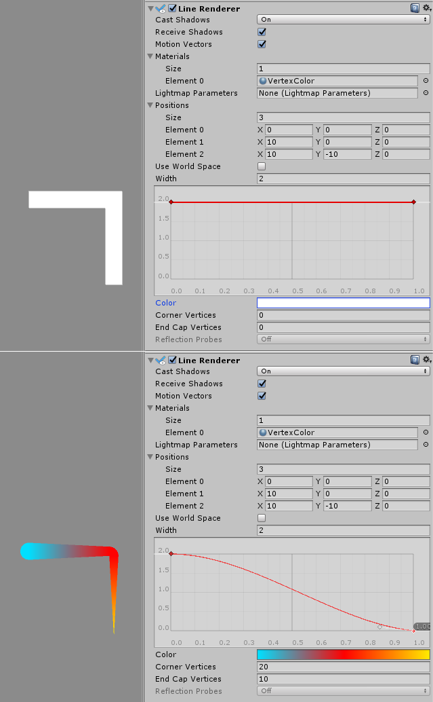

## Line Renderer
该行渲染器组件接受的两个或多个点在三维空间中的阵列，并绘制每一个之间的直线。因此，单个Line Renderer组件可用于绘制从简单直线到复杂螺旋线的所有内容。该行始终是连续的；如果需要绘制两条或更多条完全分开的线，则应使用多个GameObject，每个GameObjects都有自己的Line Renderer。

线渲染器不渲染一像素宽的线。它渲染的广告牌线（始终面对相机的多边形）以世界单位的宽度可以纹理化。它使用与Trail Renderer相同的线渲染算法。

## Properties
|Property|Function|
|:-------|:-------|
|Cast Shadows|确定路径是否投射阴影，是否应从路径的一侧或两侧投射阴影，或者路径是否应仅投射阴影而不以其他方式绘制。有关更多信息，请参阅Scripting API参考文档中的Renderer.shadowCastingMode。|
|Receive Shadows|是否接收阴影|
|Motion Vectors|如果启用，则该路径会将运动矢量渲染到“相机运动矢量”纹理中。有关更多信息，请参见Scripting API参考文档中的Renderer.motionVectors。|
|Materials|这些属性描述了用于渲染轨迹的一系列材料。粒子着色器最适合轨迹。|
|Lightmap Parameters|在此处引用“ 光照贴图参数资源”，以使路径与全局照明系统交互。|
|Positions|这些属性描述了要连接的Vector3点的数组。|
|Use World Space|如果启用，点的坐标系为世界坐标系，否则为添加了该组件的transform的局部坐标系。|
|Loop|启用此选项可以连接线的第一个和最后一个位置。这形成一个闭环。|
|Width|定义宽度值和曲线以控制路径在起点和终点之间的各个点的宽度。从轨迹的起点到终点应用曲线，并在每个顶点进行采样。曲线的总宽度由宽度值控制。|
|Color|定义渐变以控制路径沿其长度的颜色。|
|Corner Vertices|此属性指示在路径中绘制角时使用多少个额外的顶点。增大此值可使尾角变圆。|
|End Cap Vertices|此属性指示使用多少个额外的顶点在路径上创建端盖。增大此值可使轨迹线变圆。|
|Alignment|	设置为“ 视图”以使“路径”面向相机，或设置为“ 局部”以根据其“变换”组件的方向对其进行对齐。|
|Texture Mode|控制如何将纹理应用于路径。使用“ 拉伸 ”在路径的整个长度上应用“纹理”贴图，或使用“ 环绕 ”在路径的整个长度上重复“纹理”。使用“ 材质”中的“ 平铺”参数来控制重复率。|
|Light Probes|	基于探针的照明插值模式。|
|Reflection Probes|如果已启用并且场景中存在反射探针，则为此Trail Renderer选择一个反射纹理，并将其设置为内置的Shader均匀变量。|

## Details
要创建行渲染器：

* 在Unity菜单栏中，转到GameObject > 创建空白
* 在Unity菜单栏中，转到组件 > 效果 > 线条渲染器
* 将纹理或材质拖到线渲染器上。如果在材质中使用粒子着色器，则效果最佳。

## Hints
* 线渲染器对于需要在一帧中布置所有顶点的效果很有用。
* 移动相机时，线条可能会旋转。当Alignment设置为View时，这是有意的。将“ 对齐方式” 设置为“ 本地”以禁用此功能。
* Line Renderer应该是GameObject上唯一的渲染器。

## Line Renderer example setup
