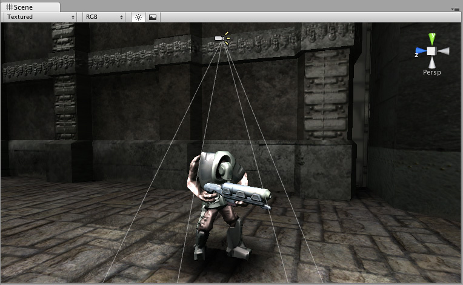

## Projector

一个Projector您可以投影材质到与它的视锥体相交的所有对象。材质必须使用特殊类型的着色器。为了使投影效果正常工作-请参见Unity standard assets中的投影机预制件。Unity 如何使用提供的Projector/Light 和Projector/Multiply shader的示例。

## Properties
|Property|Function|
|:-------|:-------|
|Near Clip Plane|靠近裁剪平面前面的对象将不会投影。|
|Far Clip Plane|超出此距离的物体将不会受到影响。|
|Field Of View|以度为单位的视场。仅当投影机不是正交图形时才使用。|
|Aspect Ratio|投影仪的纵横比。这使您可以调整投影机的高度与宽度。|
|Is Ortho Graphic|如果启用，则投影仪将是正交图形而不是透视图。|
|Ortho Graphic Size	|投影的正交图形大小。仅在打开“正交图形”时使用。|
|Material|将投影到对象上的材料。|
|Ignore Layers|位于“忽略层”之一中的对象将不受影响。默认情况下，“忽略图层”为“无”，因此所有与投影仪视锥相交的几何都会受到影响。|

## Details

使用Projector，您可以：

* 创建阴影。
* 用另一个相机在三脚架上做一个真实世界的投影仪使用渲染纹理拍摄世界上其他地方的影片。
* 创建项目符号。
* 时髦的灯光效果。

如果要创建简单的阴影效果，只需拖动StandardAssets-> Blob-Shadow-> Blob阴影投影仪即可。 预制的场景。您可以修改材质以使用其他Blob阴影纹理。

注意：创建投影仪时，请务必确保将投影仪的纹理材料的包裹模式设置为clip。否则会看到投影机的纹理重复出现，您将无法在角色上获得所需的阴影效果。

## Hints
* 如果用于正确遮蔽环境，则投影机Blob阴影可以创建令人印象深刻的“分裂细胞”般的照明效果。
* 当投影机的“材质”中未使用“ 衰减纹理”时，它可以向前和向后投影，从而产生“双重投影”。要解决此问题，请使用仅剩Alpha的Falloff纹理，该纹理的最左边像素为黑色列。