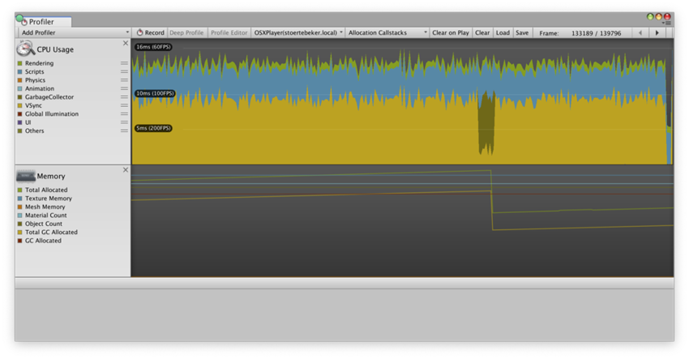
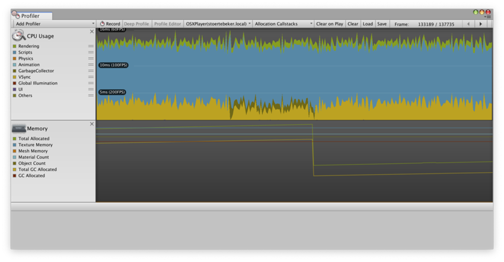
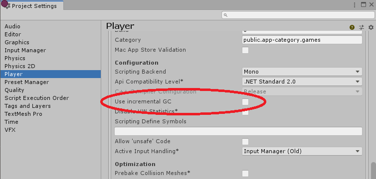

(Unity Version 2019.4)
## Understanding Automatic Memory Management
创建对象，字符串或数组时，存储它所需的内存是从称为堆的中央池中分配的。当该对象不再使用时，可以回收曾经占用的内存并将其用于其他用途。过去，通常由程序员决定使用适当的函数调用显式分配和释放这些堆内存块。如今，Unity的Mono引擎等运行时系统会自动为您管理内存。与显式分配/释放相比，自动内存管理所需的编码工作更少，并且大大减少了内存泄漏（分配了内存但从未释放的情况）的可能性。

### Value and Reference Types
调用函数时，其参数值将复制到为该特定调用保留的内存区域。仅占用几个字节的数据类型可以非常快速，轻松地复制。但是，对象，字符串和数组通常要大得多，如果定期复制这些类型的数据，效率会非常低下。幸运的是，这不是必需的。大型项目的实际存储空间是从堆中分配的，而较小的“指针”值则用于记住其位置。从那时起，在传递参数期间仅需要复制指针。只要运行时系统可以找到指针标识的项目，就可以根据需要经常使用数据的单个副本。  
直接存储并在参数传递期间复制的类型称为值类型。其中包括整数，浮点数，布尔值和Unity的结构类型（例如Color和Vector3）。分配在堆上然后通过指针访问的类型称为引用类型，因为存储在变量中的值仅“引用”实际数据。引用类型的示例包括对象，字符串和数组。

### Allocation and Garbage Collection
内存管理器跟踪它知道未使用的堆中的区域。当请求一个新的内存块时（例如，当实例化一个对象时），管理器选择一个未使用的区域来分配该块，然后从已知的未使用空间中删除已分配的内存。后续请求以相同的方式处理，直到没有足够大的可用区域来分配所需的块大小为止。此时，从堆分配的所有内存仍在使用中的可能性很小。只要仍然有引用变量可以找到堆上的引用项，就可以对其进行访问。如果对内存块的所有引用都消失了（即，已重新分配了引用变量，或者它们现在是超出范围的局部变量），则可以安全地重新分配其占用的内存。

为了确定哪些堆块不再使用，内存管理器将搜索所有当前活动的参考变量，并将其称为“活动”块。搜索结束时，内存管理器认为活动块之间的任何空间都是空的，可用于后续分配。出于显而易见的原因，查找和释放未使用的内存的过程称为垃圾回收（或简称为GC）。

Unity使用[Boehm–Demers–Weiser](https://www.hboehm.info/gc/)垃圾收集器，这是一个世界各地的垃圾收集器。
每当Unity需要执行垃圾收集时，它就会停止运行程序代码，并且仅在垃圾收集器完成所有工作后才恢复正常执行。这种中断可能导致游戏执行延迟，持续时间从不到一毫秒到几百毫秒不等，这取决于垃圾收集器需要处理多少内存以及游戏运行的平台。对于游戏等实时应用程序来说，这可能会成为一个很大的问题，因为当垃圾收集器暂停游戏的执行时，您将无法保持平滑动画所需的一致帧速率。这些中断也称为GC峰值，因为它们在Profiler帧时间图中显示为峰值。在接下来的部分中，您将了解更多有关如何编写代码以避免运行游戏时不必要的垃圾收集内存分配的信息，因此垃圾收集器的工作量减少了。

### Optimization
垃圾回收是自动的，对于程序员而言是不可见的，但是垃圾回收实际上需要大量CPU时间在后台进行。如果使用正确，自动内存管理通常将等于或超过手动分配的整体性能。但是，对于程序员而言，重要的是要避免错误，这些错误会不必要地频繁触发收集器，并在执行中造成暂停。

有一些臭名昭著的算法可能是GC的噩梦，即使它们乍一看似乎是无辜的。重复的字符串连接是一个典型的示例：
```cs
//C# script example
using UnityEngine;
using System.Collections;

public class ExampleScript : MonoBehaviour {
    void ConcatExample(int[] intArray) {
        string line = intArray[0].ToString();
        
        for (i = 1; i < intArray.Length; i++) {
            line += ", " + intArray[i].ToString();
        }
        
        return line;
    }
}
```
这里的关键细节是新片段不会一一添加到适当的字符串中。实际发生的情况是，每次循环时，line变量的先前内容都会消失-分配了一个新的字符串以包含原始片段和末尾的新部分。由于字符串随着i值的增加而变长，因此消耗的堆空间量也增加了，因此每次调用此函数时很容易用完数百个字节的可用堆空间。如果您需要将许多字符串连接在一起，那么一个更好的选择是Mono库的[System.Text.StringBuilder](http://msdn.microsoft.com/en-gb/library/system.text.stringbuilder.aspx)类。  
但是，除非反复调用，否则即使重复连接也不会造成太多麻烦，而在Unity中，这通常意味着帧更新。就像是：
```cs
//C# script example
using UnityEngine;
using UnityEngine.UI;
using System.Collections;

public class ExampleScript : MonoBehaviour {
    public Text scoreBoard;
    public int score;
    
    void Update() {
        string scoreText = "Score: " + score.ToString();
        scoreBoard.text = scoreText;
    }
}

```
当一个函数返回一个数组值时，另一个潜在的问题发生了：
```cs
//C# script example
using UnityEngine;
using System.Collections;

public class ExampleScript : MonoBehaviour {
    float[] RandomList(int numElements) {
        var result = new float[numElements];
        
        for (int i = 0; i < numElements; i++) {
            result[i] = Random.value;
        }
        
        return result;
    }
}
```
当创建一个填充值的新数组时，这种类型的函数非常优雅并且方便。但是，如果反复调用它，则每次都会分配新的内存。由于数组可能非常大，因此可用堆空间会很快用完，从而导致频繁的垃圾回收。避免此问题的一种方法是利用数组是引用类型的事实。可以在函数内修改作为参数传递给函数的数组，并且结果将在函数返回后保留。上面的函数通常可以替换为：
```cs
//C# script example
using UnityEngine;
using System.Collections;

public class ExampleScript : MonoBehaviour {
    void RandomList(float[] arrayToFill) {
        for (int i = 0; i < arrayToFill.Length; i++) {
            arrayToFill[i] = Random.value;
        }
    }
}
```
这只是用新值替换了数组的现有内容。尽管这需要在调用代码中完成数组的初始分配（看起来有点不雅致），但是函数在被调用时不会生成任何新的垃圾。

### Disabling garbage collection
如果使用的是Mono或**IL2CPP scripting backend**，则可以通过在运行时禁用垃圾收集来避免垃圾收集期间的CPU高峰。禁用垃圾收集时，内存使用量永远不会减少，因为垃圾收集器不会收集不再具有任何引用的对象。实际上，仅当禁用垃圾回收时，内存使用量才会增加。为避免随着时间的推移增加内存使用量，请在管理内存时注意。理想情况下，请在禁用垃圾收集器之前分配所有内存，并在禁用垃圾收集器时避免进行其他分配。  
有关如何在运行时启用和禁用垃圾收集的更多详细信息，请参见[GarbageCollector](https://docs.unity3d.com/ScriptReference/Scripting.GarbageCollector.html)脚本API页面。  
您也可以尝试[增量垃圾收集选项](https://docs.unity3d.com/Manual/UnderstandingAutomaticMemoryManagement.html#incremental_gc)。

### Requesting a Collection
如上所述，最好尽可能避免分配。但是，鉴于无法完全消除它们，您可以使用两种主要策略来最大程度地减少对游戏玩法的干扰。

#### Small heap with fast and frequent garbage collection
对于长时间玩游戏的人来说，这种策略通常是最好的选择，在这种情况下，平滑帧率是主要问题。像这样的游戏通常会频繁分配小块，但这些块只会短暂使用。在iOS上使用此策略时的典型堆大小在iPhone 3G上大约需要200KB，垃圾收集大约需要5ms。如果堆增加到1MB，则收集将花费大约7ms。因此，有时以规则的帧间隔请求垃圾收集可能是有利的。通常，这将使收集发生的次数多于严格必要的次数，但收集过程将迅速进行，并且对游戏的影响最小：
```cs
if (Time.frameCount % 30 == 0)
{
   System.GC.Collect();
}
```
但是，您应谨慎使用此技术，并检查分析器统计信息，以确保它确实减少了游戏的收集时间。

#### Large heap with slow but infrequent garbage collection
此策略最适用于分配（因此收集）相对不频繁且可以在游戏暂停期间进行处理的游戏。堆尽可能大而又不要大到使应用程序由于系统内存不足而被应用程序杀死，这很有用。但是，Mono运行时尽可能避免自动扩展堆。您可以通过在启动过程中预先分配一些占位符空间来手动扩展堆（即，实例化一个“无用”的对象，该对象纯粹是由于其对内存管理器的影响而分配的）：  
```cs
//C# script example
using UnityEngine;
using System.Collections;

public class ExampleScript : MonoBehaviour {
    void Start() {
        var tmp = new System.Object[1024];
        
        // make allocations in smaller blocks to avoid them to be treated in a special way, which is designed for large blocks
        for (int i = 0; i < 1024; i++)
            tmp[i] = new byte[1024];
        
        // release reference
        tmp = null;
    }
}

```
在足够容纳一个集合的游戏暂停之间，不应完全填满足够大的堆。当出现这种暂停时，您可以显式请求一个收集：
`System.GC.Collect();`  
同样，在使用此策略时应格外小心，并注意探查器统计信息，而不仅仅是假设其具有预期的效果。  

#### Reusable Object Pools
在许多情况下，可以通过减少创建和销毁的对象数量来避免产生垃圾。游戏中有某些类型的物体，例如射弹，即使一次只玩少量物体，也可能会反复遇到。在这种情况下，通常有可能重用对象而不是销毁旧对象并用新对象替换它们。

### Incremental Garbage Collection
增量垃圾收集将执行的工作分散到多个帧上。

对于增量垃圾收集，Unity仍使用Boehm-Demers-Weiser垃圾收集器，但以增量模式运行。 Unity不会在每次运行时进行完整的垃圾收集，而是将垃圾收集工作负载分配到多个帧中。因此，与其让您的程序执行一次长时间中断，以使垃圾回收器完成其工作，而是产生了多个更短的中断。虽然这并不能使垃圾收集整体上更快，但可以通过将工作负载分配到多个帧上来极大地减少垃圾收集“尖峰”破坏游戏流畅性的问题。

以下来自Unity Profiler的屏幕截图（未启用和启用增量垃圾收集）说明了增量收集如何减少帧速率的问题。在这些配置文件轨迹中，帧的浅蓝色部分显示脚本操作使用了多少时间，黄色部分显示直到Vsync（等待下一帧开始）为止帧中剩余的时间，而深绿色部分显示垃圾收集所花费的时间。  

  
*Nonincremental garbage collection profile*  
如果不使用增量GC（如上），您会看到尖峰中断了原本平滑的60fps帧速率。此尖峰推动了其中发生垃圾收集的帧，超过了维持60FPS所需的16毫秒限制。 （实际上，由于垃圾回收，此示例丢弃了多个帧。）  

  
*Incremental garbage collection profile*  
启用增量垃圾收集（上图）后，同一项目将保持一致的60fps帧速率，因为垃圾收集操作被分解为几帧，每帧只占用一小段时间（黄色的Vsync刚好位于黄色的Vsync上方轨迹）。  

  
*Incremental garbage collection using left over time in frame*  

此屏幕快照显示了同一项目，该项目也在启用增量垃圾回收的情况下运行，但是这次每帧脚本操作较少。同样，垃圾收集操作分为几帧。所不同的是，这次，垃圾回收每帧占用更多时间，并且需要更少的总帧来完成。这是因为如果Vsync，我们会根据剩余的可用帧时间来调整分配给垃圾回收的时间或正在使用Application.targetFrameRate。这样，我们可以及时运行垃圾回收，否则将花费大量时间，从而“免费”获得垃圾回收。

#### Enabling incremental garbage collection
当前在以下平台上支持增量垃圾收集：
* Mac standalone player
* Windows standalone player
* Linux standalone player
* iOS
* Android
* Windows UWP player
* PS4
* Xbox One
* Nintendo Switch
* Unity Editor

请注意，WebGL当前不支持增量垃圾收集。增量垃圾收集需要.NET 4.x等效脚本运行时版本。  
在受支持的配置上，Unity在**Player settings**窗口的**Other settings**区域中提供了增量垃圾收集作为选项。只需启用**Use incremental GC**复选框即可。  
   
*Player Settings to enable incremental garbage collection*   
此外，如果您在项目**Quality**设置中或通过**Application.VSync**属性将**VSync Count**设置为**Don’t Sync**以外的任何内容，或者设置**Application.targetFrameRate**属性值，则Unity会自动使用在帧结束时剩余的任何空闲时间用于增量垃圾收集。  

您可以使用**Scripting.GarbageCollector**类对增量垃圾收集行为进行更精确的控制。例如，如果您不想使用VSync或目标帧速率，则可以自己计算帧结束之前的可用时间，并将该时间提供给垃圾收集器使用。

#### Possible problems with incremental collection
在大多数情况下，增量垃圾收集可以缓解垃圾收集高峰的问题。但是，在某些情况下，增量垃圾回收在实践中可能没有好处。  
当增量垃圾收集中断其工作时，它会中断标记阶段，在该阶段扫描所有托管对象以确定哪些对象仍在使用中以及哪些对象可以清除。当对象之间的大多数引用在工作片段之间不变时，划分标记阶段会很好。当对象引用确实发生更改时，必须在下一次迭代中再次扫描那些对象。因此，太多的更改会使增量垃圾收集器不堪重负，并导致标记传递永远无法完成的情况，因为它总是要做更多的工作–在这种情况下，垃圾收集会退回到进行完整的非增量收集。  
同样，当使用增量垃圾收集时，只要引用发生更改，Unity需要生成其他代码（称为写障碍）来通知垃圾收集（因此垃圾收集将知道是否需要重新扫描对象）。更改引用时，这会增加一些开销，这可能会对某些托管代码产生可衡量的性能影响。  
尽管如此，大多数典型的Unity项目（如果有诸如“典型” Unity项目之类的东西）仍可从增量垃圾收集中受益，尤其是当它们遭受垃圾收集高峰时。  
始终使用探查器验证您的游戏或程序是否按预期执行。

## Further Information 
内存管理是一个微妙而复杂的学科，为此付出了大量的学术努力。如果您有兴趣了解有关它的更多信息，那么[memorymanagement.org](http://www.memorymanagement.org)是一个很好的资源，其中列出了许多出版物和在线文章。有关对象池的更多信息，请参见[Wikipedia页面](http://en.wikipedia.org/wiki/Object_pool_pattern)以及[Sourcemaking.com](https://sourcemaking.com/design_patterns/object_pool)。