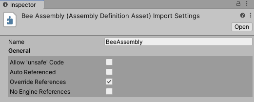
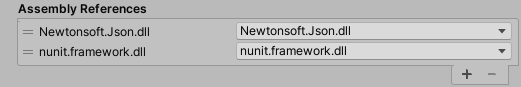

# Assembly Definition properties
单击**Assembly Definition**资产以在检查器中设置装配体的属性窗口。

程序集定义属性分为以下几节：
- [Assembly Definition properties](#assembly-definition-properties)
  - [Name and General](#name-and-general)
  - [Define Constraints](#define-constraints)
    - [Invalid or incompatible constraints](#invalid-or-incompatible-constraints)
  - [Assembly Definition References](#assembly-definition-references)
  - [Assembly References](#assembly-references)
  - [Platforms](#platforms)
  - [Version Defines](#version-defines)


## Name and General


|Property|Description
|:-------|:------
|Name|程序集的名称（不带文件扩展名）。程序集名称在整个项目中必须唯一。考虑使用反向DNS命名样式来减少名称冲突的可能性，尤其是如果您要在多个项目中使用程序集时。 </br>注意：Unity使用您分配给Assembly Definition资产的名称作为Name字段的默认值，但是您可以根据需要更改名称。但是，如果按名称而不是其GUID引用程序集定义，则更改名称将破坏引用。
|Allow ‘unsafe’ code|如果在程序集中的脚本中使用了C＃不安全关键字，则启用**Allow ‘unsafe’ Code**选项。启用此设置后，Unity在编译程序集时会将/ unsafe选项传递给C＃编译器。
|Auto Referenced|指定预定义程序集是否应引用此Project程序集。禁用**Auto Referenced**选项时，Unity不会在编译期间自动引用程序集。这对Unity是否在构建中包括它没有影响。
|Override References|启用**Override References**设置以手动指定此程序集依赖哪些预编译的程序集。启用**Override References**时，检查器将显示“装配参考”部分，可用于指定参考。 </br>预编译程序集是在Unity项目外部编译的库。默认情况下，您在Project中定义的程序集会引用添加到Project中的所有预编译程序集，这与预定义程序集引用所有预编译程序集的方式匹配。启用“覆盖引用”时，此程序集仅引用在“程序集引用”下添加的预编译程序集。</br>注意：为防止Project程序集自动引用预编译的程序集，可以禁用其**Auto Referenced**选项。有关更多信息，请参见插件检查器。
|No Engine References|启用此属性后，Unity在编译程序集时不会向UnityEditor或UnityEngine添加引用。

参考 [Creating an Assembly Definition asset](https://docs.unity3d.com/Manual/ScriptCompilationAssemblyDefinitionFiles.html#create-asmdef)

## Define Constraints
  
指定必须定义的编译器#define指令，Unity才能编译或引用程序集。

如果满足所有**Define Constraints**，则Unity仅编译和引用Project程序集。约束的工作方式类似于C＃中的#if预处理程序指令，但是约束在汇编级别而不是脚本级别。您必须在**Define Constraints**设置中定义所有符号，才能满足约束条件。

要指定符号必须是未定义的，请在其前面加上一个负号！ （爆炸）符号。例如，如果您将以下符号指定为**Define Constraints**：
```cs
!ENABLE_IL2CPP
UNITY_2018_3_OR_NEWER
```

当未定义符号ENABLE_IL2CPP且已定义符号UNITY_2018_3_OR_NEWER时，满足约束条件。换句话说，Unity仅在Unity 2018.3或更高版本的非IL2CPP脚本运行时上编译和引用此程序集。

您可以使用|| （OR）运算符指定必须存在至少一个约束条件才能满足约束条件。例如：
```cs
UNITY_IOS || UNITY_EDITOR_OSX
UNITY_2019_3_OR_NEWER
!UNITY_ANDROID
```
当定义UNITY_IOS或UNITY_EDITOR_OSX和UNITY_2019_3_OR_NEWER且未定义UNITY_ANDROID时，约束将得到满足。各个行类似于在它们之间的约束之间执行逻辑与。上面的示例等效于：
```cs
 (UNITY_IOS OR UNITY_EDITOR_OSX) AND (UNITY_2019_3_OR_NEWER) AND (NOT UNITY_ANDROID)
```

您可以使用Unity的任何内置#define指令，在全局编译器响应（.rsp）文件中定义的符号以及在“项目的脚本定义符号播放器”设置中定义的任何符号。有关更多信息，请参见[依赖于平台的编译](https://docs.unity3d.com/Manual/PlatformDependentCompilation.html)，包括内置符号列表。

注意：**Scripting Define Symbols**设置是特定于平台的。如果使用此设置来定义Unity是否应使用程序集，请确保在所有相关平台上定义必要的符号。

参考 [Conditionally including an assembly](https://docs.unity3d.com/Manual/ScriptCompilationAssemblyDefinitionFiles.html#conditional-assembly).

### Invalid or incompatible constraints
Unity根据当前定义的设置使用指示符标记每个约束。例如，以下两个约束集表明当前定义了一个符号，而另一个则未定义。由于要满足整体约束，每个单独的约束必须为真，因此“定义约束”框也被标记为无效或不兼容。  
  
为了满足此示例中的约束，您可以更改**Scripting Backend**到**IL2CPP**（在 Player Settings 中）。但是，通常重要的是在构建项目时如何评估约束，而不是约束在Unity Editor中的显示方式。例如，您可能有一个只希望包含在使用IL2CPP后端的版本中的程序集，而不希望包含在使用Mono后端的其他版本中的程序集。
## Assembly Definition References


|Property|Description
|:-------|:-------
|Assembly Definition References|指定对使用**Assembly Definition**资产创建的其他装配的引用。 Unity使用这些引用来编译程序集，并定义程序集之间的依赖关系。
|Use GUIDs|此设置控制Unity如何序列化对其他Assembly Definition资产的引用。启用此属性后，Unity会将引用保存为资产的GUID，而不是程序集定义名称。最好使用GUID代替名称，因为这意味着您可以更改组装定义资产的名称，而不必更新引用该资产的其他组装定义文件。

参考 [Creating an Assembly Definition asset](https://docs.unity3d.com/Manual/ScriptCompilationAssemblyDefinitionFiles.html#create-asmdef)
## Assembly References


仅当启用**Override References**属性（在[常规](https://docs.unity3d.com/Manual/class-AssemblyDefinitionImporter.html#general)部分中）时，“程序集引用”部分才会出现。使用此区域可以指定对该程序集所依赖的预编译程序集的任何引用。

参考 [Referencing a precompiled, plugin assembly](https://docs.unity3d.com/Manual/ScriptCompilationAssemblyDefinitionFiles.html#reference-precompiled-assembly)
## Platforms
  
设置程序集的平台兼容性。 Unity仅在包括（或不排除）的平台上编译或引用此程序集。

参考 [Creating a platform-specific assembly](https://docs.unity3d.com/Manual/ScriptCompilationAssemblyDefinitionFiles.html#create-platform-specific)
## Version Defines


指定根据项目中的软件包和模块的版本定义的符号。
|Property|Description
|:-------|:------
|Resource.|包或模块
|Define.|用于定义何时在此Unity项目中也存在资源的适用版本的符号。
|Expression|定义版本或版本范围的表达式。请参见版本定义表达式。
|Expression outcome|表达式被评估为逻辑语句，其中“ x”是检查的版本。如果表达式结果显示“无效”，则表达式格式错误。